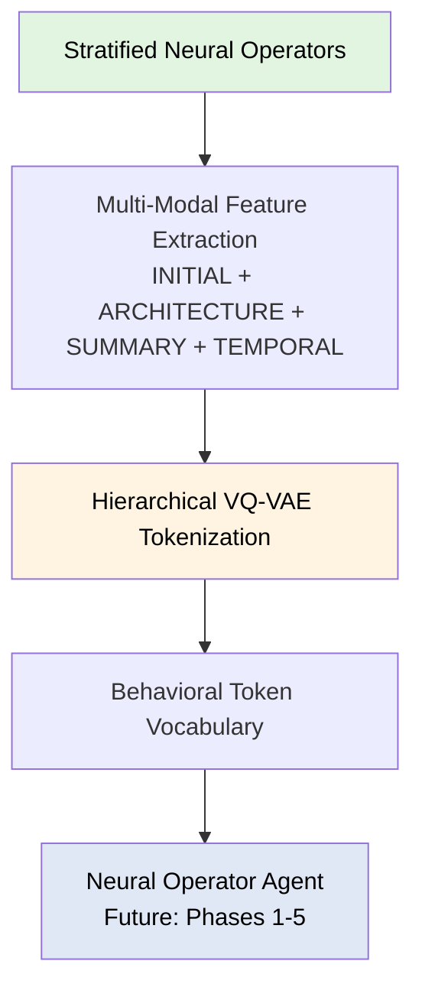

# Spinlock

**Foundation for Neural Operator Agent Research**

[](https://www.python.org/downloads/)
[](https://python-poetry.org/)
[](https://opensource.org/licenses/MIT)

A production-ready system for generating stratified neural operator datasets, extracting multi-modal behavioral features, and training hierarchical VQ-VAE tokenizers—designed as the data foundation for building a **dynamical cognitive memory system** capable of autonomous reasoning about operator behaviors, with the long-term vision of achieving agency, self-awareness, and meta-cognitive capabilities through Neural Operator Agents.

---

## Table of Contents

- [🎯 What is Spinlock?](#-what-is-spinlock)
- [🧠 Neural Operator Agents (NOA)](#-neural-operator-agents-noa)
- [🏗️ Architecture](#️-architecture)
- [📊 Feature Families](#-feature-families)
- [⚡ Quick Start](#-quick-start)
- [🚀 Installation](#-installation)
- [📚 Documentation](#-documentation)
- [🤝 Contributing](#-contributing)
- [📄 Citation](#-citation)
- [📜 License](#-license)

---

## 🎯 What is Spinlock?

Spinlock enables systematic exploration of neural operator parameter spaces to build behavioral representations for operator reasoning. Rather than studying individual operators in isolation, Spinlock treats the entire operator space as a structured domain for learning and discovery.

### Core Capabilities

- **Stratified Low-Discrepancy Sampling** - Sobol sequences with Owen scrambling for efficient parameter space exploration, ensuring diverse yet systematic coverage
- **Stochastic Rollout Generation** - 500+ timestep trajectories with multiple realizations per operator, capturing behavioral variability and dynamics
- **Multi-Modal Feature Extraction** - Four complementary feature families (INITIAL+ARCHITECTURE+SUMMARY+TEMPORAL) jointly capturing operator behavior from different perspectives
- **Hierarchical VQ-VAE Tokenization** - Data-driven feature subgrouping (i.e. category) discovery via clustering, creating discrete multi-resolution behavioral vocabularies for operator reasoning

### Name Origin

The name "Spinlock" draws inspiration from **quantum field spinlocking**—a phenomenon where coherence emerges from seemingly chaotic quantum fluctuations through the alignment of spin states. Like its quantum counterpart, this system seeks to discover **order arising from apparent chaos**: by systematically exploring stochastic neural operator behaviors, it uncovers stable, reproducible patterns and emergent structures within the high-dimensional parameter space. The metaphor reflects the core philosophy that meaningful behavioral representations can be extracted from the complex, noisy dynamics of neural operators.

### Design Philosophy

Spinlock is built on the principle that **operators have behaviors, and behaviors can be learned**. By generating diverse operator samples, extracting rich behavioral features, and tokenizing these features into discrete vocabularies, Spinlock provides the foundation for a **dynamical cognitive memory system**—one that can reason about, generate, and compose dynamical behaviors autonomously. The ultimate vision is to develop systems with genuine **agency and self-awareness**: Neural Operator Agents capable of introspecting on their own generative processes, directing their own exploration, and developing emergent understanding of operator families and dynamical regimes.

---

## 🧠 Neural Operator Agents (NOA)

Spinlock provides the data infrastructure for building **Neural Operator Agents**—systems that learn to understand, generate, and reason about dynamical behaviors through hierarchical behavioral tokenization.

### The NOA Vision: From Data to Meta-Cognition

**Phase 0: Foundation** (✅ Current)
- Stratified neural operator datasets with diverse parameter coverage
- Multi-modal feature extraction (INITIAL, ARCHITECTURE, SUMMARY, TEMPORAL)
- Hierarchical VQ-VAE tokenization of behavioral patterns

**Phase 1: Single-Step Agent Mapping** (🔄 In Development)
- Learn mappings from behavioral tokens → operator parameters + initial conditions
- Hybrid loss: token reconstruction + feature-space matching

**Phase 2: Multi-Observation Context** (📋 Planned)
- Transformer-based temporal encoder for operator sequences
- Capture higher-order dependencies and temporal correlations

**Phase 3: Exploration & Agency** (📋 Planned)
- Self-directed discovery of novel operators and initial conditions
- Meta-dynamical cognitive memory for autonomous exploration

**Phase 4: Meta-Cognition & Self-Awareness** (📋 Planned)
- Self-referential modeling: agent observes its own generative behavior
- Functional introspection through learned internal models

**Phase 5: Scientific Discovery** (📋 Planned)
- Autonomous hypothesis generation and testing
- Emergent understanding of operator families and dynamical regimes

**Current Status:** Phase 0 complete, Phase 1 in development

See [docs/noa-roadmap.md](docs/noa-roadmap.md) for detailed architecture and implementation plan.

---

## 🏗️ Architecture

### System Overview



### Pipeline Stages

#### 1. Neural Operator Generation
- **Sobol-stratified parameter sampling** - Low-discrepancy sequences ensure uniform parameter space coverage
- **CNN operator construction** - Build neural operators from parameter vectors
- **Stochastic rollout generation** - 500 timesteps × 3 realizations capturing behavioral variability

#### 2. Feature Extraction (4 Complementary Families)
- **INITIAL** (Initial Condition): 42D hybrid features
  - 14 manual features: spatial, spectral, information-theoretic, morphological
  - 28 CNN embeddings: ResNet-3 encoder for learned spatial patterns
- **ARCHITECTURE** (Neural Operator Parameters): 21D architectural/stochastic/evolution features
  - Direct parameter space features (architecture, stochastic, operator, evolution, stratification)
- **SUMMARY** (Summary Descriptor Features): 420-520D aggregated behavioral statistics
  - Spatial, spectral, temporal, cross-channel, causality, invariant drift, operator sensitivity
- **TEMPORAL** (Temporal Dynamics): Full temporal resolution trajectories [N,M,T,D]
  - Preserves time-series structure for sequential modeling

#### 3. VQ-VAE Tokenization
- **Joint training across all feature families** (INITIAL+ARCHITECTURE+SUMMARY+TEMPORAL)
- **Automatic category discovery** via hierarchical clustering (~8-15 categories)
- **Multi-level discrete latent space** (coarse → medium → fine)
- **Feature cleaning** - NaN removal, variance filtering, deduplication, outlier capping

#### 4. Behavioral Vocabulary
- **Discrete tokens** representing operator behavioral patterns
- **Category-specific embeddings** preserving multi-modal structure
- **Foundation for transformer-based agent reasoning** (Phase 2+)

See [docs/architecture.md](docs/architecture.md) for detailed system design.

---

## 📊 Feature Families

Spinlock extracts **4 complementary feature families** that jointly capture neural operator behavior from different perspectives:

| Family | Dimensions | Captures | Granularity |
|--------|-----------|----------|-------------|
| **INITIAL** | 42D | Initial condition characteristics (spatial, spectral, information, morphology) | Per-realization |
| **ARCHITECTURE** | 21D | Operator parameters (architecture, stochastic, evolution) | Per-operator |
| **SUMMARY** | 420-520D | Aggregated behavioral statistics (spatial, spectral, temporal, causality) | Scalar summaries |
| **TEMPORAL** | Variable | Full temporal trajectories preserving time-series structure | Per-timestep |

### Joint Training

The VQ-VAE jointly trains on all 4 families simultaneously, learning unified representations that span:
- **INITIAL**: How initial conditions influence operator dynamics
- **ARCHITECTURE**: How architectural choices determine behavioral regimes
- **SUMMARY**: Statistical signatures of emergent patterns
- **TEMPORAL**: Temporal evolution and regime transitions

This multi-modal training enables the model to discover behavioral categories that integrate structural, dynamical, and temporal characteristics—essential for NOA systems that reason about operator behavior.

See [docs/features/](docs/features/) for detailed feature definitions and extraction methods.

---

## ⚡ Quick Start

### Generate Operator Dataset

```bash
poetry run spinlock generate \
    --config configs/experiments/baseline_10k.yaml \
    --output datasets/my_operators.h5
```

### Inspect Dataset

```bash
poetry run spinlock inspect datasets/my_operators.h5
```

### Train VQ-VAE Tokenizer

```bash
poetry run spinlock train-vqvae \
    --dataset datasets/my_operators.h5 \
    --config configs/vqvae/production.yaml \
    --output checkpoints/vqvae/
```

### Extract Behavioral Tokens

```python
import torch
from spinlock.encoding import CategoricalHierarchicalVQVAE

# Load trained model
checkpoint = torch.load("checkpoints/vqvae/best_model.pt")
model = CategoricalHierarchicalVQVAE.from_checkpoint(checkpoint)

# Extract behavioral tokens from new operators
with torch.no_grad():
    tokens_coarse, tokens_medium, tokens_fine = model.get_tokens(features)
```

See [docs/getting-started.md](docs/getting-started.md) for tutorials and examples.

---

## 🚀 Installation

**Requirements:** Python 3.11+, CUDA 11.8+ (for GPU acceleration)

```bash
git clone https://github.com/yourusername/spinlock.git
cd spinlock
poetry install
```

**Docker:** See [docs/installation.md#docker](docs/installation.md#docker)

**From Source:** See [docs/installation.md#source](docs/installation.md#source)

For detailed installation instructions, platform-specific guides, and troubleshooting, see [docs/installation.md](docs/installation.md).

---

## 📚 Documentation

- [**NOA Roadmap**](docs/noa-roadmap.md) - 5-phase development plan for Neural Operator Agents
- [**Architecture**](docs/architecture.md) - Detailed system design and implementation
- [**Feature Families**](docs/features/README.md) - INITIAL, ARCHITECTURE, SUMMARY, TEMPORAL feature definitions and extraction
- [**Getting Started**](docs/getting-started.md) - Tutorials and end-to-end examples
- [**Installation**](docs/installation.md) - Platform-specific installation guides

---

## 🤝 Contributing

Contributions are welcome! Please see our contributing guidelines for:
- Code style and formatting
- Testing requirements
- Pull request process

For bugs and feature requests, please open an issue on GitHub.

---

## 📄 Citation

If you use Spinlock in your research, please cite:

```bibtex
@software{spinlock2024,
  title = {Spinlock: Foundation for Neural Operator Agent Research},
  author = {Your Name},
  year = {2024},
  url = {https://github.com/yourusername/spinlock}
}
```

---

## 📜 License

This project is licensed under the MIT License - see the [LICENSE](LICENSE) file for details.

---

## Acknowledgments

Built with:
- [PyTorch](https://pytorch.org/) - Deep learning framework
- [Poetry](https://python-poetry.org/) - Dependency management
- [HDF5](https://www.hdfgroup.org/solutions/hdf5/) - Efficient data storage

Spinlock is part of ongoing research into meta-cognitive neural operator systems and autonomous scientific discovery.
