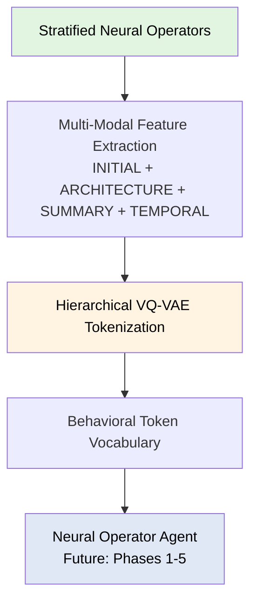

# Spinlock

**Foundation for Neural Operator Agent Research**

[](https://www.python.org/downloads/)
[](https://python-poetry.org/)
[](https://opensource.org/licenses/MIT)

A self-directed discovery substrate for learning the "physics of change" through autonomous exploration of neural operator space. Uses stratified low-discrepancy sampling and bias-minimizing feature extraction to discover truly alien computational structures—enabling general dynamical reasoning beyond task-specific machine learning.

---

## Table of Contents

- [🎯 What is Spinlock?](#-what-is-spinlock)
- [🧠 Neural Operator Agents (NOA)](#-neural-operator-agents-noa)
- [🏗️ Architecture](#️-architecture)
- [📊 Feature Families](#-feature-families)
- [⚡ Quick Start](#-quick-start)
- [🚀 Installation](#-installation)
- [📚 Documentation](#-documentation)
- [🤝 Contributing](#-contributing)
- [📄 Citation](#-citation)
- [📜 License](#-license)

---

## 🎯 What is Spinlock?

Spinlock enables systematic exploration of neural operator parameter spaces to build behavioral representations for operator reasoning. Rather than studying individual operators in isolation, Spinlock treats the entire operator space as a structured domain for learning and discovery.

### Core Capabilities

- **Stratified Low-Discrepancy Sampling** - Custom-engineered Sobol sampler with Owen scrambling achieves provably optimal space-filling coverage (discrepancy <0.01) across high-dimensional parameter spaces (d>100), eliminating sampling blind spots that could bias discovery. This mathematical guarantee of exploration fairness is foundational to finding truly novel structures.
- **Bias-Minimizing Multi-Modal Features** - Four orthogonal feature families (INITIAL, ARCHITECTURE, SUMMARY, TEMPORAL) extract comprehensive behavioral signatures without predetermined "interesting" features, enabling discovery of patterns humans might never imagine
- **Data-Driven Behavioral Taxonomy** - Unsupervised hierarchical clustering discovers natural behavioral categories from empirical data, not human labels—creating discrete vocabularies that reflect the true geometry of operator space
- **General Dynamical Reasoning** - Treats computation as a first-class object for study, learning the "physics of change" rather than optimizing for specific tasks—applicable across domains

### Name Origin

The name "Spinlock" draws inspiration from **quantum field spinlocking**—a phenomenon where coherence emerges from seemingly chaotic quantum fluctuations through the alignment of spin states. Like its quantum counterpart, this system seeks to discover **order arising from apparent chaos**: by systematically exploring stochastic neural operator behaviors, it uncovers stable, reproducible patterns and emergent structures within the high-dimensional parameter space. The metaphor reflects the core philosophy that meaningful behavioral representations can be extracted from the complex, noisy dynamics of neural operators.

### Minimizing Semantic Bias: Discovering Alien Structure

**Core Thesis**: The discovery of truly novel computational structures requires minimizing human-imposed semantic bias at every level of the pipeline.

Spinlock is designed around a radical premise: **we don't know what we're looking for**. Rather than pre-defining behavioral categories or imposing domain-specific taxonomies, the system treats neural operator space as fundamentally alien territory to be explored without preconceptions.

#### Bias-Minimizing Design Principles

1. **Stratified Low-Discrepancy Sampling**
   - Uses Sobol sequences with Owen scrambling for provably optimal space-filling coverage
   - Target discrepancy <0.01 ensures no "blind spots" in parameter space exploration
   - Mathematical guarantee of fairness: every region of the hypercube is explored equitably
   - Prevents sampling artifacts that could masquerade as discovered structure

2. **Data-Driven Feature Extraction**
   - A broad spectrum of features covering initial conditions, operator architecture, multiscale summary statistics and spatiotemporal dynamics that aim to capture rollout behavior from complementary perspectives
   - No predetermined "interesting" features—extract comprehensive statistical signatures
   - Hierarchical clustering discovers categories empirically from the data itself
   - Categories emerge from actual behavioral variation, not human intuition

3. **Bias-Free Tokenization**
   - VQ-VAE learns discrete behavioral vocabularies through unsupervised compression
   - No labeled data, no task-specific objectives
   - Codebook structure reflects the natural geometry of operator behavior space
   - Enables discovering categories that humans might never imagine

#### Why This Matters: Learning the "Physics of Change"

Traditional ML systems optimize for specific tasks (classification, regression, generation). Spinlock instead treats **dynamical computation itself** as the object of study:

- **Not**: "Train an operator to solve task X"
- **But**: "What are the fundamental behavioral regimes across all possible operators?"

This shift enables:
- **Discovery of universal patterns** in computational dynamics
- **Identification of phase transitions** and bifurcations in parameter space
- **Emergent taxonomies** that reflect the true structure of the computational physics
- **General dynamical reasoning** applicable beyond any single domain

By minimizing bias, we maximize the potential for **genuine discovery**: finding structure and semantics that are truly alien, emergent, and potentially fundamental to understanding computation as a physical process.

### Design Philosophy

Spinlock is built on the principle that **discovering unknown structure requires minimizing imposed structure**. By systematically exploring operator space through bias-free sampling, extracting comprehensive multi-modal features, and allowing categories to emerge through unsupervised learning, the system learns the "physics of change" from the data itself.

This is not about building better task-specific models—it's about **treating computational dynamics as a fundamental object of scientific study**. The long-term vision is to develop agents capable of self-directed discovery: systems that autonomously identify high-variance behavioral regimes (prediction error/surprise), adaptively refine their own world models, and develop functional understanding of computational physics through transparent, inspectable mechanisms.

The goal is not anthropomorphic "intelligence," but **systematic discovery of alien semantics** in the space of all possible dynamical behaviors—structures and patterns that emerge from rigorous, unbiased exploration of the computational physics landscape.

---

## 🧠 Neural Operator Agents (NOA)

Spinlock provides the data infrastructure for building **Neural Operator Agents**—systems that learn to understand, generate, and reason about dynamical behaviors through hierarchical behavioral tokenization.

The NOA system represents a novel approach to learning general dynamical reasoning through self-directed exploration. Unlike task-specific ML systems, the NOA treats computational physics as the object of study, learning to predict, generate, and reason about operator behaviors through hierarchical behavioral tokenization.

**Key Innovation**: Topological positional encoding that maps parameter-space distance rather than chronological time, allowing the agent to reason about functional similarity across disparate operator "memories."

### The NOA Vision: From Data to Systematic Discovery

**Phase 0: Foundation** (✅ Current)
- Stratified neural operator datasets with diverse parameter coverage
- Multi-modal feature extraction (INITIAL, ARCHITECTURE, SUMMARY, TEMPORAL)
- Data-driven behavioral taxonomy via hierarchical clustering

**Phase 1: Single-Step Agent Mapping** (🔄 In Development)
- Learn mappings from behavioral tokens → operator parameters + initial conditions
- Hybrid loss: token reconstruction + feature-space matching
- Interpretable behavioral axes for transparent understanding

**Phase 2: Multi-Observation Context** (📋 Planned)
- Transformer-based temporal encoder for operator sequences
- Capture higher-order dependencies and temporal correlations
- In-context learning of operator physics through attention mechanisms

**Phase 3: Curiosity-Driven Exploration** (📋 Planned)
- Adaptive refinement: Agent identifies high-variance regimes (prediction error/surprise) and autonomously re-parameterizes sampling
- World model uncertainty: Track which regions of operator space are poorly understood
- Directed discovery: Use prediction error as curiosity signal to guide exploration toward behavioral frontiers
- Validation: Does curiosity-driven sampling discover fundamentally new behavioral categories?

**Phase 4: Transparent Self-Modeling** (📋 Planned)
- Self-model learning: Agent develops interpretable internal model of its own behavioral prediction process
- Calibration validation: Measure alignment between what the agent predicts about itself vs. actual performance
- Distributional shift detection: Self-model enables identifying when the agent encounters truly novel operator regimes
- Transparency requirement: Self-models must be inspectable—understand what the system "believes" about its own capabilities

**Phase 5: Systematic Discovery of Computational Laws** (📋 Planned)
- Hypothesis generation: Identify potential universal patterns in operator behavior (e.g., "operators with high spatial gradients exhibit turbulent temporal dynamics")
- Rigorous testing: Validate hypotheses through directed sampling and statistical analysis
- Symbolic regression: Distill discovered patterns into interpretable mathematical relationships
- Falsifiability: Every discovered "law" must be testable and potentially refutable

**Current Status:** Phase 0 complete, Phase 1 in development

See [docs/noa-roadmap.md](docs/noa-roadmap.md) for detailed architecture and implementation plan.

---

## 🏗️ Architecture

### System Overview



### Pipeline Stages

#### 1. Neural Operator Generation
- **Sobol-stratified parameter sampling** - Low-discrepancy sequences ensure uniform parameter space coverage
- **CNN operator construction** - Build neural operators from parameter vectors
- **Stochastic rollout generation** - 500 timesteps × 3 realizations capturing behavioral variability

#### 2. Feature Extraction (4 Complementary Families)
- **INITIAL** (Initial Condition): Hybrid features combining manual and learned spatial patterns
  - Manual features: spatial, spectral, information-theoretic, morphological
  - CNN embeddings: ResNet-3 encoder for learned spatial patterns
- **ARCHITECTURE** (Neural Operator Parameters): Architectural/stochastic/evolution features
  - Direct parameter space features (architecture, stochastic, operator, evolution, stratification)
- **SUMMARY** (Summary Descriptor Features): Aggregated per-rollout behavioral statistics
  - Spatial, spectral, temporal, cross-channel, causality, invariant drift, operator sensitivity
  - Aggregated across all timesteps and realizations per operator
- **TEMPORAL** (Temporal Dynamics): Full temporal resolution trajectories
  - Preserves time-series structure for sequential modeling

#### 3. VQ-VAE Tokenization
- **Joint training across all feature families** (INITIAL+ARCHITECTURE+SUMMARY+TEMPORAL)
- **Automatic category discovery** via hierarchical clustering (~8-15 categories)
- **Multi-level discrete latent space** (coarse → medium → fine)
- **Feature cleaning** - NaN removal, variance filtering, deduplication, outlier capping

#### 4. Behavioral Vocabulary
- **Discrete tokens** representing operator behavioral patterns
- **Category-specific embeddings** preserving multi-modal structure
- **Foundation for transformer-based agent reasoning** (Phase 2+)

See [docs/architecture.md](docs/architecture.md) for detailed system design.

---

## 📊 Feature Families

Spinlock extracts **4 complementary feature families** that jointly capture neural operator behavior from different perspectives:

| Family | Captures | Granularity |
|--------|----------|-------------|
| **INITIAL** | Initial condition characteristics (spatial, spectral, information, morphology) | Per-realization |
| **ARCHITECTURE** | Operator parameters (architecture, stochastic, evolution) | Per-operator |
| **SUMMARY** | Aggregated behavioral statistics (spatial, spectral, temporal, causality) | Per-rollout (aggregated across timesteps and realizations) |
| **TEMPORAL** | Full temporal trajectories preserving time-series structure | Per-timestep |

### Joint Training

The VQ-VAE jointly trains on all 4 families simultaneously, learning unified representations that span:
- **INITIAL**: How initial conditions influence operator dynamics
- **ARCHITECTURE**: How architectural choices determine behavioral regimes
- **SUMMARY**: Statistical signatures of emergent patterns
- **TEMPORAL**: Temporal evolution and regime transitions

This multi-modal training enables the model to discover behavioral categories that integrate structural, dynamical, and temporal characteristics—essential for NOA systems that reason about operator behavior.

See [docs/features/](docs/features/) for detailed feature definitions and extraction methods.

---

## ⚡ Quick Start

### Generate Operator Dataset

```bash
poetry run spinlock generate \
    --config configs/experiments/baseline_10k.yaml \
    --output datasets/my_operators.h5
```

### Inspect Dataset

```bash
poetry run spinlock inspect datasets/my_operators.h5
```

### Train VQ-VAE Tokenizer

```bash
poetry run spinlock train-vqvae \
    --dataset datasets/my_operators.h5 \
    --config configs/vqvae/production.yaml \
    --output checkpoints/vqvae/
```

### Extract Behavioral Tokens

```python
import torch
from spinlock.encoding import CategoricalHierarchicalVQVAE

# Load trained model
checkpoint = torch.load("checkpoints/vqvae/best_model.pt")
model = CategoricalHierarchicalVQVAE.from_checkpoint(checkpoint)

# Extract behavioral tokens from new operators
with torch.no_grad():
    tokens_coarse, tokens_medium, tokens_fine = model.get_tokens(features)
```

See [docs/getting-started.md](docs/getting-started.md) for tutorials and examples.

---

## 🚀 Installation

**Requirements:** Python 3.11+, CUDA 11.8+ (for GPU acceleration)

```bash
git clone https://github.com/yourusername/spinlock.git
cd spinlock
poetry install
```

**Docker:** See [docs/installation.md#docker](docs/installation.md#docker)

**From Source:** See [docs/installation.md#source](docs/installation.md#source)

For detailed installation instructions, platform-specific guides, and troubleshooting, see [docs/installation.md](docs/installation.md).

---

## 📚 Documentation

- [**NOA Roadmap**](docs/noa-roadmap.md) - 5-phase development plan for Neural Operator Agents
- [**Architecture**](docs/architecture.md) - Detailed system design and implementation
- [**Feature Families**](docs/features/README.md) - INITIAL, ARCHITECTURE, SUMMARY, TEMPORAL feature definitions and extraction
- [**Getting Started**](docs/getting-started.md) - Tutorials and end-to-end examples
- [**Installation**](docs/installation.md) - Platform-specific installation guides

---

## 🤝 Contributing

Contributions are welcome! Please see our contributing guidelines for:
- Code style and formatting
- Testing requirements
- Pull request process

For bugs and feature requests, please open an issue on GitHub.

---

## 📄 Citation

If you use Spinlock in your research, please cite:

```bibtex
@software{spinlock2024,
  title = {Spinlock: Foundation for Neural Operator Agent Research},
  author = {Your Name},
  year = {2024},
  url = {https://github.com/yourusername/spinlock}
}
```

---

## 📜 License

This project is licensed under the MIT License - see the [LICENSE](LICENSE) file for details.

---

## Acknowledgments

Built with:
- [PyTorch](https://pytorch.org/) - Deep learning framework
- [Poetry](https://python-poetry.org/) - Dependency management
- [HDF5](https://www.hdfgroup.org/solutions/hdf5/) - Efficient data storage

Spinlock is part of ongoing research into meta-cognitive neural operator systems and autonomous scientific discovery.
