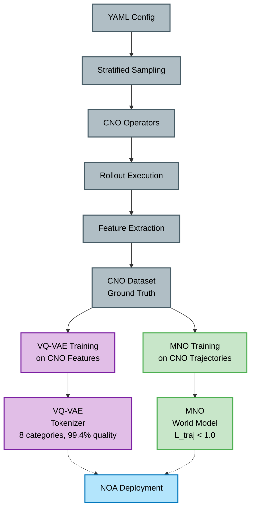

# Spinlock

**Foundation for Neural Operator Agent Research**

[](https://www.python.org/downloads/)
[](https://python-poetry.org/)
[](https://opensource.org/licenses/MIT)

Infrastructure for training **Meta-Neural Operators (MNO)** and **Neural Operator Agents (NOA)**—systems that learn statistical regularities across millions of dynamical systems to function as learned physics engines not bound to specific equations. The MNO learns autonomous spatiotemporal dynamics through diverse PDE training, while the NOA harnesses the MNO as a computational substrate for perturbation-driven exploration, episodic memory, and curiosity-based discovery of behavioral patterns.

**Name Origin:** The name draws from quantum field spinlocking—coherence emerging from chaotic fluctuations through spin alignment. Similarly, this system intends to discover order arising from apparent chaos by systematically exploring stochastic systems to uncover stable, reproducible patterns in high-dimensional parameter space.

---

## Table of Contents

- [🎯 What is Spinlock? (Target Architecture, WIP)](#-what-is-spinlock)
- [🔬 Design Philosophy: Bias-Minimizing Discovery](#-design-philosophy-bias-minimizing-discovery)
- [🧠 Neural Operator Agents (NOA)](#-neural-operator-agents-noa)
- [🏗️ Architecture](#️-architecture)
- [📊 Feature Families](#-feature-families)
- [🎛️ VQ-VAE Behavioral Tokenization](#️-vq-vae-behavioral-tokenization)
- [⚡ Quick Start](#-quick-start)
- [🚀 Installation](#-installation)
- [📚 Documentation](#-documentation)
- [🤝 Contributing](#-contributing)
- [📄 Citation](#-citation)
- [📜 License](#-license)

---

## 🎯 What's the Idea?

### Learned Physics Engines

The system is built around two distinct components: the **Meta-Neural Operator (MNO)**, a learned physics engine, and the **Neural Operator Agent (NOA)**, a higher-level cognitive architecture that harnesses the MNO for reasoning and exploration. The MNO forms the computational substrate—a U-AFNO neural operator trained on diverse PDE trajectories that learns statistical regularities across dynamical systems. The NOA operates over discrete behavioral tokens (VQ-VAE encoded) to enable symbolic reasoning, memory, and curiosity-driven discovery while using the MNO for precise physics execution.

**MNO: The Physics Engine**

When trained on thousands of distinct operators and deployed autonomously—driven by perturbations rather than explicit parameter conditioning—the MNO transitions from simulator to learned dynamical system. It no longer represents any specific PDE. Instead, it embodies statistical regularities extracted from its training distribution, functioning as **a learned physics engine not bound to specific equations**.

During training, the MNO learns P(u_t+1 | u_t) across the training ensemble. This implicit generative model captures characteristic timescales, typical relaxation dynamics, and behavioral patterns that recur across parameter space. The learned state space contains attractors corresponding not to specific parameter values, but to typical behavioral regimes—equilibrium patterns, oscillatory modes, chaotic mixing—averaged across thousands of systems.

**Autonomous operation under perturbation:**

The system evolves according to learned dynamics rather than prescribed equations. An impulse perturbation excites eigenmodes that decay or oscillate at characteristic timescales. Continuous video-frame perturbations create driven dynamics where internal relaxation balances external forcing. The observable trajectory represents the system's projection of arbitrary inputs onto its learned manifold of "dynamics-like" behavior.

Internal states represent high-dimensional reservoir dynamics encoding perturbation history, coordinates in a learned Koopman eigenfunction space, predictive distributions over likely continuations, and implicit belief states about "what kind of system this resembles."

**Learned distributions, not retrieval:**

Like a language model trained on text corpora, the MNO learns to generate continuations statistically typical of its training distribution. It does not retrieve memorized trajectories—it samples from learned patterns. Given a perturbation, it produces the most likely spatiotemporal response according to implicit priors: "what would a typical reaction-diffusion system do if forced this way?" This is both less and more than simulation: less physically accurate for any specific system, but more general across behavioral families.

**NOA: Harnessing the Physics Engine**

The NOA architecture layers symbolic reasoning capabilities atop the MNO physics engine. While the MNO executes continuous spatiotemporal dynamics, the NOA operates over discrete behavioral tokens extracted via VQ-VAE encoding. This dual-system architecture enables fast symbolic screening (token-based categorical reasoning) and precise verification (MNO trajectory execution). The NOA uses the MNO as its "mental simulator" for exploring hypothetical perturbations, building episodic memories of dynamical patterns, and developing curiosity signals from prediction error.

**Current implementation achieves this through CNO-trained components:**
- **Component 1:** Train VQ-VAE on CNO ground truth (50K samples) → discrete behavioral tokens (8 categories, 99.4% quality)
- **Component 2:** Train MNO on CNO ground truth (10K samples) → high-fidelity physics simulator (target: L_traj < 1.0)
- **Integration:** MNO serves as sparse world model for NOA perturbation-driven exploration, using CNO-trained VQ tokens for symbolic reasoning
- **Result:** Independent CNO-trained components (VQ-VAE + MNO) compose for NOA cognitive capabilities

**Research directions:** Autonomous systems that explore their own behavioral manifolds through perturbation-response loops, build episodic memories of dynamical patterns, develop curiosity signals from prediction error, and discover universal computational structures through self-directed experimentation.

### Multi-Domain Research Objectives

The architecture extends to multiple physics domains to test fundamental hypotheses about computational universality:

**Research Questions:**
1. Do behavioral categories discovered by domain-specific VQ-VAEs align across physics families?
2. Can token sequences from one domain transfer semantic meaning to another (e.g., "oscillatory" in chemistry vs fluids)?
3. Are there universal computational primitives that emerge across parabolic PDEs, hyperbolic equations, and other dynamical systems?
4. Can NOA trained on one domain generalize to others via symbolic transfer?

**Approach:**
- Train specialized MNOs for distinct physics families (reaction-diffusion, Navier-Stokes, wave equations)
- Extract domain-specific VQ-VAE tokenizers independently
- Analyze vocabulary alignment: Do categories correspond to equivalent behavioral regimes?
- Test cross-domain NOA: Does symbolic reasoning transfer where trajectory predictions fail?

**Current Status:** Single domain complete (reaction-diffusion). Multi-domain architecture is research objective, not implemented system.

---

## 🔬 Design Philosophy: Bias-Minimizing Discovery

Spinlock operates on a foundational principle: **discovering novel computational structures requires minimizing human-imposed semantic bias**. Rather than pre-defining behavioral categories or task-specific objectives, the system treats neural operator space as alien territory to be explored without preconceptions.

**Core Approach:**
- **Stratified sampling:** Sobol sequences with Owen scrambling provide provably optimal space-filling coverage (discrepancy <0.01), eliminating blind spots in high-dimensional parameter spaces
- **Data-driven features:** Multi-modal extraction (INITIAL, SUMMARY, TEMPORAL) captures comprehensive behavioral signatures without predetermined "interesting" features
- **Unsupervised tokenization:** VQ-VAE discovers discrete behavioral vocabularies through compression, learning categories from empirical data rather than human labels
- **Physics of change:** Study computational dynamics as a fundamental object, not task-specific optimization

This approach enables discovery of universal patterns, phase transitions, and emergent taxonomies that reflect the true geometry of operator behavior space—structures potentially alien to human intuition but fundamental to understanding computation as a physical process.

---

## 🧠 Neural Operator Agents (NOA)

Spinlock provides the infrastructure for building **Neural Operator Agents (NOA)**—hybrid neural operator systems with discrete VQ-VAE perceptual loss that learn to understand, generate, and reason about dynamical behaviors.

The NOA uses a **U-AFNO backbone** that operates directly in continuous function space, generating rollouts whose behavioral features are encoded into discrete tokens via a frozen VQ-VAE. This physics-native architecture enables self-consistent self-modeling and law discovery in the same function space as the dynamics being studied.

**Key Innovations**:
- **Physics-native backbone:** U-AFNO neural operator (not transformer on tokens) operating in continuous function space
- **Discrete perceptual loss:** VQ-VAE encodes NOA rollouts → behavioral tokens for loss computation
- **Topological encoding:** Parameter-space distance (not chronological time) enables reasoning about functional similarity

### The NOA Vision: From Data to Systematic Discovery

**Phase 0: Foundation** 
- Stratified neural operator datasets with diverse parameter coverage
- Multi-modal feature extraction (INITIAL, ARCHITECTURE, SUMMARY, TEMPORAL)
- Data-driven behavioral taxonomy via hierarchical clustering

**Phase 1: MNO Training (Meta-Neural Operator)** (🔄 In Progress - Independent Optimization)

The **Meta-Neural Operator (MNO)** is a neural network that learns to predict dynamics across an entire family of operators. Unlike a standard neural operator that learns a single PDE or system, the MNO learns a *meta-mapping* from operator parameters θ (architecture, coefficients) to their forward dynamics. Given any (θ, u₀) pair, it predicts the full rollout trajectory—essentially learning "what any operator in this family will do."

Why "meta"? It operates one level above individual operators, learning the relationship between operator structure and behavior across thousands of distinct systems.

- U-AFNO backbone (226M parameters) with pure MSE training
- Trains the **MNO**: pure physics simulator (no agency, no reasoning)
- Later phases build **NOA** (Neural Operator Agent) on top of MNO + tokens
- **Two Independent Components (CNO-trained)**:

  | Component | Input | Objective | Output |
  |-----------|-------|-----------|--------|
  | **VQ-VAE Tokenizer** | CNO ground truth (50K) | L_recon + L_commit | Discrete behavioral vocabulary (8 categories) |
  | **MNO World Model** | CNO ground truth (10K) | L_traj only (pure MSE) | High-fidelity physics simulator (L_traj < 1.0) |

- **Philosophy**: Train both components on ground truth CNO data independently, then compose for NOA.
- **VQ-VAE**: Trained on CNO features → discrete symbolic representation (99.4% reconstruction quality)
- **MNO**: Trained on CNO trajectories → sparse high-accuracy world model for exploration
- **Assumption**: If MNO achieves L_traj < 1.0, its outputs are distributionally similar to CNO
- **Validation**: Verify VQ reconstruction quality on MNO outputs post-training
- **Truncated BPTT**: Long-horizon training (256-step rollouts, 32-step backprop window)
- **Training flow**: VQ-VAE (on CNO) + MNO (on CNO) → Foundation for NOA agent

**Two-Component Rationale**: Training both components independently on CNO ground truth provides:
1. **Simplicity**: No sequential dependency (VQ-VAE doesn't wait for MNO)
2. **Modularity**: Each component validated independently on CNO
3. **Efficiency**: No need to generate 100K+ MNO rollouts for VQ training
4. **Parallelism**: VQ-VAE and MNO can be trained simultaneously
5. **Validation**: If MNO achieves L_traj < 1.0, CNO-trained VQ should work on MNO outputs

See [CNO-Trained Architecture](docs/noa-architecture.md) for complete implementation details and [Two-Stage Curriculum (Deprecated)](docs/two-stage-curriculum-architecture.md) for the old approach.

---
### Future Extensions
**Multi-Observation Context**
- Lightweight transformer/recurrent heads on VQ token sequences
- Capture higher-order dependencies and temporal correlations
- In-context learning of operator physics through attention mechanisms

**Curiosity-Driven Exploration**
- Adaptive refinement: Agent identifies high-variance regimes (prediction error/surprise) and autonomously re-parameterizes sampling
- World model uncertainty: Track which regions of operator space are poorly understood
- Directed discovery: Use prediction error as curiosity signal to guide exploration toward behavioral frontiers
- Validation: Does curiosity-driven sampling discover fundamentally new behavioral categories?

**Transparent Self-Modeling**
- Self-model learning: Agent develops interpretable internal model of its own behavioral prediction process
- Calibration validation: Measure alignment between what the agent predicts about itself vs. actual performance
- Distributional shift detection: Self-model enables identifying when the agent encounters truly novel operator regimes
- Transparency requirement: Self-models must be inspectable—understand what the system "believes" about its own capabilities

**Systematic Discovery of Computational Laws**
- Hypothesis generation: Identify potential universal patterns in operator behavior 
- Rigorous testing: Validate hypotheses through directed sampling and statistical analysis
- Symbolic regression: Distill discovered patterns into interpretable mathematical relationships
- Falsifiability: Every discovered "law" must be testable and potentially refutable

**Complete Training Workflow:**
```bash
# Component 1: Train VQ-VAE on CNO ground truth
spinlock train-vqvae \
    --config configs/vqvae/50k_baseline.yaml \
    --verbose

# Component 2: Train MNO on CNO ground truth
spinlock train-meta-operator \
    --config configs/noa/10k_baseline.yaml \
    --verbose

# Validation: Verify VQ reconstruction on MNO outputs (post-training)
# Generate MNO rollouts and tokenize with CNO-trained VQ-VAE
# Check reconstruction error remains ~0.006
```

**Configuration:** Edit YAML configs to adjust:
- Model capacity (`base_channels: 32-48` for 144M-226M params)
- Training scale (`n_samples`, `batch_size`, `epochs`)
- Feature generation (`n_samples` for NOA rollouts)
- BPTT parameters (`timesteps`, `bptt_window`)

See [docs/architecture.md](docs/architecture.md) for system overview and [docs/noa-architecture.md](docs/noa-architecture.md) for CNO-trained architecture guide. For the old 3-stage approach, see [docs/noa-vqvae-independent.md](docs/noa-vqvae-independent.md) (deprecated). For the two-stage curriculum approach, see [docs/two-stage-curriculum-architecture.md](docs/two-stage-curriculum-architecture.md) (deprecated).

---

## 🏗️ Architecture

Spinlock implements an end-to-end pipeline from dataset generation through meta-operator training:


```mermaid
flowchart TB
    Config[YAML Config] --> Sampling[Stratified Sampling]
    Sampling --> CNOs[CNO Operators]
    CNOs --> Rollouts[Rollout Execution]
    Rollouts --> Extract[Feature Extraction]
    Extract --> CNOData[CNO Dataset<br/>Ground Truth]

    CNOData --> VQTrain[VQ-VAE Training<br/>on CNO Features]
    VQTrain --> VQVAEModel[VQ-VAE<br/>Tokenizer<br/>8 categories, 99.4% quality]

    CNOData --> MNOTrain[MNO Training<br/>on CNO Trajectories]
    MNOTrain --> MNOModel[MNO<br/>World Model<br/>L_traj < 1.0]

    VQVAEModel -.-> Deployment[NOA Deployment]
    MNOModel -.-> Deployment

    classDef phase0 fill:#b0bec5,stroke:#455a64,stroke-width:2px,color:#000
    classDef vqvae fill:#e1bee7,stroke:#7b1fa2,stroke-width:2px,color:#000
    classDef mno fill:#c8e6c9,stroke:#4caf50,stroke-width:2px,color:#000
    classDef deployment fill:#b3e5fc,stroke:#0277bd,stroke-width:2px,color:#000

    class Config,Sampling,CNOs,Rollouts,Extract,CNOData phase0
    class VQTrain,VQVAEModel vqvae
    class MNOTrain,MNOModel mno
    class Deployment deployment
```

### Pipeline Overview

**Phase 0: Foundation - CNO Dataset Generation** (blue-grey)
1. Stratified parameter sampling via Sobol sequences (provably optimal space-filling)
2. CNO operator construction and stochastic rollout execution (256 steps)
3. Multi-modal feature extraction (INITIAL, SUMMARY, TEMPORAL)
4. CNO dataset establishing ground truth physics (50K samples for VQ-VAE, 10K for MNO)

**Component 1: VQ-VAE Tokenizer Training** (purple)
- Train VQ-VAE on CNO ground truth features (50K samples)
- Loss: L_recon + L_commit (no physics loss)
- Auto-category discovery via per-family clustering
- Target: L_recon < 0.05 (achieved 0.006 in 50K baseline)
- Output: Frozen discrete tokenizer (8 categories, 22 tokens/sample)

**Component 2: MNO World Model Training** (green)
- Train MNO on CNO ground truth trajectories (10K samples)
- Loss: L_traj + L_ic (pure MSE, no VQ constraints)
- Architecture: U-AFNO with FiLM conditioning (227M params)
- Target: L_traj < 1.0 (RMSE < field variation)
- Output: High-fidelity physics simulator for NOA exploration

**Integration: NOA Deployment** (blue)
- MNO generates rollouts via perturbation-driven exploration
- VQ-VAE tokenizes MNO outputs → discrete sequences
- NOA reasons over tokens (symbolic layer)
- CNO available for validation and surprisal-driven refinement

**Two-Component Rationale**: Training both components independently on CNO ground truth provides:
1. **Simplicity**: No sequential dependency (VQ-VAE doesn't wait for MNO)
2. **Modularity**: Each component validated independently on CNO
3. **Efficiency**: No need to generate 100K+ MNO rollouts for VQ training
4. **Parallelism**: VQ-VAE and MNO can be trained simultaneously
5. **Validation**: If MNO achieves L_traj < 1.0, CNO-trained VQ should work on MNO outputs

See [CNO-Trained Architecture](docs/noa-architecture.md) for complete implementation details.

### Key Components

- **Stratified Sampling**: Sobol sequences with Owen scrambling for uniform parameter space coverage
- **Multi-Modal Features**: INITIAL (16D), SUMMARY (18D), TEMPORAL (variable)
- **VQ-VAE Tokenization**: Automatic category discovery, hierarchical 3-level encoding, adaptive compression
- **CNO-Trained Components**: VQ-VAE and MNO both train independently on CNO ground truth
- **CLI Commands**: `spinlock generate`, `spinlock train-meta-operator`, `spinlock train-vqvae`

See [docs/architecture.md](docs/architecture.md) for comprehensive system design and [docs/noa-architecture.md](docs/noa-architecture.md) for CNO-trained components.

---

## 📊 Feature Families

Spinlock extracts **4 complementary feature families** that jointly capture neural operator behavior from different perspectives:

| Family | Captures | Granularity |
|--------|----------|-------------|
| **INITIAL** | Initial condition characteristics (spatial, spectral, information, morphology) | Per-realization |
| **ARCHITECTURE** | Operator parameters (architecture, stochastic, evolution) | Per-operator |
| **SUMMARY** | Aggregated behavioral statistics (spatial, spectral, temporal, causality) | Per-rollout (aggregated across timesteps and realizations) |
| **TEMPORAL** | Full temporal trajectories preserving time-series structure | Per-timestep |

### Joint Training

The VQ-VAE jointly trains on all 4 families simultaneously, learning unified representations that span:
- **INITIAL**: How initial conditions influence operator dynamics
- **ARCHITECTURE**: How architectural choices determine behavioral regimes
- **SUMMARY**: Statistical signatures of emergent patterns
- **TEMPORAL**: Temporal evolution and regime transitions

This multi-modal training enables the model to discover behavioral categories that integrate structural, dynamical, and temporal characteristics—essential for NOA systems that reason about operator behavior.

See [docs/features/](docs/features/) for detailed feature definitions and extraction methods.

---

## 🎛️ VQ-VAE Behavioral Tokenization

The VQ-VAE pipeline transforms continuous behavioral features into discrete tokens—a compositional vocabulary for describing neural operator dynamics.

### Why "Categories"?

The term **categories** for the top-level groupings produced by orthogonality-weighted clustering is deliberate. These are not mere statistical clusters but conceptual primitives through which continuous dynamical behavior is coarse-grained into interpretable structure.

| Term | Why Not | Categories Are Different |
|------|---------|--------------------------|
| **Clusters** | Too neutral—implies data density, not conceptual primacy | Categories are the basic "kinds" of behavior, not density modes |
| **Modes** | Suggests spectral/vibrational modes (overlaps with AFNO terminology) | Categories are perceptual, not physical |
| **Prototypes** | Feels exemplar-based (like k-means centers) | Categories are hierarchical lenses, not single points |
| **Factors** | Evokes latent variables without hierarchical structure | Categories have multi-level refinement |

**Philosophical grounding:** Categories function as fundamental ways of understanding emergent behavior—akin to Aristotelian/Kantian categories that structure perception of reality. In the NOA's "mind," categories are perceptual building blocks: the agent "sees" the world through these coarse filters first (top-level codebooks), then refines within them (lower levels). The orthogonality weighting explicitly encourages independence, reinforcing their role as distinct, non-overlapping modes of interpretation.

**Long-term vision:** These categories are seeds of an emergent "language of computation" that NOA may use for reasoning and discovery—the first step in turning continuous physics into symbolic thought.

📖 **See also:** [docs/baselines/50k-vqvae-baseline.md](docs/baselines/50k-vqvae-baseline.md) for the full terminology discussion and current production baseline.

### Production Baseline: 50K v3.1 with Per-Family Clustering

Our current baseline achieves **97.3% reconstruction quality** with **20.5% codebook utilization** on 50,000 CNO samples:

| Metric | Value |
|--------|-------|
| Val Loss | **0.049** |
| Reconstruction Error | **0.027** (97.3% quality) |
| Codebook Utilization | **20.5%** (98/477 codes) |
| Topographic Similarity (Post) | **1.000** (perfect) |
| Topographic Similarity (Pre) | **0.986** (excellent) |
| Input Features | 142 (14 initial + 128 temporal v3.1) |
| Categories Discovered | **8** (per-family clustering) |
| Hierarchical Levels | 2 (initial) or 3 (temporal) per category |
| Total Tokens/Sample | **22** (4 initial + 18 temporal) |
| Combinatorial Capacity | **~2.2 billion** distinct sequences |

**Key design choices:**
- **Per-family clustering**: Initial and temporal features clustered independently to discover semantic subcategories within each family (2 initial + 6 temporal categories)
- **Enhanced v3.1 temporal features**: Spectral analysis, local dynamics, wavelet transforms (128D)
- **Adaptive compression ratios**: Auto-determined per category using balanced strategy
- **Entropy regularization**: Encourages uniform codebook usage (reformulated as positive loss: log(K) - entropy)
- **Low commitment cost** (0.05): Allows encoder exploration of full codebook
- **High dropout** (0.3): Robustness and forces backup code usage

### Visualization Dashboards

```bash
# Generate all three dashboards
poetry run spinlock visualize-vqvae \
    --checkpoint checkpoints/vqvae/50k_baseline/ \
    --output visualizations/ \
    --type all
```

| Dashboard | Purpose |
|-----------|---------|
| **Engineering** | Training curves, utilization heatmap, architecture schematic |
| **Topological** | t-SNE codebook embeddings, inter-codebook similarity |
| **Semantic** | Feature→category mapping, category sizes, correlation |

📖 **Detailed documentation:** [docs/baselines/50k-vqvae-baseline.md](docs/baselines/50k-vqvae-baseline.md)

---

## ⚡ Quick Start

### Generate Operator Dataset

```bash
# Generate with default fast configuration (v1.0-v2.0 features, 64×64, T=256, M=5)
poetry run spinlock generate \
    --config configs/experiments/baseline_10k.yaml

# Or with all v2.1 features enabled (slower, more comprehensive)
# Add to config YAML:
# features:
#   summary:
#     distributional: {enabled: true}
#     structural: {enabled: true}
#     physics: {enabled: true}
#     morphological: {enabled: true}
```

### Inspect Dataset

```bash
poetry run spinlock inspect datasets/my_operators.h5
```

### Visualize Operator Dynamics

Generate videos showing temporal evolution of operators with aggregate views (PCA, variance, mean):

```bash
# Visualize convex operators (more dynamic, amoeba-like behavior)
poetry run spinlock visualize-dataset \
    --dataset datasets/100k_full_features.h5 \
    --output visualizations/convex_operators.mp4 \
    --evolution-policy convex \
    --sampling-method diverse \
    --aggregates pca variance mean
```


*Convex evolution policy produces sustained, morphing dynamics. Each row is an operator; columns show realizations and aggregate statistics (PCA modes as RGB, variance map, mean field).*

### Train VQ-VAE Tokenizer

```bash
# Train on full dataset with ARCHITECTURE + SUMMARY features
poetry run spinlock train-vqvae \
    --config configs/vqvae/production/10k_arch_summary_400epochs.yaml \
    --verbose

# Or train on validation dataset (1K samples) for testing
poetry run spinlock train-vqvae \
    --config configs/vqvae/validation/1k_arch_summary.yaml \
    --verbose
```

### Extract Behavioral Tokens

```python
import torch
import yaml
from pathlib import Path
from spinlock.encoding import CategoricalHierarchicalVQVAE, CategoricalVQVAEConfig

# Load VQ-VAE configuration
with open("checkpoints/vqvae/config.yaml") as f:
    config_dict = yaml.safe_load(f)

# Construct model from config
config = CategoricalVQVAEConfig(**config_dict["model"])
model = CategoricalHierarchicalVQVAE(config)

# Load trained weights
checkpoint = torch.load("checkpoints/vqvae/best_model.pt")
model.load_state_dict(checkpoint["model_state_dict"])
model.eval()

# Extract behavioral tokens from new operators
with torch.no_grad():
    # features: [N, D] tensor of operator features
    tokens = model.get_tokens(features)  # [N, num_categories * num_levels]
```

See [docs/getting-started.md](docs/getting-started.md) for tutorials and examples.

---

## 🚀 Installation

**Requirements:** Python 3.11+, CUDA 11.8+ (for GPU acceleration)

```bash
git clone https://github.com/yourusername/spinlock.git
cd spinlock
poetry install
```

**Docker:** See [docs/installation.md#docker](docs/installation.md#docker)

**From Source:** See [docs/installation.md#source](docs/installation.md#source)

For detailed installation instructions, platform-specific guides, and troubleshooting, see [docs/installation.md](docs/installation.md).

---

## 📚 Documentation

- [**NOA Roadmap**](docs/noa-roadmap.md) - 5-phase development plan for Neural Operator Agents
- [**Architecture**](docs/architecture.md) - Detailed system design and implementation
- [**Independent Optimization Guide**](docs/noa-vqvae-independent.md) - **Recommended approach:** Complete guide for 3-stage independent training. Stage 1: High fidelity physics baseline (pure MSE, L_traj < 1.0). Stage 2: Generate 100K+ NOA rollout features. Stage 3: Train VQ-VAE on NOA's distribution (alignment by construction). Includes implementation details, hyperparameters, troubleshooting, and performance benchmarks. Achieves optimal physics + optimal tokenization without competing gradients.
- [**NOA Training Guide**](docs/noa-training-guide.md) - Training configuration, loss functions, checkpointing, and troubleshooting
- [**Two-Stage Curriculum (Deprecated)**](docs/two-stage-curriculum-architecture.md) - Alternative approach with token-conditioned training (Stage 1) and VQ-led fine-tuning (Stage 2). Deprecated due to competing gradients between L_traj and L_recon causing equilibrium plateaus at batch 500 where neither objective optimizes fully. Empirical analysis shows NOA learns "VQ-friendly" dynamics at cost of physics accuracy. See independent optimization for superior approach.
- [**Feature Families**](docs/features/README.md) - INITIAL, ARCHITECTURE, SUMMARY, TEMPORAL feature definitions and extraction
- [**HDF5 Layout**](docs/features/hdf5-layout.md) - Dataset schema reference for VQ-VAE pipeline
- [**Baselines**](docs/baselines/README.md) - Production datasets and VQ-VAE tokenizers
  - [50K VQ-VAE Baseline](docs/baselines/50k-vqvae-baseline.md) - **CURRENT:** Per-family clustering tokenizer (val_loss: 0.049, L_recon: 0.027, utilization: 20.5%, topo: 1.000)
  - [100K Dataset](docs/baselines/100k-full-features-dataset.md) - 100K operators with INITIAL+SUMMARY+TEMPORAL+ARCHITECTURE features
  - [100K VQ-VAE](docs/baselines/100k-full-features-vqvae.md) - Prior baseline tokenizer (val_loss: 0.172, quality: 0.95, utilization: 67%)
- [**Getting Started**](docs/getting-started.md) - Tutorials and end-to-end examples
- [**Installation**](docs/installation.md) - Platform-specific installation guides

---

## 🔮 Future Directions

### Multi-Agent Token Communication

The independent optimization architecture enables a critical capability for collaborative discovery: **discrete symbolic communication between agents**. By operating over shared VQ-VAE token vocabularies, multiple NOA instances can engage in compositional reasoning, emergent communication protocols, and collaborative parameter space exploration.

**Key insight:** The independent optimization architecture naturally enables both symbolic and physics-accurate reasoning:

| VQ-VAE Tokens (System 1) | NOA Rollouts (System 2) |
|--------------------------|------------------------|
| Fast symbolic reasoning | Precise physics execution |
| Token-based communication | Continuous trajectories |
| Collaborative exploration | Ground-truth verification |
| Categorical classification | Quantitative prediction |

**Example workflow:**
```python
# Agent A: Fast symbolic screening
for theta in search_space:
    rollout = noa(theta, u0)
    features = extract_features(rollout, u0)
    tokens = vqvae.encode(features)
    if tokens match TARGET_CATEGORY:
        send_message(agent_b, tokens, theta)

# Agent B: Precise verification
for (tokens, theta) in messages:
    trajectory = noa(theta, u0)
    evaluate_exact_metrics(trajectory)
```

**Research directions:**
- Emergent compositional communication protocols
- Hierarchical multi-resolution discourse (L0/L1/L2 tokens)
- Token-based theory of mind
- Cross-domain behavioral transfer via shared vocabulary

📖 **Full documentation:** [docs/future/multiagent-token-communication.md](docs/future/multiagent-token-communication.md)

### Domain Modularity and Transfer

The architecture enables systematic testing of computational universals through modular domain integration:

**Specialized MNOs per Domain:**
- **Reaction-Diffusion MNO** (current): U-AFNO on parabolic PDEs, 226M params
- **Fluid Dynamics MNO** (planned): Navier-Stokes, possibly vector-valued variant
- **Wave Equation MNO** (future): Hyperbolic PDEs, different architectural requirements
- **Quantum MNO** (speculative): Complex-valued fields, fundamentally different structure

**Domain-Specific Tokenization:**
Each MNO paired with VQ-VAE trained on its distribution:
- VQ-VAE-RD: 10 categories from reaction-diffusion behaviors
- VQ-VAE-Fluids: Categories for turbulence, vortex dynamics, flow regimes
- VQ-VAE-Waves: Categories for propagation, interference, dispersion

**Cross-Domain Discovery:**
NOA operates over all vocabularies simultaneously:
- **Hypothesis:** If categories align, computational universals exist
- **Test:** Train NOA on Domain A tokens, evaluate on Domain B
- **Metric:** Cross-domain transfer accuracy, vocabulary correlation
- **Outcome:** Either discover universals or identify domain boundaries

**Why This Matters:**
If behavioral tokens transfer across domains, it suggests substrate-independent computational structures—patterns that emerge from the mathematics of spatiotemporal evolution regardless of specific equations. This would represent discovered physics rather than derived physics.

---

## 🤝 Contributing

Contributions are welcome! Please see our contributing guidelines for:
- Code style and formatting
- Testing requirements
- Pull request process

For bugs and feature requests, please open an issue on GitHub.

---

## 📄 Citation

If you use Spinlock in your research, please cite:

```bibtex
@software{spinlock2026,
  title = {Spinlock: Foundation for Neural Operator Agent Research},
  author = {Your Name},
  year = {2026},
  url = {https://github.com/yourusername/spinlock}
}
```

---

## 📜 License

This project is licensed under the MIT License - see the [LICENSE](LICENSE) file for details.

---

## Acknowledgments

Built with:
- [PyTorch](https://pytorch.org/) - Deep learning framework
- [Poetry](https://python-poetry.org/) - Dependency management
- [HDF5](https://www.hdfgroup.org/solutions/hdf5/) - Efficient data storage

Spinlock is part of ongoing research into meta-cognitive neural operator systems and autonomous scientific discovery.
