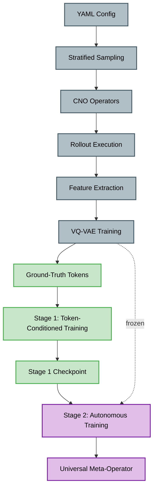

# Spinlock

**Foundation for Neural Operator Agent Research**

[](https://www.python.org/downloads/)
[](https://python-poetry.org/)
[](https://opensource.org/licenses/MIT)

Pre-training infrastructure for **Neural Operator Agents (NOA)**—foundation models that learn to predict, classify, and reason about dynamical system behaviors. Generate large-scale operator datasets, extract multi-modal behavioral features, and train VQ-VAE tokenizers for downstream scientific ML applications.

---

## Table of Contents

- [🎯 What is Spinlock?](#-what-is-spinlock)
- [🔬 Design Philosophy: Bias-Minimizing Discovery](#-design-philosophy-bias-minimizing-discovery)
- [🧠 Neural Operator Agents (NOA)](#-neural-operator-agents-noa)
- [🏗️ Architecture](#️-architecture)
- [📊 Feature Families](#-feature-families)
- [🎛️ VQ-VAE Behavioral Tokenization](#️-vq-vae-behavioral-tokenization)
- [⚡ Quick Start](#-quick-start)
- [🚀 Installation](#-installation)
- [📚 Documentation](#-documentation)
- [🤝 Contributing](#-contributing)
- [📄 Citation](#-citation)
- [📜 License](#-license)

---

## 🎯 What is Spinlock?

Spinlock provides infrastructure for training **Neural Operator Agents (NOA)**—foundation models that learn to predict, classify, and reason about dynamical system behaviors across diverse parameter regimes. Rather than studying individual operators in isolation, the system learns meta-operators by treating operator parameter space and initial conditions as structured domains for systematic exploration and discovery.

### Foundation Models for Dynamical Systems

The system enables pre-training on diverse dynamical behaviors for downstream application across physics, metaphysics, biochemistry, and engineering—analogous to language model pre-training on text corpora. The current implementation demonstrates this approach through a two-stage curriculum that trains meta-operators on 100K+ neural operator trajectories.

**Current Implementation:**
- **Data:** 100K+ stratified operator trajectories with provably optimal parameter space coverage
- **Features:** Multi-modal behavioral descriptors (INITIAL, SUMMARY, TEMPORAL)
- **Tokenization:** Discovers 10 behavioral categories and applies hierarchical VQ-VAE with 3-level codebooks
- **Meta-Operator:** U-AFNO backbone (144-226M params) trained via two-stage curriculum:
  - Stage 1: Token-conditioned physics learning (MSE-led)
  - Stage 2: Autonomous VQ-compatible rollout generation (VQ-led)

**Research Directions:**

*Dynamical Systems:*
- Surrogate modeling for accelerated simulation
- Anomaly detection in real-time sensor data
- Transfer learning to domain-specific PDEs
- Discovery of universal patterns in computational physics

*Cognitive Capabilities:*
- Meta-learning from dynamics: few-shot adaptation via abstract behavioral principles
- Compositional reasoning: predict emergent behaviors from component interactions
- Working memory: temporal state maintenance and transformation
- Episodic encoding: consolidation and retrieval of dynamical event sequences
- Cross-domain abstraction: domain-invariant behavioral patterns

---

## 🔬 Design Philosophy: Bias-Minimizing Discovery

Spinlock operates on a foundational principle: **discovering novel computational structures requires minimizing human-imposed semantic bias**. Rather than pre-defining behavioral categories or task-specific objectives, the system treats neural operator space as alien territory to be explored without preconceptions.

**Core Approach:**
- **Stratified sampling:** Sobol sequences with Owen scrambling provide provably optimal space-filling coverage (discrepancy <0.01), eliminating blind spots in high-dimensional parameter spaces
- **Data-driven features:** Multi-modal extraction (INITIAL, SUMMARY, TEMPORAL) captures comprehensive behavioral signatures without predetermined "interesting" features
- **Unsupervised tokenization:** VQ-VAE discovers discrete behavioral vocabularies through compression, learning categories from empirical data rather than human labels
- **Physics of change:** Study computational dynamics as a fundamental object, not task-specific optimization

This approach enables discovery of universal patterns, phase transitions, and emergent taxonomies that reflect the true geometry of operator behavior space—structures potentially alien to human intuition but fundamental to understanding computation as a physical process.

**Name Origin:** The name draws from quantum field spinlocking—coherence emerging from chaotic fluctuations through spin alignment. Similarly, this system discovers order arising from apparent chaos by systematically exploring stochastic neural operator behaviors to uncover stable, reproducible patterns in high-dimensional parameter space.

---

## 🧠 Neural Operator Agents (NOA)

Spinlock provides the infrastructure for building **Neural Operator Agents (NOA)**—hybrid neural operator systems with discrete VQ-VAE perceptual loss that learn to understand, generate, and reason about dynamical behaviors.

The NOA uses a **U-AFNO backbone** that operates directly in continuous function space, generating rollouts whose behavioral features are encoded into discrete tokens via a frozen VQ-VAE. This physics-native architecture enables self-consistent self-modeling and law discovery in the same function space as the dynamics being studied.

**Key Innovations**:
- **Physics-native backbone:** U-AFNO neural operator (not transformer on tokens) operating in continuous function space
- **Discrete perceptual loss:** VQ-VAE encodes NOA rollouts → behavioral tokens for loss computation
- **Topological encoding:** Parameter-space distance (not chronological time) enables reasoning about functional similarity

### The NOA Vision: From Data to Systematic Discovery

**Phase 0: Foundation** 
- Stratified neural operator datasets with diverse parameter coverage
- Multi-modal feature extraction (INITIAL, ARCHITECTURE, SUMMARY, TEMPORAL)
- Data-driven behavioral taxonomy via hierarchical clustering

**Phase 1: Meta-Operator Training** (🔄 In Progress - Two-Stage Curriculum)
- U-AFNO backbone (144-226M parameters) with token conditioning support
- **Two-Stage Curriculum Training**:

  | Stage | Input | Loss | Goal |
  |-------|-------|------|------|
  | **1: MSE-Led** | (u₀, θ) + ground-truth tokens | L_traj (pure MSE vs CNO) | Learn physics with token scaffolding |
  | **2: VQ-Led** | (u₀, θ) only | L_recon + L_commit + 0.3·L_traj | Autonomous VQ-compatible rollouts |

- **Stage 1**: Token conditioning provides behavioral hints; model learns physics with discrete scaffolding
- **Stage 2**: Remove tokens; fine-tune for autonomous operation with VQ alignment as primary objective
- **Truncated BPTT**: Long-horizon training (256-step rollouts, 32-step backprop window)
- **Training flow**: VQ-VAE → ground-truth tokens → Stage 1 → Stage 2

**Phase 2: Multi-Observation Context** (📋 Planned)
- Lightweight transformer/recurrent heads on VQ token sequences
- Capture higher-order dependencies and temporal correlations
- In-context learning of operator physics through attention mechanisms

**Phase 3: Curiosity-Driven Exploration** (📋 Planned)
- Adaptive refinement: Agent identifies high-variance regimes (prediction error/surprise) and autonomously re-parameterizes sampling
- World model uncertainty: Track which regions of operator space are poorly understood
- Directed discovery: Use prediction error as curiosity signal to guide exploration toward behavioral frontiers
- Validation: Does curiosity-driven sampling discover fundamentally new behavioral categories?

**Phase 4: Transparent Self-Modeling** (📋 Planned)
- Self-model learning: Agent develops interpretable internal model of its own behavioral prediction process
- Calibration validation: Measure alignment between what the agent predicts about itself vs. actual performance
- Distributional shift detection: Self-model enables identifying when the agent encounters truly novel operator regimes
- Transparency requirement: Self-models must be inspectable—understand what the system "believes" about its own capabilities

**Phase 5: Systematic Discovery of Computational Laws** (📋 Planned)
- Hypothesis generation: Identify potential universal patterns in operator behavior (e.g., "operators with high spatial gradients exhibit turbulent temporal dynamics")
- Rigorous testing: Validate hypotheses through directed sampling and statistical analysis
- Symbolic regression: Distill discovered patterns into interpretable mathematical relationships
- Falsifiability: Every discovered "law" must be testable and potentially refutable

**Current Status:** Phase 0 complete, Phase 1 Stage 1 training in progress

**Complete Training Workflow:**
```bash
# Step 1: Train VQ-VAE on trajectory features
spinlock train-vqvae --config configs/vqvae/production_100k_3family.yaml

# Step 2: Generate ground-truth tokens for training dataset
spinlock compute-ground-truth-tokens \
    --dataset datasets/100k_full_features.h5 \
    --cno-config configs/experiments/local_100k_optimized.yaml \
    --vqvae-checkpoint checkpoints/production/100k_3family_v1/best_model.pt \
    --output datasets/100k_ground_truth_tokens.h5

# Step 3: Stage 1 training (MSE-led with token conditioning)
spinlock train-meta-operator \
    --config configs/noa/experiments/phase2/exp2f_256step_tbptt.yaml

# Step 4: Stage 2 training (VQ-led autonomous)
spinlock train-meta-operator \
    --config configs/noa/experiments/phase2/exp2g_stage2_vqled.yaml
```

**Configuration:** Edit YAML configs to adjust:
- Model capacity (`base_channels: 32-48` for 144M-226M params)
- Training scale (`n_samples`, `batch_size`, `epochs`)
- Loss weights (`lambda_recon`, `lambda_commit`, `lambda_traj`)
- BPTT parameters (`timesteps`, `bptt_window`)

See [docs/architecture.md](docs/architecture.md) for system overview and [docs/two-stage-curriculum-architecture.md](docs/two-stage-curriculum-architecture.md) for training details.

---

## 🏗️ Architecture

Spinlock implements an end-to-end pipeline from dataset generation through meta-operator training:


```mermaid
flowchart TB
    Config[YAML Config] --> Sampling[Stratified Sampling]
    Sampling --> CNOs[CNO Operators]
    CNOs --> Rollouts[Rollout Execution]
    Rollouts --> Extract[Feature Extraction]
    Extract --> VQVAE[VQ-VAE Training]

    VQVAE --> GTTokens[Ground-Truth Tokens]
    GTTokens --> Stage1[Stage 1: Token-Conditioned Training]
    Stage1 --> Checkpoint[Stage 1 Checkpoint]

    Checkpoint --> Stage2[Stage 2: Autonomous Training]
    VQVAE -.->|frozen| Stage2
    Stage2 --> Final[Universal Meta-Operator]

    classDef phase1 fill:#b0bec5,stroke:#455a64,stroke-width:2px,color:#000
    classDef phase2stage1 fill:#c8e6c9,stroke:#4caf50,stroke-width:2px,color:#000
    classDef phase2stage2 fill:#e1bee7,stroke:#7b1fa2,stroke-width:2px,color:#000

    class Config,Sampling,CNOs,Rollouts,Extract,VQVAE phase1
    class GTTokens,Stage1,Checkpoint phase2stage1
    class Stage2,Final phase2stage2
```

### Pipeline Overview

**Dataset Generation & Feature Learning** (blue-grey)
1. Stratified parameter sampling via Sobol sequences
2. CNO operator construction and stochastic rollout execution
3. Multi-modal feature extraction (INITIAL, SUMMARY, TEMPORAL)
4. Hierarchical VQ-VAE training for behavioral tokenization

**Stage 1: MSE-Led Training** (green)
- Generate ground-truth VQ tokens from CNO rollouts
- Train NOA with token conditioning for physics accuracy
- Loss: Pure MSE against CNO trajectories
- Output: Token-aware internal representations

**Stage 2: VQ-Led Training** (purple)
- Initialize from Stage 1 checkpoint
- Remove token conditioning (autonomous operation)
- Loss: VQ reconstruction + commitment (primary) + physics regularization
- Output: Universal meta-operator generating VQ-compatible rollouts

### Key Components

- **Stratified Sampling**: Sobol sequences with Owen scrambling for uniform parameter space coverage
- **Multi-Modal Features**: INITIAL (42D), ARCHITECTURE (21D), SUMMARY (420-520D), TEMPORAL (variable)
- **VQ-VAE Tokenization**: Automatic category discovery, hierarchical 3-level encoding, adaptive compression
- **Meta-Operator Training**: Two-stage curriculum (token-conditioned → autonomous)
- **CLI Commands**: `spinlock generate`, `spinlock train-vqvae`, `spinlock compute-ground-truth-tokens`, `spinlock train-meta-operator`

See [docs/architecture.md](docs/architecture.md) for comprehensive system design and implementation details.

---

## 📊 Feature Families

Spinlock extracts **4 complementary feature families** that jointly capture neural operator behavior from different perspectives:

| Family | Captures | Granularity |
|--------|----------|-------------|
| **INITIAL** | Initial condition characteristics (spatial, spectral, information, morphology) | Per-realization |
| **ARCHITECTURE** | Operator parameters (architecture, stochastic, evolution) | Per-operator |
| **SUMMARY** | Aggregated behavioral statistics (spatial, spectral, temporal, causality) | Per-rollout (aggregated across timesteps and realizations) |
| **TEMPORAL** | Full temporal trajectories preserving time-series structure | Per-timestep |

### Joint Training

The VQ-VAE jointly trains on all 4 families simultaneously, learning unified representations that span:
- **INITIAL**: How initial conditions influence operator dynamics
- **ARCHITECTURE**: How architectural choices determine behavioral regimes
- **SUMMARY**: Statistical signatures of emergent patterns
- **TEMPORAL**: Temporal evolution and regime transitions

This multi-modal training enables the model to discover behavioral categories that integrate structural, dynamical, and temporal characteristics—essential for NOA systems that reason about operator behavior.

See [docs/features/](docs/features/) for detailed feature definitions and extraction methods.

---

## 🎛️ VQ-VAE Behavioral Tokenization

The VQ-VAE pipeline transforms continuous behavioral features into discrete tokens—a compositional vocabulary for describing neural operator dynamics.

### Why "Categories"?

The term **categories** for the top-level groupings produced by orthogonality-weighted clustering is deliberate. These are not mere statistical clusters but conceptual primitives through which continuous dynamical behavior is coarse-grained into interpretable structure.

| Term | Why Not | Categories Are Different |
|------|---------|--------------------------|
| **Clusters** | Too neutral—implies data density, not conceptual primacy | Categories are the basic "kinds" of behavior, not density modes |
| **Modes** | Suggests spectral/vibrational modes (overlaps with AFNO terminology) | Categories are perceptual, not physical |
| **Prototypes** | Feels exemplar-based (like k-means centers) | Categories are hierarchical lenses, not single points |
| **Factors** | Evokes latent variables without hierarchical structure | Categories have multi-level refinement |

**Philosophical grounding:** Categories function as fundamental ways of understanding emergent behavior—akin to Aristotelian/Kantian categories that structure perception of reality. In the NOA's "mind," categories are perceptual building blocks: the agent "sees" the world through these coarse filters first (top-level codebooks), then refines within them (lower levels). The orthogonality weighting explicitly encourages independence, reinforcing their role as distinct, non-overlapping modes of interpretation.

**Long-term vision:** These categories are seeds of an emergent "language of computation" that NOA may use for reasoning and discovery—the first step in turning continuous physics into symbolic thought.

📖 **See also:** [docs/baselines/100k-full-features-vqvae.md](docs/baselines/100k-full-features-vqvae.md) for the full terminology discussion.

### Production Baseline: 100K Full Features

Our production model achieves **98.4% quality** with **43.9% codebook utilization** on 100,000 operators:

| Metric | Value |
|--------|-------|
| Val Loss | **0.115** |
| Reconstruction Quality | **0.984** (98.4%) |
| Reconstruction Error | **0.016** |
| Input Features | ~200 (after cleaning from 298 encoded) |
| Categories Discovered | **10** (auto-discovered via clustering) |
| Hierarchical Levels | 3 (coarse → medium → fine) |
| Total Codebooks | 30 (10 categories × 3 levels) |
| Codebook Utilization | **43.9%** |
| Topographic Similarity | **0.997** (post-quantization) |

**Key design choices:**
- **Adaptive compression ratios**: Per-category ratios computed from feature characteristics (variance, dimensionality, information, correlation)
- **Hybrid INITIAL encoder** with end-to-end CNN training (14D manual + 28D learned)
- **Pure clustering** for category discovery with orphan reassignment (100% feature assignment)
- **Higher commitment cost** (0.35) for improved codebook utilization
- **Correlation > variance**: Clustering prioritizes correlation patterns over variance scale

### Visualization Dashboards

```bash
# Generate all three dashboards
poetry run spinlock visualize-vqvae \
    --checkpoint checkpoints/production/100k_with_initial/ \
    --output visualizations/ \
    --type all
```

| Dashboard | Purpose |
|-----------|---------|
| **Engineering** | Training curves, utilization heatmap, architecture schematic |
| **Topological** | t-SNE codebook embeddings, inter-codebook similarity |
| **Semantic** | Feature→category mapping, category sizes, correlation |

📖 **Detailed documentation:** [docs/baselines/100k-full-features-vqvae.md](docs/baselines/100k-full-features-vqvae.md)

---

## ⚡ Quick Start

### Generate Operator Dataset

```bash
# Generate with default fast configuration (v1.0-v2.0 features, 64×64, T=256, M=5)
poetry run spinlock generate \
    --config configs/experiments/baseline_10k.yaml

# Or with all v2.1 features enabled (slower, more comprehensive)
# Add to config YAML:
# features:
#   summary:
#     distributional: {enabled: true}
#     structural: {enabled: true}
#     physics: {enabled: true}
#     morphological: {enabled: true}
```

### Inspect Dataset

```bash
poetry run spinlock inspect datasets/my_operators.h5
```

### Visualize Operator Dynamics

Generate videos showing temporal evolution of operators with aggregate views (PCA, variance, mean):

```bash
# Visualize convex operators (more dynamic, amoeba-like behavior)
poetry run spinlock visualize-dataset \
    --dataset datasets/100k_full_features.h5 \
    --output visualizations/convex_operators.mp4 \
    --evolution-policy convex \
    --sampling-method diverse \
    --aggregates pca variance mean
```


*Convex evolution policy produces sustained, morphing dynamics. Each row is an operator; columns show realizations and aggregate statistics (PCA modes as RGB, variance map, mean field).*

### Train VQ-VAE Tokenizer

```bash
# Train on full dataset with ARCHITECTURE + SUMMARY features
poetry run spinlock train-vqvae \
    --config configs/vqvae/production/10k_arch_summary_400epochs.yaml \
    --verbose

# Or train on validation dataset (1K samples) for testing
poetry run spinlock train-vqvae \
    --config configs/vqvae/validation/1k_arch_summary.yaml \
    --verbose
```

### Extract Behavioral Tokens

```python
import torch
import yaml
from pathlib import Path
from spinlock.encoding import CategoricalHierarchicalVQVAE, CategoricalVQVAEConfig

# Load VQ-VAE configuration
with open("checkpoints/vqvae/config.yaml") as f:
    config_dict = yaml.safe_load(f)

# Construct model from config
config = CategoricalVQVAEConfig(**config_dict["model"])
model = CategoricalHierarchicalVQVAE(config)

# Load trained weights
checkpoint = torch.load("checkpoints/vqvae/best_model.pt")
model.load_state_dict(checkpoint["model_state_dict"])
model.eval()

# Extract behavioral tokens from new operators
with torch.no_grad():
    # features: [N, D] tensor of operator features
    tokens = model.get_tokens(features)  # [N, num_categories * num_levels]
```

See [docs/getting-started.md](docs/getting-started.md) for tutorials and examples.

---

## 🚀 Installation

**Requirements:** Python 3.11+, CUDA 11.8+ (for GPU acceleration)

```bash
git clone https://github.com/yourusername/spinlock.git
cd spinlock
poetry install
```

**Docker:** See [docs/installation.md#docker](docs/installation.md#docker)

**From Source:** See [docs/installation.md#source](docs/installation.md#source)

For detailed installation instructions, platform-specific guides, and troubleshooting, see [docs/installation.md](docs/installation.md).

---

## 📚 Documentation

- [**NOA Roadmap**](docs/noa-roadmap.md) - 5-phase development plan for Neural Operator Agents
- [**Architecture**](docs/architecture.md) - Detailed system design and implementation
- [**Two-Stage Curriculum Training**](docs/two-stage-curriculum-architecture.md) - Complete guide for Stage 1 (MSE-led) and Stage 2 (VQ-led) training, including loss scales, VQ-VAE data processing, and hyperparameter tuning
- [**NOA Training Guide**](docs/noa-training-guide.md) - Training configuration, loss functions, checkpointing, and troubleshooting
- [**Feature Families**](docs/features/README.md) - INITIAL, ARCHITECTURE, SUMMARY, TEMPORAL feature definitions and extraction
- [**HDF5 Layout**](docs/features/hdf5-layout.md) - Dataset schema reference for VQ-VAE pipeline
- [**Baselines**](docs/baselines/README.md) - Production datasets and VQ-VAE tokenizers
  - [100K Dataset](docs/baselines/100k-full-features-dataset.md) - 100K operators with INITIAL+SUMMARY+TEMPORAL+ARCHITECTURE features
  - [100K VQ-VAE](docs/baselines/100k-full-features-vqvae.md) - Tokenizer (val_loss: 0.172, quality: 0.95, utilization: 67%)
- [**Getting Started**](docs/getting-started.md) - Tutorials and end-to-end examples
- [**Installation**](docs/installation.md) - Platform-specific installation guides

---

## 🔮 Future Directions

### Multi-Agent Token Communication

The VQ-led training paradigm enables a critical capability for collaborative discovery: **discrete symbolic communication between agents**. By operating over shared VQ-VAE token vocabularies, multiple NOA instances can engage in compositional reasoning, emergent communication protocols, and collaborative parameter space exploration.

**Key insight:** VQ-led models produce discrete behavioral tokens that enable inter-agent communication, while MSE-led models provide physics-accurate execution. The optimal architecture uses **both** in complementary roles:

| VQ-Led (System 1) | MSE-Led (System 2) |
|-------------------|-------------------|
| Fast symbolic reasoning | Precise physics execution |
| Token-based communication | Continuous trajectories |
| Collaborative exploration | Ground-truth verification |
| Categorical classification | Quantitative prediction |

**Example workflow:**
```python
# Agent A: Fast symbolic screening (VQ-led)
for theta in search_space:
    tokens = vq_led_noa(theta, u0)
    if tokens match TARGET_CATEGORY:
        send_message(agent_b, tokens, theta)

# Agent B: Precise verification (MSE-led)
for (tokens, theta) in messages:
    trajectory = mse_led_noa(theta, u0)
    evaluate_exact_metrics(trajectory)
```

**Research directions:**
- Emergent compositional communication protocols
- Hierarchical multi-resolution discourse (L0/L1/L2 tokens)
- Token-based theory of mind
- Cross-domain behavioral transfer via shared vocabulary

📖 **Full documentation:** [docs/future/multiagent-token-communication.md](docs/future/multiagent-token-communication.md)

---

## 🤝 Contributing

Contributions are welcome! Please see our contributing guidelines for:
- Code style and formatting
- Testing requirements
- Pull request process

For bugs and feature requests, please open an issue on GitHub.

---

## 📄 Citation

If you use Spinlock in your research, please cite:

```bibtex
@software{spinlock2024,
  title = {Spinlock: Foundation for Neural Operator Agent Research},
  author = {Your Name},
  year = {2024},
  url = {https://github.com/yourusername/spinlock}
}
```

---

## 📜 License

This project is licensed under the MIT License - see the [LICENSE](LICENSE) file for details.

---

## Acknowledgments

Built with:
- [PyTorch](https://pytorch.org/) - Deep learning framework
- [Poetry](https://python-poetry.org/) - Dependency management
- [HDF5](https://www.hdfgroup.org/solutions/hdf5/) - Efficient data storage

Spinlock is part of ongoing research into meta-cognitive neural operator systems and autonomous scientific discovery.
