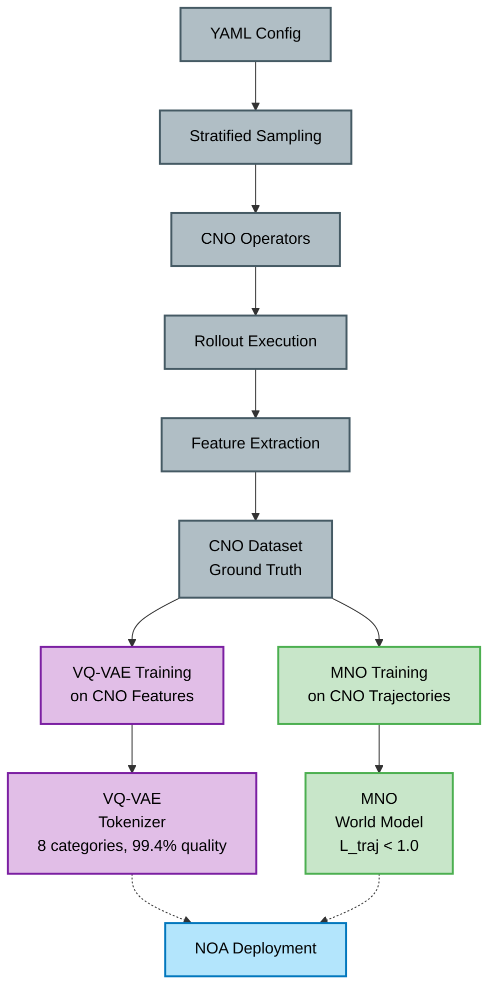
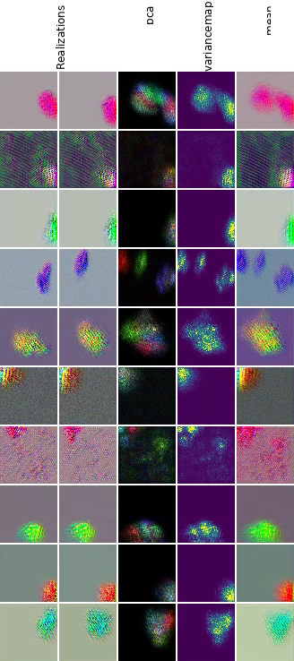

# Spinlock

**Generative pre-training framework for neural operator systems**

[](https://www.python.org/downloads/)
[](https://python-poetry.org/)
[](https://opensource.org/licenses/MIT)

Spinlock (named after quantum field spin alignment, not concurrency primitives) is a framework for generating large-scale PDE trajectory datasets and training neural operator components. It provides infrastructure for stratified sampling across operator parameter spaces, multi-modal feature extraction, behavioral tokenization via VQ-VAE, and meta-operator training.

The framework is designed as a foundation for higher-level systems—agents that reason about dynamics, generative models for exploration, or surrogate models for behavioral sampling.

---

## Table of Contents

- [Overview](#overview)
- [🏗️ Architecture](#️-architecture)
- [📊 Feature Families](#-feature-families)
- [🎛️ VQ-VAE Behavioral Tokenization](#️-vq-vae-behavioral-tokenization)
- [⚡ Quick Start](#-quick-start)
- [🚀 Installation](#-installation)
- [Research Context](#research-context)
- [📚 Documentation](#-documentation)
- [🤝 Contributing](#-contributing)
- [📄 Citation](#-citation)
- [📜 License](#-license)

---

## Overview

### What This Framework Provides

**1. Dataset Generation**
- Stratified sampling of PDE operator parameters using Sobol sequences (provably optimal space-filling)
- Stochastic trajectory execution with configurable solvers (CNO, FNO, or custom)
- Multi-modal feature extraction (initial conditions, architecture parameters, summary statistics, temporal dynamics)
- HDF5 storage with efficient chunking for large-scale datasets (100K+ operators)

**2. VQ-VAE Tokenization**
- Hierarchical behavioral encoding with multi-scale temporal pyramids
- Variable-length sequence support (16-256 timesteps with adaptive pyramid levels)
- Flexible category assignment (static clustering or learnable gradient-based optimization)
- Per-family clustering for independent discovery across feature modalities

**3. Meta-Neural Operator (MNO) Training**
- U-AFNO backbone for spatiotemporal dynamics learning
- Learns statistical regularities across diverse operator distributions
- Can serve as world model, surrogate sampler, or dynamics predictor
- Supports use in agents, exploration systems, or fast behavioral screening

### Meta-Neural Operators

An MNO is a neural network trained on trajectories from multiple operators within a family (e.g., reaction-diffusion systems with varying parameters). Unlike standard neural operators that learn a single PDE, an MNO learns P(u_{t+1} | u_t, θ) across an ensemble, capturing behavioral patterns that recur across parameter space.

**Use cases:**
- **World models** for agent-based systems (fast, differentiable dynamics)
- **Surrogate samplers** for exploring behavioral spaces without running expensive solvers
- **Generative exploration** to discover novel parameter regions
- **Symbolic reasoning substrate** via VQ-VAE token sequences

The MNO can operate autonomously (perturbation-driven, no explicit parameter conditioning) or conditionally (parameter-conditioned for specific operator prediction).

### Design Principles

**Minimal bias in discovery:** Rather than hand-engineering behavioral categories or task-specific objectives, the framework uses unsupervised methods (stratified sampling, data-driven features, VQ-VAE compression) to discover structure in operator behavior space.

**Composable components:** VQ-VAE tokenizers and MNO world models are trained independently on ground truth data, then composed for downstream systems. This modularity enables validation of each component and flexible integration.

**Scalable infrastructure:** Efficient HDF5 storage, chunked processing, and torch.compile optimization support training on 100K+ operator datasets with reasonable compute.

---

## 🏗️ Architecture

Spinlock implements an end-to-end pipeline from dataset generation through meta-operator training:


```mermaid
flowchart TB
    Config[YAML Config] --> Sampling[Stratified Sampling]
    Sampling --> CNOs[CNO Operators]
    CNOs --> Rollouts[Rollout Execution]
    Rollouts --> Extract[Feature Extraction]
    Extract --> CNOData[CNO Dataset<br/>Ground Truth]

    CNOData --> VQTrain[VQ-VAE Training<br/>on CNO Features]
    VQTrain --> VQVAEModel[VQ-VAE<br/>Tokenizer<br/>8 categories, 99.4% quality]

    CNOData --> MNOTrain[MNO Training<br/>on CNO Trajectories]
    MNOTrain --> MNOModel[MNO<br/>World Model<br/>L_traj < 1.0]

    VQVAEModel -.-> Deployment[NOA Deployment]
    MNOModel -.-> Deployment

    classDef phase0 fill:#b0bec5,stroke:#455a64,stroke-width:2px,color:#000
    classDef vqvae fill:#e1bee7,stroke:#7b1fa2,stroke-width:2px,color:#000
    classDef mno fill:#c8e6c9,stroke:#4caf50,stroke-width:2px,color:#000
    classDef deployment fill:#b3e5fc,stroke:#0277bd,stroke-width:2px,color:#000

    class Config,Sampling,CNOs,Rollouts,Extract,CNOData phase0
    class VQTrain,VQVAEModel vqvae
    class MNOTrain,MNOModel mno
    class Deployment deployment
```

### Pipeline Overview

**Phase 0: Foundation - CNO Dataset Generation** (blue-grey)
1. Stratified parameter sampling via Sobol sequences (provably optimal space-filling)
2. CNO operator construction and stochastic rollout execution (256 steps)
3. Multi-modal feature extraction (INITIAL, SUMMARY, TEMPORAL)
4. CNO dataset establishing ground truth physics (50K samples for VQ-VAE, 10K for MNO)

**Component 1: VQ-VAE Tokenizer Training** (purple)
- Train VQ-VAE on CNO ground truth features (50K samples)
- Loss: L_recon + L_commit (no physics loss)
- Auto-category discovery via per-family clustering
- Target: L_recon < 0.05 (achieved 0.006 in 50K baseline)
- Output: Frozen discrete tokenizer (8 categories, 22 tokens/sample)

**Component 2: MNO World Model Training** (green)
- Train MNO on CNO ground truth trajectories (10K samples)
- Loss: L_traj + L_ic (pure MSE, no VQ constraints)
- Architecture: U-AFNO with FiLM conditioning (227M params)
- **Achieved**: L_traj = 0.5343 (target <1.0 ✓), val_loss = 0.641 (epoch 2)
- Output: High-fidelity physics simulator for NOA exploration
- See: [10K MNO Baseline](docs/baselines/10k-mno-baseline.md)

**Integration: NOA Deployment** (blue)
- MNO generates rollouts via perturbation-driven exploration
- VQ-VAE tokenizes MNO outputs → discrete sequences
- NOA reasons over tokens (symbolic layer)
- CNO available for validation and surprisal-driven refinement

**Two-Component Rationale**: Training both components independently on CNO ground truth provides:
1. **Simplicity**: No sequential dependency (VQ-VAE doesn't wait for MNO)
2. **Modularity**: Each component validated independently on CNO
3. **Efficiency**: No need to generate 100K+ MNO rollouts for VQ training
4. **Parallelism**: VQ-VAE and MNO can be trained simultaneously
5. **Validation**: MNO achieved L_traj=0.53 < 1.0 ✓, CNO-trained VQ should work on MNO outputs

**Current Status:**
- ✅ VQ-VAE: Production ready ([50K baseline](docs/baselines/50k-vqvae-baseline.md), 99.4% quality, 8 categories)
- ✅ MNO: Production ready ([10K baseline](docs/baselines/10k-mno-baseline.md), L_traj=0.53, 227M params)
- 🔄 NOA Integration: Ready for experimentation

See [CNO-Trained Architecture](docs/noa-architecture.md) for complete implementation details.

### Key Components

- **Stratified Sampling**: Sobol sequences with Owen scrambling for uniform parameter space coverage
- **Multi-Modal Features**: INITIAL (16D), SUMMARY (18D), TEMPORAL (variable)
- **VQ-VAE Tokenization**: Automatic category discovery, hierarchical 3-level encoding, adaptive compression
- **CNO-Trained Components**: VQ-VAE and MNO both train independently on CNO ground truth
- **CLI Commands**: `spinlock generate`, `spinlock train-meta-operator`, `spinlock train-vqvae`

See [docs/architecture.md](docs/architecture.md) for comprehensive system design and [docs/noa-architecture.md](docs/noa-architecture.md) for CNO-trained components.

---

## 📊 Feature Families

Spinlock extracts **4 complementary feature families** that jointly capture neural operator behavior from different perspectives:

| Family | Captures | Granularity |
|--------|----------|-------------|
| **INITIAL** | Initial condition characteristics (spatial, spectral, information, morphology) | Per-realization |
| **ARCHITECTURE** | Operator parameters (architecture, stochastic, evolution) | Per-operator |
| **SUMMARY** | Aggregated behavioral statistics (spatial, spectral, temporal, causality) | Per-rollout (aggregated across timesteps and realizations) |
| **TEMPORAL** | Full temporal trajectories preserving time-series structure | Per-timestep |

### Joint Training

The VQ-VAE jointly trains on all 4 families simultaneously, learning unified representations that span:
- **INITIAL**: How initial conditions influence operator dynamics
- **ARCHITECTURE**: How architectural choices determine behavioral regimes
- **SUMMARY**: Statistical signatures of emergent patterns
- **TEMPORAL**: Temporal evolution and regime transitions

This multi-modal training enables the model to discover behavioral categories that integrate structural, dynamical, and temporal characteristics—essential for NOA systems that reason about operator behavior.

See [docs/features/](docs/features/) for detailed feature definitions and extraction methods.

---

## 🎛️ VQ-VAE Behavioral Tokenization

The VQ-VAE pipeline transforms continuous behavioral features into discrete tokens—a compositional vocabulary for describing neural operator dynamics.

### VQ-VAE Architecture

Spinlock's VQ-VAE converts operator features into discrete behavioral tokens through:

1. **Category Assignment** - Groups features into semantic categories (static or learned)
2. **Hierarchical Encoding** - Multi-level representation per category
3. **Vector Quantization** - Discrete codebook learning
4. **Reconstruction** - Decoder trained to recover original features

**Assignment Strategies:**
- **Static Assignment** (Default): Pre-computed clustering, deterministic, interpretable
- **Learnable Assignment** (Optional): Gradient-based optimization, task-optimal, flexible

**Encoding Paths:**
- **Fixed-length**: Standard feature vectors from pre-computed SDF extractions
- **Variable-length**: Temporal pyramid for multi-scale dynamics (runtime encoding)
- **Hybrid**: End-to-end CNN training for initial conditions with gradient flow

**Performance:**
- Compilation: ~30-40% speedup (fixed-length), ~15-25% (variable-length)
- Memory: 2-6 GB GPU depending on encoding path
- Quality: >95% feature recovery, 15-30% codebook utilization

See [docs/vqvae/architecture.md](docs/vqvae/architecture.md) for comprehensive architecture details and [docs/vqvae/assignment-strategies.md](docs/vqvae/assignment-strategies.md) for choosing between static and learnable assignments.

### Terminology Note

We use **categories** rather than "clusters" or "modes" for the top-level feature groupings to emphasize their role in hierarchical encoding. Each category represents a distinct behavioral modality with independent multi-level quantization. Orthogonality weighting during clustering encourages non-overlapping semantic groupings rather than just density-based clusters.

### Modern Features

**Hierarchical Multi-Scale Encoding:**
- **Spatial hierarchy**: Multi-level VQ quantization per category for coarse-to-fine representation
- **Temporal hierarchy**: Pyramid encoder capturing dynamics at multiple scales (fast fluctuations → slow trends)
- **Per-family clustering**: Independent category discovery for initial conditions and temporal dynamics

**Variable-Length Sequence Support:**
- Adaptive pyramid levels for sequences of varying lengths (16-256 timesteps)
- Scale-invariant learning: same behavioral patterns recognized regardless of trajectory duration
- Sample weighting to prevent short sequences from dominating gradients

**Advanced Training Techniques:**
- **Learnable category assignments**: Gradient-based optimization of feature-to-category mappings with Gumbel-Softmax
- **Hybrid initial encoder**: End-to-end CNN training for initial conditions with gradient flow
- **torch.compile optimization**: 30-40% speedup for fixed-length, 15-25% for variable-length models
- **Per-family assignment matrices**: Block-diagonal constraints for clean family separation

📖 **Complete documentation:**
- [VQ-VAE Architecture Guide](docs/vqvae/architecture.md) - Comprehensive architecture overview
- [Assignment Strategies](docs/vqvae/assignment-strategies.md) - Static vs learnable comparison
- [Temporal Pyramid](docs/vqvae/temporal-pyramid.md) - Multi-scale temporal encoding
- [Variable-Length Encoding](docs/vqvae/variable-length-encoding.md) - Adaptive sequence handling
- [Performance Optimization](docs/vqvae/torch-compile.md) - torch.compile integration

---

## ⚡ Quick Start

### Generate Operator Dataset

```bash
# Generate with default fast configuration (v1.0-v2.0 features, 64×64, T=256, M=5)
poetry run spinlock generate \
    --config configs/experiments/baseline_10k.yaml

# Or with all v2.1 features enabled (slower, more comprehensive)
# Add to config YAML:
# features:
#   summary:
#     distributional: {enabled: true}
#     structural: {enabled: true}
#     physics: {enabled: true}
#     morphological: {enabled: true}
```

### Inspect Dataset

```bash
poetry run spinlock inspect datasets/my_operators.h5
```

### Visualize Operator Dynamics

Generate videos showing temporal evolution of operators with aggregate views (PCA, variance, mean):

```bash
# Visualize convex operators (more dynamic, amoeba-like behavior)
poetry run spinlock visualize-dataset \
    --dataset datasets/100k_full_features.h5 \
    --output visualizations/convex_operators.mp4 \
    --evolution-policy convex \
    --sampling-method diverse \
    --aggregates pca variance mean
```



*Convex evolution policy produces sustained, morphing dynamics. Each row is an operator; columns show realizations and aggregate statistics (PCA modes as RGB, variance map, mean field).*

### Train VQ-VAE Tokenizer

```bash
# Standard static assignment (default, fast)
poetry run spinlock train-vqvae \
    --config configs/vqvae/baseline_vqvae_variable_length.yaml \
    --epochs 500

# Learnable assignment (gradient-based categories)
poetry run spinlock train-vqvae \
    --config configs/vqvae/learnable_hybrid_variable_length.yaml \
    --epochs 1000

# Enable torch.compile for speedup
poetry run spinlock train-vqvae \
    --config configs/vqvae/baseline_vqvae_variable_length.yaml \
    --compile \
    --epochs 500
```

**Training output:**
```
Epoch 728/1000 (9.6s): train=0.495, val=0.576, util=16.7%
  Train: recon=0.022, vq=0.018, ortho=0.172, info=0.635, topo=0.011, entropy=2.008
  Raw MSE: recon=0.561, info=16.101
  Val: recon=0.791, recon_norm=0.366, topo=0.990→0.996
```

### Extract Behavioral Tokens

```python
import torch
import yaml
from pathlib import Path
from spinlock.encoding import CategoricalHierarchicalVQVAE, CategoricalVQVAEConfig

# Load VQ-VAE configuration
with open("checkpoints/vqvae/config.yaml") as f:
    config_dict = yaml.safe_load(f)

# Construct model from config
config = CategoricalVQVAEConfig(**config_dict["model"])
model = CategoricalHierarchicalVQVAE(config)

# Load trained weights
checkpoint = torch.load("checkpoints/vqvae/best_model.pt")
model.load_state_dict(checkpoint["model_state_dict"])
model.eval()

# Extract behavioral tokens from new operators
with torch.no_grad():
    # features: [N, D] tensor of operator features
    tokens = model.get_tokens(features)  # [N, num_categories * num_levels]
```

See [docs/getting-started.md](docs/getting-started.md) for tutorials and examples.

---

## 🚀 Installation

**Requirements:** Python 3.11+, CUDA 11.8+ (for GPU acceleration)

```bash
git clone https://github.com/yourusername/spinlock.git
cd spinlock
poetry install
```

**Docker:** See [docs/installation.md#docker](docs/installation.md#docker)

**From Source:** See [docs/installation.md#source](docs/installation.md#source)

For detailed installation instructions, platform-specific guides, and troubleshooting, see [docs/installation.md](docs/installation.md).

---


## Research Context

### Learned Physics Engines and Agent Systems

The components provided by this framework (datasets, VQ-VAE tokenizers, MNO world models) serve as building blocks for higher-level systems. One research direction explores **Neural Operator Agents (NOA)**—systems that use MNOs as learned physics engines and VQ-VAE tokens for symbolic reasoning about dynamics.

**MNO as learned physics engine:** When trained on diverse operators and deployed autonomously (perturbation-driven, no explicit parameter conditioning), an MNO learns statistical regularities across its training distribution. It captures characteristic timescales, typical relaxation dynamics, and behavioral patterns—functioning as an implicit generative model over "dynamics-like" behavior rather than a simulator for specific equations.

**Symbolic reasoning via VQ-VAE:** Discrete tokens enable fast categorical screening and pattern matching, while the MNO provides precise trajectory verification. This dual-system architecture (System 1: tokens, System 2: continuous dynamics) supports agent-based exploration, episodic memory of behavioral patterns, and curiosity-driven discovery.

### Multi-Domain Research Questions

The framework's modular design enables testing hypotheses about computational universality across physics domains:

1. Do behavioral categories discovered by domain-specific VQ-VAEs align across physics families?
2. Can token sequences transfer semantic meaning between domains (e.g., "oscillatory" patterns in chemistry vs fluids)?
3. Are there universal computational primitives that emerge across parabolic PDEs, hyperbolic equations, and other dynamical systems?
4. Does symbolic reasoning via tokens transfer where trajectory predictions fail?

**Approach:** Train specialized MNOs for distinct physics families (reaction-diffusion, Navier-Stokes, wave equations), extract domain-specific tokenizers, and analyze vocabulary alignment.

**Current status:** Single domain implemented (reaction-diffusion). Multi-domain architecture is a research objective.

### Design Philosophy

The framework prioritizes minimal human bias in discovery. Rather than pre-defining behavioral categories or task-specific objectives:

- **Stratified sampling** via Sobol sequences provides provably optimal space-filling coverage
- **Data-driven features** capture comprehensive behavioral signatures without predetermined notions of "interesting"
- **Unsupervised tokenization** discovers discrete vocabularies through compression, learning categories from empirical data
- **Modular validation** enables independent verification of each component before composition

This approach enables discovery of patterns, phase transitions, and emergent taxonomies that reflect the true geometry of operator behavior space—structures potentially non-obvious but fundamental to understanding dynamical systems.

---
## 📚 Documentation

### Core Guides

- [**NOA Roadmap**](docs/noa-roadmap.md) - 5-phase development plan for Neural Operator Agents
- [**Architecture**](docs/architecture.md) - Detailed system design and implementation
- [**Independent Optimization Guide**](docs/noa-vqvae-independent.md) - **Recommended approach:** Complete guide for 3-stage independent training. Stage 1: High fidelity physics baseline (pure MSE, L_traj < 1.0). Stage 2: Generate 100K+ NOA rollout features. Stage 3: Train VQ-VAE on NOA's distribution (alignment by construction). Includes implementation details, hyperparameters, troubleshooting, and performance benchmarks. Achieves optimal physics + optimal tokenization without competing gradients.
- [**NOA Training Guide**](docs/noa-training-guide.md) - Training configuration, loss functions, checkpointing, and troubleshooting
- [**Two-Stage Curriculum (Deprecated)**](docs/two-stage-curriculum-architecture.md) - Alternative approach with token-conditioned training (Stage 1) and VQ-led fine-tuning (Stage 2). Deprecated due to competing gradients between L_traj and L_recon causing equilibrium plateaus at batch 500 where neither objective optimizes fully. Empirical analysis shows NOA learns "VQ-friendly" dynamics at cost of physics accuracy. See independent optimization for superior approach.

### VQ-VAE Documentation

- [**VQ-VAE Overview**](docs/vqvae/README.md) - Complete guide to VQ-VAE architecture and usage
- [**Architecture**](docs/vqvae/architecture.md) - Encoding paths, components, and training process
- [**Assignment Strategies**](docs/vqvae/assignment-strategies.md) - Static vs learnable category assignment
- [**Learnable Assignments**](docs/vqvae/learnable-assignments.md) - Gradient-based category learning implementation
- [**Learnable Mode Guide**](docs/vqvae/learnable-mode-guide.md) - Complete usage guide for learnable mode
- [**Variable-Length Encoding**](docs/vqvae/variable-length-encoding.md) - Temporal pyramid integration
- [**torch.compile Optimization**](docs/vqvae/torch-compile.md) - Performance optimization guide
- [**Checkpoint Format**](docs/vqvae/checkpoint-format.md) - Model saving/loading specification

### Features & Data

- [**Feature Families**](docs/features/README.md) - INITIAL, ARCHITECTURE, SUMMARY, TEMPORAL feature definitions and extraction
- [**HDF5 Layout**](docs/features/hdf5-layout.md) - Dataset schema reference for VQ-VAE pipeline

### Baselines & Experiments

- [**Baselines Directory**](docs/baselines/README.md) - Historical baselines and experimental results

### Getting Started

- [**Getting Started**](docs/getting-started.md) - Tutorials and end-to-end examples
- [**Installation**](docs/installation.md) - Platform-specific installation guides

---

## 🔮 Future Directions

### Multi-Agent Token Communication

The independent optimization architecture enables a critical capability for collaborative discovery: **discrete symbolic communication between agents**. By operating over shared VQ-VAE token vocabularies, multiple NOA instances can engage in compositional reasoning, emergent communication protocols, and collaborative parameter space exploration.

**Key insight:** The independent optimization architecture naturally enables both symbolic and physics-accurate reasoning:

| VQ-VAE Tokens (System 1) | NOA Rollouts (System 2) |
|--------------------------|------------------------|
| Fast symbolic reasoning | Precise physics execution |
| Token-based communication | Continuous trajectories |
| Collaborative exploration | Ground-truth verification |
| Categorical classification | Quantitative prediction |

**Example workflow:**
```python
# Agent A: Fast symbolic screening
for theta in search_space:
    rollout = noa(theta, u0)
    features = extract_features(rollout, u0)
    tokens = vqvae.encode(features)
    if tokens match TARGET_CATEGORY:
        send_message(agent_b, tokens, theta)

# Agent B: Precise verification
for (tokens, theta) in messages:
    trajectory = noa(theta, u0)
    evaluate_exact_metrics(trajectory)
```

**Research directions:**
- Emergent compositional communication protocols
- Hierarchical multi-resolution discourse (L0/L1/L2 tokens)
- Token-based theory of mind
- Cross-domain behavioral transfer via shared vocabulary

📖 **Full documentation:** [docs/future/multiagent-token-communication.md](docs/future/multiagent-token-communication.md)

### Domain Modularity and Transfer

The architecture enables systematic testing of computational universals through modular domain integration:

**Specialized MNOs per Domain:**
- **Reaction-Diffusion MNO** (current): U-AFNO on parabolic PDEs, 226M params
- **Fluid Dynamics MNO** (planned): Navier-Stokes, possibly vector-valued variant
- **Wave Equation MNO** (future): Hyperbolic PDEs, different architectural requirements
- **Quantum MNO** (speculative): Complex-valued fields, fundamentally different structure

**Domain-Specific Tokenization:**
Each MNO paired with VQ-VAE trained on its distribution:
- VQ-VAE-RD: 10 categories from reaction-diffusion behaviors
- VQ-VAE-Fluids: Categories for turbulence, vortex dynamics, flow regimes
- VQ-VAE-Waves: Categories for propagation, interference, dispersion

**Cross-Domain Discovery:**
NOA operates over all vocabularies simultaneously:
- **Hypothesis:** If categories align, computational universals exist
- **Test:** Train NOA on Domain A tokens, evaluate on Domain B
- **Metric:** Cross-domain transfer accuracy, vocabulary correlation
- **Outcome:** Either discover universals or identify domain boundaries

**Why This Matters:**
If behavioral tokens transfer across domains, it suggests substrate-independent computational structures—patterns that emerge from the mathematics of spatiotemporal evolution regardless of specific equations. This would represent discovered physics rather than derived physics.

---

## 🤝 Contributing

Contributions are welcome! Please see our contributing guidelines for:
- Code style and formatting
- Testing requirements
- Pull request process

For bugs and feature requests, please open an issue on GitHub.

---

## 📄 Citation

If you use Spinlock in your research, please cite:

```bibtex
@software{spinlock2026,
  title = {Spinlock: Foundation for Neural Operator Agent Research},
  author = {Your Name},
  year = {2026},
  url = {https://github.com/yourusername/spinlock}
}
```

---

## 📜 License

This project is licensed under the MIT License - see the [LICENSE](LICENSE) file for details.

---

## Acknowledgments

Built with:
- [PyTorch](https://pytorch.org/) - Deep learning framework
- [Poetry](https://python-poetry.org/) - Dependency management
- [HDF5](https://www.hdfgroup.org/solutions/hdf5/) - Efficient data storage

Spinlock is part of ongoing research into meta-cognitive neural operator systems and autonomous scientific discovery.
