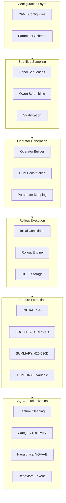

# Spinlock Architecture

**Stratified neural operator dataset generation and hierarchical VQ-VAE tokenization system.**

## System Overview

## Core Components

### 1. Configuration System
**Location:** `src/spinlock/config/`

- **Parameter schema:** Defines operator parameter spaces
- **Stratification:** Sobol-based low-discrepancy sampling
- **Validation:** Type checking and constraint enforcement

### 2. Operator Generation
**Location:** `src/spinlock/operators/`

- **Parameter mapping:** Maps Sobol samples to CNN architectures
- **Operator builder:** Constructs neural operators from parameters
- **Block composition:** Modular building blocks for operator design

### 3. Rollout Execution
**Location:** `src/spinlock/rollout/`

- **Initial conditions:** 28 INITIAL types across 5 diversity tiers
- **Stochastic rollouts:** 500 timesteps × 3 realizations per operator
- **Execution engine:** Batched GPU execution with memory optimization

### 4. Feature Extraction
**Location:** `src/spinlock/features/`

Four complementary feature families:
- **INITIAL (Initial Condition):** 42D hybrid features
- **ARCHITECTURE (Neural Operator Parameters):** 21D+ parameter features
- **SUMMARY (Summary Descriptor Features):** 420-520D aggregated statistics
- **TEMPORAL (Temporal Dynamics):** Variable temporal resolution features

See [Feature Families](features/README.md) for details.

### 5. VQ-VAE Tokenization
**Location:** `src/spinlock/encoding/`

- **Automatic feature cleaning:** NaN removal, variance filtering, deduplication
- **Category discovery:** Hierarchical clustering across all feature families
- **Hierarchical VQ:** 3-level discrete latent space (coarse → medium → fine)
- **Joint training:** Unified representations across INITIAL+ARCHITECTURE+SUMMARY+TEMPORAL

See [VQ-VAE Training Guide](vqvae/training-guide.md) for details.

### 6. Dataset Storage
**Location:** `src/spinlock/dataset/`

- **HDF5 format:** Efficient storage with compression
- **Metadata tracking:** INITIAL types, evolution policies, parameter stratification
- **Chunked I/O:** Optimized for large-scale dataset generation

### 7. Visualization
**Location:** `src/spinlock/visualization/`

- **Temporal evolution rendering:** Heatmap, RGB, PCA-based rendering
- **Aggregate statistics:** Mean, variance, FFT visualization
- **Video export:** MP4 and GIF generation

## Performance Characteristics

### Dataset Generation (Baseline 10K)
- **Operator count:** 10,000 neural operators
- **Rollout size:** 500 timesteps × 3 realizations
- **Grid resolution:** 128×128 (fixed for VQ-VAE compatibility)
- **Generation time:** ~12 hours (GPU-accelerated)
- **Dataset size:** ~50-100 GB (HDF5 compressed)

### Feature Extraction
- **Inline extraction:** Features computed during rollout generation
- **GPU acceleration:** Batch processing for INITIAL, SUMMARY, TEMPORAL features
- **Memory optimization:** Streaming computation for large datasets

### VQ-VAE Training
- **Input features:** ~500-600D after cleaning (INITIAL+ARCHITECTURE+SUMMARY+TEMPORAL concatenation)
- **Categories:** ~8-15 automatically discovered via clustering
- **Codebook sizes:** Configurable (typically 128-512 codes per level)
- **Training time:** ~2-6 hours for 10K dataset (GPU)

## Design Principles

### 1. Modularity
- Clean separation between config, sampling, generation, execution, features, encoding
- Composable building blocks for operators
- Extensible feature extraction system

### 2. DRY (Don't Repeat Yourself)
- Shared utilities across feature extractors
- Unified parameter mapping system
- Reusable GPU kernels for feature computation

### 3. Extensibility
- Easy addition of new feature families
- Pluggable operator architectures
- Configurable VQ-VAE architectures

### 4. Performance
- GPU-first design for all compute-intensive operations
- Batched processing throughout pipeline
- Memory-efficient streaming for large datasets

### 5. Reproducibility
- Stratified sampling for parameter space coverage
- Deterministic rollouts (seeded randomness)
- Comprehensive metadata tracking

## Data Flow

```mermaid
flowchart LR
    Config[Config YAML] --> Params[Parameter Vectors]
    Params --> Operators[Neural Operators]
    Operators --> Rollouts[Stochastic Rollouts]
    Rollouts --> Features[Multi-Modal Features]
    Features --> Cleaned[Cleaned Features]
    Cleaned --> VQVAE[VQ-VAE Model]
    VQVAE --> Tokens[Behavioral Tokens]
    Tokens --> NOA[Neural Operator Agent]

    style Config fill:#e1f5e1,color:#000
    style NOA fill:#e1e8f5,color:#000
```

## References

- [NOA Roadmap](noa-roadmap.md) - 5-phase development plan
- [Feature Families](features/README.md) - INITIAL, ARCHITECTURE, SUMMARY, TEMPORAL documentation
- [Getting Started](getting-started.md) - Usage tutorials
- [Installation](installation.md) - Setup instructions
