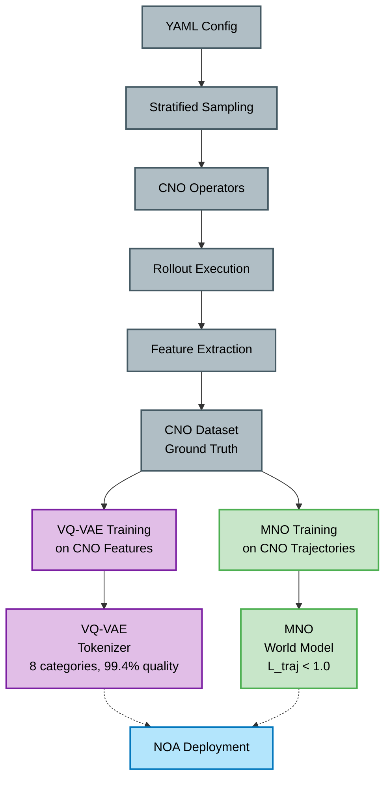
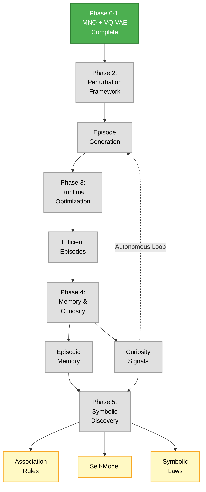
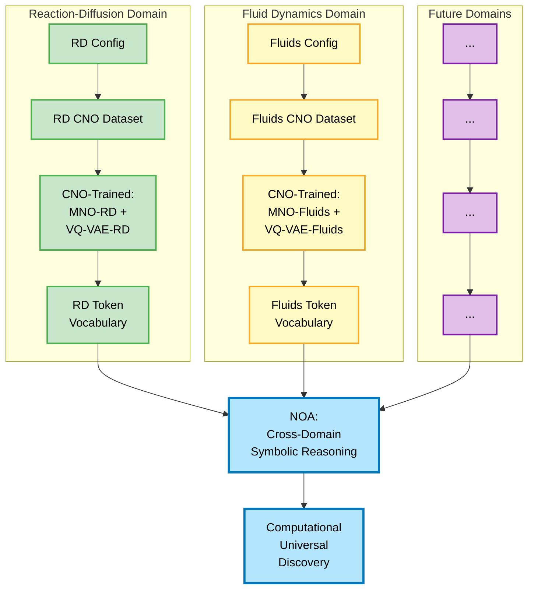
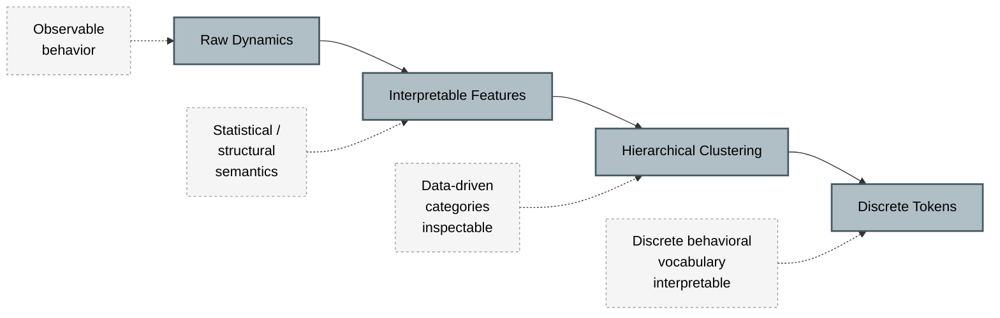

# Spinlock Architecture

**End-to-end meta-neural operator training system with behavioral tokenization and autonomous perturbation-driven exploration.**

This document describes the complete pipeline for training meta-neural operators (MNO) that learn universal dynamics from diverse operator datasets, followed by autonomous operation under perturbations for curiosity-driven behavioral discovery. The system combines:

1. **Foundation (Phase 0-1):** Stratified dataset generation, multi-modal feature extraction, hierarchical VQ-VAE encoding, and CNO-trained components where VQ-VAE and MNO train independently on CNO ground truth, then compose for NOA.

2. **Autonomous Operation (Phase 2-5):** Perturbation framework, episodic memory, token-based curiosity signals, and symbolic discovery that enable self-directed exploration of MNO's behavioral manifold without parameter conditioning.

## System Overview

### Single-Domain Pipeline (Current Implementation)


```mermaid
flowchart TB
    Config[YAML Config] --> Sampling[Stratified Sampling]
    Sampling --> CNOs[CNO Operators]
    CNOs --> Rollouts[Rollout Execution]
    Rollouts --> Extract[Feature Extraction]
    Extract --> CNOData[CNO Dataset<br/>Ground Truth]

    CNOData --> VQTrain[VQ-VAE Training<br/>on CNO Features]
    VQTrain --> VQVAEModel[VQ-VAE<br/>Tokenizer<br/>8 categories, 99.4% quality]

    CNOData --> MNOTrain[MNO Training<br/>on CNO Trajectories]
    MNOTrain --> MNOModel[MNO<br/>World Model<br/>L_traj < 1.0]

    VQVAEModel -.-> Deployment[NOA Deployment]
    MNOModel -.-> Deployment

    classDef phase0 fill:#b0bec5,stroke:#455a64,stroke-width:2px,color:#000
    classDef vqvae fill:#e1bee7,stroke:#7b1fa2,stroke-width:2px,color:#000
    classDef mno fill:#c8e6c9,stroke:#4caf50,stroke-width:2px,color:#000
    classDef deployment fill:#b3e5fc,stroke:#0277bd,stroke-width:2px,color:#000

    class Config,Sampling,CNOs,Rollouts,Extract,CNOData phase0
    class VQTrain,VQVAEModel vqvae
    class MNOTrain,MNOModel mno
    class Deployment deployment
```

### Autonomous Operation Pipeline (Phase 2-5)


```mermaid
flowchart TB
    Foundation[Phase 0-1:<br/>MNO + VQ-VAE<br/>Complete]

    Foundation --> Phase2[Phase 2:<br/>Perturbation<br/>Framework]
    Phase2 --> Episodes[Episode<br/>Generation]

    Episodes --> Phase3[Phase 3:<br/>Runtime<br/>Optimization]
    Phase3 --> FastEpisodes[Efficient<br/>Episodes]

    FastEpisodes --> Phase4[Phase 4:<br/>Memory &<br/>Curiosity]
    Phase4 --> Storage[Episodic<br/>Memory]
    Phase4 --> Curiosity[Curiosity<br/>Signals]

    Storage --> Phase5[Phase 5:<br/>Symbolic<br/>Discovery]
    Curiosity --> Phase5

    Phase5 --> Rules[Association<br/>Rules]
    Phase5 --> SelfModel[Self-Model]
    Phase5 --> Laws[Symbolic<br/>Laws]

    Curiosity -.Autonomous Loop.-> Episodes

    classDef complete fill:#4CAF50,color:#fff,stroke:#2E7D32,stroke-width:2px
    classDef active fill:#2196F3,color:#fff,stroke:#1976D2,stroke-width:2px
    classDef future fill:#e0e0e0,color:#000,stroke:#9e9e9e,stroke-width:2px
    classDef output fill:#FFF9C4,color:#000,stroke:#F9A825,stroke-width:2px

    class Foundation complete
    class Phase2,Episodes,Phase3,FastEpisodes future
    class Phase4,Storage,Curiosity,Phase5 future
    class Rules,SelfModel,Laws output
```

### Multi-Domain Architecture (Research Objective)


```mermaid
flowchart TB
    subgraph Domain1[Reaction-Diffusion Domain]
        Config1[RD Config] --> CNO1[RD CNO Dataset]
        CNO1 --> MNO1[CNO-Trained:<br/>MNO-RD +<br/>VQ-VAE-RD]
        MNO1 --> Tokens1[RD Token<br/>Vocabulary]
    end

    subgraph Domain2[Fluid Dynamics Domain]
        Config2[Fluids Config] --> CNO2[Fluids CNO Dataset]
        CNO2 --> MNO2[CNO-Trained:<br/>MNO-Fluids +<br/>VQ-VAE-Fluids]
        MNO2 --> Tokens2[Fluids Token<br/>Vocabulary]
    end

    subgraph Domain3[Future Domains]
        ConfigN[...] --> CNON[...]
        CNON --> MNON[...]
        MNON --> TokensN[...]
    end

    Tokens1 --> NOA[NOA:<br/>Cross-Domain<br/>Symbolic Reasoning]
    Tokens2 --> NOA
    TokensN --> NOA

    NOA --> Discovery[Computational<br/>Universal<br/>Discovery]

    classDef domain1 fill:#c8e6c9,stroke:#4caf50,stroke-width:2px,color:#000
    classDef domain2 fill:#fff9c4,stroke:#f9a825,stroke-width:2px,color:#000
    classDef domain3 fill:#e1bee7,stroke:#7b1fa2,stroke-width:2px,color:#000
    classDef noa fill:#b3e5fc,stroke:#0277bd,stroke-width:3px,color:#000

    class Config1,CNO1,MNO1,Tokens1 domain1
    class Config2,CNO2,MNO2,Tokens2 domain2
    class ConfigN,CNON,MNON,TokensN domain3
    class NOA,Discovery noa
```

### Pipeline Stages

**Phase 0-1: Foundation (Complete)**

**Dataset Generation**
- Stratified parameter sampling (Sobol sequences with Owen scrambling)
- CNO operator construction from sampled parameters
- Stochastic rollout execution with multiple realizations
- Multi-modal feature extraction (INITIAL, SUMMARY, TEMPORAL)
- Output: CNO ground truth dataset (50K samples for VQ-VAE, 10K for MNO)

**Component 1: VQ-VAE Tokenizer Training**
- Train VQ-VAE on CNO ground truth features (50K samples)
- Loss: L_recon + L_commit (no physics loss)
- Auto-category discovery via per-family clustering
- Target: L_recon < 0.05 (achieved 0.006 in 50K baseline)
- Output: Frozen discrete tokenizer (8 categories, 22 tokens/sample)

**Component 2: MNO World Model Training**
- Train MNO on CNO ground truth trajectories (10K samples)
- Loss: L_traj + L_ic (pure MSE, no VQ constraints)
- Architecture: U-AFNO with FiLM conditioning (227M params)
- **Achieved**: L_traj = 0.5343 (target <1.0 ✓), val_loss = 0.641 (epoch 2)
- Output: High-fidelity physics simulator for NOA exploration
- See: [10K MNO Baseline](baselines/10k-mno-baseline.md)

**Integration: NOA Deployment**
- MNO generates rollouts via perturbation-driven exploration
- VQ-VAE tokenizes MNO outputs → discrete sequences
- NOA reasons over tokens (symbolic layer)
- CNO available for validation and surprisal-driven refinement

**Phase 2-5: Autonomous Operation (Planned)**

After completing Phase 0-1 foundation, the system transitions from parameter-conditioned supervised learning to autonomous perturbation-driven operation:

- **Phase 2:** Perturbation framework validates MNO responds meaningfully to impulse forcing without θ conditioning
- **Phase 3:** Runtime optimization (adaptive sampling, token screening) enables large-scale exploration
- **Phase 4:** Episodic memory and curiosity signals drive self-directed perturbation generation
- **Phase 5:** Symbolic discovery extracts interpretable laws from autonomous exploration data

See "Autonomous Operation Architecture (Phase 2-5)" section below for detailed technical design.

## Core Components

### 1. Configuration System
**Location:** `src/spinlock/config/`

- **Parameter schema:** Defines operator parameter spaces
- **Stratification:** Sobol-based low-discrepancy sampling
- **Validation:** Type checking and constraint enforcement

### 2. Operator Generation
**Location:** `src/spinlock/operators/`

- **Parameter mapping:** Maps Sobol samples to operator architectures
- **Operator builder:** Constructs neural operators from parameters
- **Block composition:** Modular building blocks for operator design
- **Architecture types:**
  - **CNN (default):** Sequential convolutional layers with residual blocks
  - **U-AFNO:** U-Net encoder + AFNO spectral bottleneck + U-Net decoder
    - Global receptive field via FFT-based spectral mixing
    - Multi-scale hierarchy with skip connections
    - Configurable modes, encoder levels, AFNO blocks

### 3. Rollout Execution
**Location:** `src/spinlock/rollout/`

- **Initial conditions:** 28 INITIAL types across 5 diversity tiers
- **Stochastic rollouts:** 500 timesteps × 3 realizations per operator
- **Execution engine:** Batched GPU execution with memory optimization

### 4. Feature Extraction
**Location:** `src/spinlock/features/`

Four complementary feature families:
- **INITIAL (Initial Condition):** Hybrid features (manual + learned CNN embeddings)
- **ARCHITECTURE (Neural Operator Parameters):** Operator parameter features
- **SUMMARY (Summary Descriptor Features):** Aggregated statistics across trajectory
- **TEMPORAL (Temporal Dynamics):** Per-timestep sequences (full temporal resolution)

**Documentation**:
- [Feature Catalog](features/feature-catalog.md) - Enumeration of features in current configuration
- [Feature Families](features/README.md) - Overview and philosophy
- [Feature Reference](features/feature-reference.md) - Detailed formulas and interpretations

#### Temporal Pyramid Architecture

The TEMPORAL family uses a multi-resolution pyramid encoder:

```
Raw features: [N, T, 345]
                 │
     ┌───────────┼───────────┬───────────┐
     ▼           ▼           ▼           ▼
  P0: T/1    P1: T/2    P2: T/4    P3: T/8
 (32D out)  (64D out)  (96D out) (128D out)
     │           │           │           │
     └───────────┴───────────┴───────────┘
                     │
              Concatenate → 320D
                     │
         Per-level clustering discovers
         temporal_p0, temporal_p1, temporal_p2, temporal_p3
```

**Shared backbone**: All pyramid levels pass through the same ResNet-1D CNN (shared weights), then diverge via per-level projection heads. This enables the network to learn universal temporal pattern detectors that fire differently at different resolutions.

**Per-level clustering**: Each pyramid scale becomes an independent feature family. Clustering discovers different numbers of categories at each scale (e.g., P0: 3 categories, P3: 8 categories), reflecting that fast/slow dynamics have different intrinsic complexity.

See [Temporal Pyramid Documentation](vqvae/temporal-pyramid.md) for complete details.

---

## Multi-Domain Architecture

### Research Vision: Computational Universals

The architecture extends to multiple physics domains to test whether behavioral categories discovered through VQ-VAE tokenization represent:
- **Domain artifacts**: Specific to reaction-diffusion, fluids, etc.
- **Computational universals**: Substrate-independent patterns across all spatiotemporal dynamics

### Domain Independence

Each physics family receives specialized treatment:

**Per-Domain Pipeline:**
1. **CNO Dataset**: Domain-specific operators (RD, Navier-Stokes, wave equations)
2. **VQ-VAE Training**: Trained on CNO ground truth features, discovers domain categories
3. **MNO Training**: Architecture optimized for domain (U-AFNO for parabolic, variants for hyperbolic)
4. **Post-Training Validation**: Verify VQ reconstruction on MNO outputs

**Why Independence:**
- Optimal performance: Each MNO uses architecture suited to its physics
- Clear hypothesis testing: Do independently discovered categories align?
- Modular debugging: Improve one domain without affecting others
- Incremental expansion: Add domains as research progresses

### Vocabulary Alignment

**The Key Experiment:**

Train VQ-VAE independently on reaction-diffusion and fluid dynamics. Compare discovered categories:

**If Categories Align:**
- ✓ Computational universals exist
- ✓ Token sequences transfer semantic meaning across domains
- ✓ NOA can reason about cross-domain behavioral equivalences
- ✓ Symbolic transfer works where trajectory transfer fails

**If Categories Don't Align:**
- ✓ Different physics have genuinely different behavioral geometry
- ✓ Learned boundaries of universality
- ✓ Each domain still has optimal MNO
- ✓ Domain-specific NOAs remain valuable

### Current Status

**Implemented:**
- Reaction-diffusion domain (MNO + VQ-VAE)
- Single-domain CNO-trained components (VQ-VAE + MNO)

**Research Objectives:**
- Train second domain (2D Navier-Stokes)
- Compare VQ-VAE category structures
- Test vocabulary alignment hypotheses
- Implement cross-domain NOA architecture

---

## Multi-Modal Integration for Interpretability

### Why Four Feature Families?

The decomposition into INITIAL, ARCHITECTURE, SUMMARY, and TEMPORAL is not arbitrary—each family answers distinct questions about operator behavior:

| Family | Question Answered | Interpretability Value | Cognitive Analogue |
|--------|------------------|----------------------|-------------------|
| **INITIAL** | How do input characteristics influence behavior? | Identifies sensitivity to initial conditions | Input encoding |
| **ARCHITECTURE** | Which design choices determine behavioral regimes? | Links structure to function explicitly | Structural priors |
| **SUMMARY** | What are the observable signatures of behavior? | Provides statistical evidence of patterns | Episodic summaries |
| **TEMPORAL** | How do behaviors evolve and transition? | Reveals dynamical mechanisms | Sequential processing |

This multi-modal decomposition mirrors cognitive architectures that integrate information across multiple timescales and representations—though here applied to learning operator behavior rather than perceptual tasks.

### Cross-Validation Through Multiple Perspectives

Multi-modal training enables **consistency checking**:
- If ARCHITECTURE suggests chaotic behavior, do SUMMARY entropy features confirm this?
- If TEMPORAL shows period-doubling bifurcations, do SUMMARY spectral features detect harmonics?
- If INITIAL indicates smooth inputs, does SUMMARY show expected spatial autocorrelation?

This cross-validation improves confidence that discovered categories reflect genuine behavioral differences, not statistical artifacts.

### Transparent Behavioral Taxonomy

The VQ-VAE codebook learns to compress behavior across all four perspectives simultaneously. This creates tokens that:
1. **Integrate evidence** from structure, statistics, and dynamics
2. **Are interpretable** through feature-space attribution
3. **Enable validation** by reconstructing interpretable features

Unlike end-to-end learned representations, this approach maintains a **transparent chain of reasoning**:


```mermaid
flowchart LR
    A[Raw Dynamics] --> B[Interpretable Features]
    B --> C[Hierarchical Clustering]
    C --> D[Discrete Tokens]

    A1[Observable<br/>behavior] -.-> A
    B1[Statistical /<br/>structural<br/>semantics] -.-> B
    C1[Data-driven<br/>categories<br/>inspectable] -.-> C
    D1[Discrete behavioral<br/>vocabulary<br/>interpretable] -.-> D

    classDef process fill:#b0bec5,stroke:#455a64,stroke-width:2px,color:#000
    classDef annotation fill:#f5f5f5,stroke:#9e9e9e,stroke-width:1px,color:#000,stroke-dasharray: 3 3

    class A,B,C,D process
    class A1,B1,C1,D1 annotation
```

### 5. Data-Driven Behavioral Taxonomy
**Location:** `src/spinlock/encoding/`

- **Automatic feature cleaning:** NaN removal, variance filtering, deduplication
- **Category discovery:** Correlation-based hierarchical clustering with orphan reassignment (100% feature assignment)
- **Adaptive compression ratios:** Per-category latent dimensions computed from feature characteristics (variance, dimensionality, information content, correlation)
- **Hierarchical VQ:** 3-level discrete latent space per category (coarse → medium → fine)
- **Joint training:** Unified representations across INITIAL+SUMMARY+TEMPORAL (ARCHITECTURE excluded; MNO already knows operator parameters θ)

#### Interpretability Properties

The hierarchical clustering approach provides several transparency advantages:

1. **Inspectable Categories**: Unlike end-to-end learned embeddings, clusters can be characterized by:
   - Feature-space centroids (what defines each behavioral category?)
   - Feature attribution (which features distinguish categories?)
   - Hierarchical relationships (how do fine-grained behaviors relate to coarse categories?)

2. **Validation Pathways**:
   - Cluster quality metrics (silhouette score, Davies-Bouldin index)
   - Inter-cluster distances (are categories well-separated?)
   - Utilization rates (are all tokens meaningful, or are some unused?)

3. **Human-Interpretable Discoveries**:
   - Behavioral categories emerge from data, but can be validated by domain experts
   - Feature decomposition enables understanding *why* certain operators cluster together
   - Hierarchical structure reveals natural behavioral taxonomies

See [VQ-VAE Training Guide](vqvae/training-guide.md) for details.

### 6. Dataset Storage
**Location:** `src/spinlock/dataset/`

- **HDF5 format:** Efficient storage with compression
- **Metadata tracking:** INITIAL types, evolution policies, parameter stratification
- **Chunked I/O:** Optimized for large-scale dataset generation

### 7. Visualization
**Location:** `src/spinlock/visualization/`

- **Temporal evolution rendering:** Heatmap, RGB, PCA-based rendering
- **Aggregate statistics:** Mean, variance, FFT visualization
- **Video export:** MP4 and GIF generation

### 8. Meta-Neural Operator (MNO)
**Location:** `src/spinlock/noa/`

The MNO is a **pure physics simulator trained via independent optimization**. It serves as the physics engine for the eventual NOA (Neural Operator Agent) which will add agency, working memory, and curiosity-driven exploration in later phases.

**MNO vs NOA:**
- **MNO**: Pure physics simulator (Phase 1). No agency, no reasoning—just accurate trajectory prediction.
- **NOA**: Higher-level agent (Phase 2+). Uses MNO + operates over VQ tokens with working memory and planning.

**Architecture:**
- **Backbone:** U-AFNO neural operator (144-226M parameters, U-Net encoder + AFNO spectral bottleneck + decoder)
- **Input:** (θ, u₀) - operator parameters and initial grid state
- **Output:** Predicted rollout trajectory [B, T, C, H, W]
- **Training:** Pure MSE optimization (Stage 1 only)

**Implementation Files:**
| File | Description |
|------|-------------|
| `src/spinlock/noa/backbone.py` | MNO/NOABackbone class (U-AFNO, configurable capacity) |
| `src/spinlock/noa/losses/mse_led.py` | Pure MSE loss implementation |
| `src/spinlock/noa/feature_extraction.py` | Feature extraction from MNO rollouts |
| `src/spinlock/noa/generation_pipeline.py` | Large-scale feature generation pipeline |
| `src/spinlock/noa/truncated_bptt.py` | Truncated BPTT for long-horizon training |
| `src/spinlock/cli/train_meta_operator.py` | MNO training CLI command |
| `src/spinlock/cli/generate_noa_features.py` | MNO feature generation CLI command |

**CNO-Trained Components:**

**Component 1: VQ-VAE Tokenizer Training**
```bash
# Train VQ-VAE on CNO ground truth features
poetry run spinlock train-vqvae \
  --config configs/vqvae/50k_baseline.yaml \
  --verbose

Training Loss: L = L_recon + L_commit
- Standard VQ-VAE training (no physics loss)
- Learns to tokenize CNO ground truth features
- Auto-category discovery via per-family clustering
- Target: L_recon < 0.05 (achieved 0.006 in 50K baseline)
- Output: Frozen discrete tokenizer (8 categories, 22 tokens/sample)
```

**Component 2: MNO World Model Training**
```bash
# Train MNO on CNO ground truth trajectories
poetry run spinlock train-meta-operator \
  --config configs/noa/10k_baseline.yaml \
  --verbose

Training Loss: L = L_traj + L_ic (pure physics)
- Single objective: minimize trajectory MSE vs CNO
- No VQ-VAE involvement, no competing gradients
- Truncated BPTT: 256-step rollouts, 32-step windows
- **Achieved**: L_traj = 0.5343 (target <1.0 ✓), val_loss = 0.641 (epoch 2)
- Output: High-fidelity physics simulator (227M params)
- See: [10K MNO Baseline](baselines/10k-mno-baseline.md)
```

**Post-Training Validation**
```bash
# Verify VQ reconstruction quality on MNO outputs
# Generate MNO rollouts and tokenize with CNO-trained VQ-VAE
# Check reconstruction error remains ~0.006

Process:
1. Generate MNO rollouts from validation set
2. Extract features from MNO outputs
3. Tokenize with CNO-trained VQ-VAE
4. Measure L_recon on MNO features (should be ~0.006)
5. Verify token distribution similarity to CNO
```

**Why U-AFNO?**
- **Physics-native:** Operates directly in continuous function space matching the studied dynamics
- **Resolution-independent:** Spectral mixing captures global patterns regardless of grid size
- **Self-consistent:** Enables emergent self-modeling and law discovery in the same function space
- **Efficient:** Global receptive field via FFT-based mixing

See [CNO-Trained Architecture](noa-architecture.md) for complete training guide. For the old 3-stage approach, see [Independent Optimization (Deprecated)](noa-vqvae-independent.md).

---

## Autonomous Operation Architecture (Phase 2-5)

After Phase 1 (MNO and VQ-VAE trained on CNO ground truth), the system transitions from **parameter-conditioned supervised learning** to **autonomous perturbation-driven operation**. The MNO becomes a learned dynamical system that evolves under perturbations, with the VQ-VAE providing behavioral tokenization for episodic memory and curiosity-driven exploration.

### Phase 2: Perturbation Framework & Behavioral Validation

**Objective:** Build minimal perturbation interface and validate that MNO responds meaningfully to autonomous operation without parameter conditioning.

#### Perturbation Interface

**Location:** `src/spinlock/perturbations/`

```python
class BasePerturbation(ABC):
    """Abstract interface for all perturbation types."""

    @abstractmethod
    def apply(self, state: Tensor, t: int) -> Tensor:
        """Apply perturbation to state at timestep t.

        Args:
            state: Current state [B, C, H, W]
            t: Current timestep

        Returns:
            Perturbed state [B, C, H, W]
        """

    @abstractmethod
    def is_active(self, t: int) -> bool:
        """Check if perturbation active at timestep t."""

    def get_metadata(self) -> Dict[str, Any]:
        """Return parameters for logging/memory storage."""
        return {"type": self.__class__.__name__}
```

**Perturbation Types (Modular Expansion):**

| Type | File | Description | Use Case |
|------|------|-------------|----------|
| **Impulse** | `impulse.py` | Single-timestep δ-function | Eigenmode excitation, transient response |
| **Sustained** | `sustained.py` | Multi-timestep forcing | Driven dynamics, energy injection |
| **Structured** | `structured.py` | Pattern-based (Phase 4+) | Learned perturbation generation |

**Design Principles:**
- **Domain-agnostic:** Works with any state representation (reaction-diffusion, fluids, etc.)
- **Composable:** Multiple perturbations can be combined (Phase 3+)
- **Metadata-complete:** All parameters logged for episodic memory retrieval
- **DRY expansion:** New perturbation types inherit from `BasePerturbation`, register in factory

#### Episode Management

**Location:** `src/spinlock/noa/episode.py`

```python
@dataclass
class Episode:
    """Complete record of perturbation-response experiment."""
    perturbation: BasePerturbation
    initial_state: Tensor              # u₀ [C, H, W]
    trajectory: Tensor                 # [T, C, H, W]
    token_sequence: Tensor             # [T, num_categories * num_levels]
    metadata: Dict[str, Any]

class EpisodeRunner:
    """Executes MNO under perturbations until early stopping."""

    def __init__(self, mno: NOABackbone, vqvae: CategoricalHierarchicalVQVAE,
                 early_stopping: EarlyStoppingCriteria):
        self.mno = mno
        self.vqvae = vqvae
        self.early_stopping = early_stopping

    def run_episode(self, u0: Tensor, perturbation: BasePerturbation,
                    max_steps: int = 256) -> Episode:
        """Run MNO rollout with perturbation until stopping criteria met.

        Process:
        1. Initialize state from u₀
        2. At each timestep:
           - Apply perturbation if active
           - MNO forward step: u_{t+1} = MNO(u_t)
           - Extract features, tokenize with VQ-VAE
           - Check early stopping criteria
        3. Return complete episode record
        """
```

**Early Stopping Criteria:**

**Location:** `src/spinlock/noa/early_stopping.py`

| Criterion | Description | Mathematical Definition | Use Case |
|-----------|-------------|------------------------|----------|
| **Convergence** | Equilibrium reached | \|\|u_t - u_{t-1}\|\| < ε | Stable fixed point |
| **Token Stability** | Behavioral loop | token_t = token_{t-k} for k steps | Limit cycle detected |
| **Max Steps** | Safety fallback | t ≥ T_max | Prevent infinite runs |
| **Composite** | Combine criteria | OR/AND logic over multiple conditions | Flexible policies |

```python
class CompositeEarlyStopping:
    """Combine multiple stopping criteria with AND/OR logic."""

    def __init__(self, criteria: List[EarlyStoppingCriterion],
                 logic: Literal["OR", "AND"] = "OR"):
        self.criteria = criteria
        self.logic = logic

    def should_stop(self, episode_state: EpisodeState) -> Tuple[bool, str]:
        """Returns (should_stop, reason)."""
```

#### Behavioral Encoding

**Location:** `src/spinlock/noa/behavioral_encoding.py`

Token sequences encode MNO's behavioral trajectory. Extract signatures for memory indexing and curiosity computation:

```python
class BehavioralSignature:
    """Compressed representation of episode behavior."""

    @staticmethod
    def from_tokens(token_sequence: Tensor) -> Dict[str, Any]:
        """Extract behavioral features from token sequence.

        Features:
        - Token entropy: H(tokens) - behavioral complexity
        - Level transitions: L0→L1→L2 progression patterns
        - Regime stability: Run-length encoding of token states
        - Trajectory length: Total timesteps before convergence
        """

    @staticmethod
    def similarity(sig1: Dict, sig2: Dict) -> float:
        """Compute behavioral similarity between episodes."""
```

**Validation Experiments (Phase 2):**
1. **Perturbation response divergence:** Different perturbations → different token sequences
2. **Regime clustering:** Token-based clusters match spatial behavior clusters
3. **Early stopping efficiency:** 30-50% computation savings vs fixed max_steps
4. **Reproducibility:** Same (u₀, perturbation) → same tokens (>0.95 similarity)

### Phase 3: Dynamic Sampling & Runtime Optimization

**Objective:** Intelligent MNO rollout sampling and token-based screening for 10× exploration speedup.

#### Adaptive Sampling

**Location:** `src/spinlock/noa/adaptive_sampler.py`

During episode execution, dynamically adjust MNO timestep density:

```python
class AdaptiveSampler:
    """Intelligent timestep sampling based on dynamics."""

    def __init__(self, base_rate: int = 1, max_skip: int = 8,
                 strategy: Literal["gradient", "token", "hybrid"] = "hybrid"):
        """
        Args:
            base_rate: Minimum sampling frequency (1 = every step)
            max_skip: Maximum timesteps to skip during equilibrium
            strategy: Sampling criterion
                - gradient: High ||∂u/∂t|| → dense sampling
                - token: Token changes → dense sampling
                - hybrid: Combine both signals
        """

    def should_sample(self, state_history: List[Tensor],
                     token_history: List[Tensor]) -> bool:
        """Decide whether to run full MNO step or interpolate."""
```

**Strategy Trade-offs:**

| Strategy | Speedup | Token Fidelity | Compute Cost |
|----------|---------|----------------|--------------|
| Dense (no skip) | 1× | 100% | High |
| Adaptive (hybrid) | 1.5-2× | 90-95% | Medium |
| Aggressive skip | 2-3× | 80-85% | Low |

**Key Insight:** During equilibrium/transient phases, MNO output becomes predictable → skip expensive forward passes, interpolate states linearly, re-engage dense sampling when dynamics accelerate.

#### Token Screening Pipeline

**Location:** `src/spinlock/noa/token_predictor.py`, `src/spinlock/noa/screening_pipeline.py`

For large-scale exploration (1000s of perturbations), use lightweight token predictor to filter candidates before expensive MNO rollouts.

```python
class TokenPredictor(nn.Module):
    """Lightweight transformer: token_history → next_token.

    Architecture:
    - Input: Token sequence [seq_len, num_categories * num_levels]
    - Transformer: 4 layers, 256 dim, 4 heads (~1M params)
    - Output: Next token probabilities [num_categories * num_levels, vocab_size]

    Training: Supervised on Phase 2 episodes
    Cost: 100-1000× cheaper than full MNO rollout
    """

class ScreeningPipeline:
    """Fast-path filtering for perturbation exploration."""

    def screen_perturbations(self,
                            perturbations: List[BasePerturbation],
                            u0: Tensor,
                            k_keep: int = 100) -> List[BasePerturbation]:
        """Filter perturbations using token predictor.

        Process:
        1. Fast prediction: Run TokenPredictor on all perturbations
        2. Novelty scoring: Entropy, uncertainty, memory distance
        3. Select top-k novel/uncertain perturbations
        4. Run full MNO episodes on filtered set

        Result: 10× throughput increase for exploration
        """
```

**Execution Policies:**

**Location:** `src/spinlock/noa/execution_policy.py`

```python
class ExecutionPolicy(ABC):
    """Strategy pattern for quality vs runtime trade-offs."""

class HighFidelityPolicy(ExecutionPolicy):
    """Dense MNO sampling, no screening."""
    mno_calls: 256, token_fidelity: 100%, use_case: "validation"

class BalancedPolicy(ExecutionPolicy):
    """Adaptive sampling + early stopping."""
    mno_calls: 120-180, token_fidelity: 90-95%, use_case: "standard exploration"

class ExploratoryPolicy(ExecutionPolicy):
    """Token screening + selective verification."""
    mno_calls: 10-50, token_fidelity: 80-90%, use_case: "large-scale search"
```

### Phase 4: Episodic Memory & Curiosity-Driven Exploration

**Objective:** Store episodes in token-indexed memory, compute prediction-error curiosity, generate self-directed perturbations.

#### Episode Storage

**Location:** `src/spinlock/noa/memory/episode_store.py`

```python
class EpisodeStore:
    """Persistent HDF5 storage for episodes."""

    # Schema: /episodes/{episode_id}/{perturbation, tokens, trajectory, metadata}

    def store(self, episode: Episode) -> str:
        """Store episode, return episode_id."""

    def retrieve(self, episode_id: str) -> Episode:
        """Load complete episode."""

    def query(self, criteria: Dict[str, Any]) -> List[str]:
        """Query by metadata (perturbation type, regime, etc.)."""
```

**Storage Optimization:**
- **Compression:** Store tokens + metadata (KB), reconstruct trajectories on-demand (MB)
- **Chunking:** HDF5 chunks for fast partial reads
- **Indexing:** Separate token index for similarity search

#### Token-Based Similarity Index

**Location:** `src/spinlock/noa/memory/token_index.py`

```python
class TokenIndex:
    """Fast ANN search over token sequences (FAISS/Annoy)."""

    def __init__(self, embedding_dim: int = 128):
        """
        Process:
        1. Embed token sequences → fixed-dim vectors
        2. Build ANN index (L2 distance)
        3. Enable K-NN retrieval by behavioral similarity
        """

    def add(self, episode_id: str, token_sequence: Tensor):
        """Add episode to index."""

    def search(self, query_tokens: Tensor, k: int = 10) -> List[Tuple[str, float]]:
        """Find K most similar episodes.

        Returns:
            List of (episode_id, similarity_score)
        """
```

**Embedding Strategies:**
- **Simple:** Flatten token sequence, apply PCA
- **Learned:** Train autoencoder on token sequences (Phase 4+)
- **Behavioral:** Weight by signature features (entropy, transitions)

#### Curiosity Signal

**Location:** `src/spinlock/noa/curiosity/signal.py`, `src/spinlock/noa/curiosity/predictor.py`

```python
class MemoryBasedPredictor:
    """Predict token sequence from perturbation using K-NN retrieval."""

    def predict(self, perturbation: BasePerturbation, u0: Tensor,
                k: int = 10) -> Tuple[Tensor, float]:
        """
        Process:
        1. Encode perturbation metadata
        2. Retrieve K similar episodes from memory
        3. Average token sequences (weighted by similarity)
        4. Confidence = agreement across neighbors

        Returns:
            (predicted_tokens, confidence)
        """

class CuriositySignal:
    """Compute prediction-error curiosity."""

    @staticmethod
    def compute(predicted_tokens: Tensor, actual_tokens: Tensor,
                confidence: float) -> float:
        """
        Curiosity = prediction_error × (1 - confidence)

        High curiosity: Wrong prediction AND low confidence (knowledge gap)
        Low curiosity: Correct prediction OR high confidence (known region)
        """
```

#### Self-Directed Perturbation Generation

**Location:** `src/spinlock/noa/curiosity/perturbation_generator.py`, `src/spinlock/noa/curiosity/exploration_loop.py`

```python
class PerturbationGenerator:
    """Generate perturbations targeting exploration goals."""

    def generate(self, strategy: Literal["exploit", "explore", "curious", "balanced"],
                 n_samples: int = 100) -> List[BasePerturbation]:
        """
        Strategies:
        - exploit: Near high-reward regions (known good behaviors)
        - explore: Maximize coverage (space-filling)
        - curious: Target high prediction error + low confidence
        - balanced: Weighted combination of above
        """

class ExplorationLoop:
    """Autonomous curiosity-driven exploration."""

    def run(self, n_iterations: int = 1000,
            strategy: str = "curious") -> List[Episode]:
        """
        Process:
        1. Generate perturbations using strategy
        2. Execute episodes (with runtime optimization)
        3. Compute curiosity for each episode
        4. Store high-curiosity episodes
        5. Update perturbation generator
        6. Repeat

        Result: Self-directed behavioral exploration
        """
```

**Success Metrics:**
- **Coverage:** 50%+ more unique token patterns vs random exploration
- **Efficiency:** 2× median curiosity for novel vs familiar regions
- **Memory:** 100K episodes, <100ms retrieval latency
- **Precision:** 80%+ precision@10 for token similarity search

### Phase 5: Symbolic Discovery & Self-Modeling

**Objective:** Extract interpretable symbolic rules from episodic memory, develop self-models predicting MNO's responses, enable hypothesis generation and falsification.

#### Pattern Extraction & Association Rules

**Location:** `src/spinlock/noa/symbolic/pattern_extractor.py`

```python
class PatternExtractor:
    """Mine association rules from episodic memory."""

    def extract_rules(self, min_support: float = 0.05,
                     min_confidence: float = 0.7) -> List[AssociationRule]:
        """
        Association rule mining:

        Antecedent (perturbation profile) → Consequent (token pattern)

        Example rules:
        - "High amplitude center perturbation" → "[Category 3, L1=5, L2=12]"
        - "Low amplitude edge forcing" → "[Category 1, L1=2, L2=8]"
        - "Sustained forcing > 20 steps" → "Token entropy > 2.5"

        Metrics:
        - Support: P(antecedent ∧ consequent)
        - Confidence: P(consequent | antecedent)
        - Lift: P(consequent | antecedent) / P(consequent)
        """
```

**Rule Format:**
```python
@dataclass
class AssociationRule:
    antecedent: Dict[str, Any]  # Perturbation conditions
    consequent: Dict[str, Any]  # Token/behavioral outcomes
    support: float
    confidence: float
    lift: float
    examples: List[str]  # Episode IDs supporting rule
```

#### Self-Modeling

**Location:** `src/spinlock/noa/self_model/predictor.py`

```python
class SelfModel(nn.Module):
    """Lightweight model predicting MNO's behavioral response.

    Purpose: Fast approximation of MNO's perturbation-response mapping
    without running full 226M-parameter physics rollout.

    Architecture:
    - Input: Perturbation embedding + state embedding
    - Transformer: 6 layers, 512 dim (~10M params)
    - Output: Predicted token sequence [T, num_categories * num_levels]

    Training:
    - Supervised on episodic memory
    - Loss: CrossEntropy(predicted_tokens, actual_tokens)
    - Auxiliary: Token entropy, convergence time regression

    Calibration:
    - Uncertainty estimation via ensemble/dropout
    - ECE (Expected Calibration Error) < 0.1
    - Identify capability boundaries (when predictions fail)
    """

    def predict_with_uncertainty(self, perturbation: BasePerturbation,
                                 u0: Tensor) -> Tuple[Tensor, Tensor]:
        """
        Returns:
            (predicted_tokens, uncertainty_per_timestep)
        """
```

**Self-Model Applications:**
1. **Fast screening:** 100× faster than MNO for perturbation filtering
2. **Counterfactual reasoning:** "What if I applied different perturbation?"
3. **Capability boundaries:** Detect when self-model confidence low (needs real MNO)
4. **Hypothesis testing:** Generate predictions to falsify symbolic rules

#### Symbolic Regression

**Location:** `src/spinlock/noa/symbolic/regression.py`

```python
class SymbolicRegressor:
    """Fit symbolic equations to perturbation-response data (PySR)."""

    def fit(self, X: np.ndarray, y: np.ndarray,
            operators: List[str] = ["+", "-", "*", "/", "exp", "log"]) -> str:
        """
        Discover interpretable mathematical relationships:

        Example laws:
        - token_entropy = 2.3 * log(amplitude) + 0.5 * spatial_scale - 1.1
        - convergence_time = 45 / amplitude^0.8
        - regime_transitions = exp(-0.3 * perturbation_duration)

        Returns:
            Symbolic equation as string (SymPy format)
        """
```

**Discovery Workflow:**
1. **Feature engineering:** Extract perturbation parameters (amplitude, location, duration, etc.)
2. **Target variables:** Token entropy, convergence time, regime labels, etc.
3. **Symbolic regression:** Fit interpretable equations with PySR
4. **Validation:** R² > 0.8 on held-out episodes
5. **Interpretation:** Convert equations to natural language hypotheses

#### Hypothesis Generation & Falsification

**Location:** `src/spinlock/noa/symbolic/hypothesis.py`, `src/spinlock/noa/symbolic/falsification.py`

```python
class Hypothesis:
    """Testable scientific hypothesis about MNO behavior."""

    natural_language: str  # "High amplitude perturbations cause chaotic regimes"
    formal_rule: AssociationRule  # Quantitative formulation
    predicted_outcomes: Dict[str, Any]  # What should happen if true
    confidence: float  # Based on supporting evidence

class HypothesisTester:
    """Design experiments to test/falsify hypotheses."""

    def design_experiment(self, hypothesis: Hypothesis) -> List[BasePerturbation]:
        """
        Generate perturbations that would:
        - Confirm hypothesis (positive examples)
        - Falsify hypothesis (edge cases, counterexamples)
        """

    def test(self, hypothesis: Hypothesis,
            n_experiments: int = 100) -> HypothesisResult:
        """
        Execute designed experiments, collect evidence.

        Statistical validation:
        - Chi-square test for association rules
        - Confidence intervals for symbolic equations
        - Multiple testing correction (Bonferroni)

        Returns:
            - confirmed: Hypothesis supported by data
            - rejected: Hypothesis falsified
            - inconclusive: Insufficient evidence
        """
```

**Example Discoveries:**

| Hypothesis | Symbolic Law | R² | Validation |
|------------|--------------|-----|-----------|
| "High amplitude → chaos" | entropy = 2.1 * log(A) - 0.8 | 0.87 | Confirmed (p<0.001) |
| "Center perturbations faster convergence" | t_conv = 120 / (1 + 0.5*center_weight) | 0.91 | Confirmed (p<0.001) |
| "Sustained forcing prevents equilibrium" | P(equilibrium\|duration>30) = 0.05 | N/A | Confirmed (χ²<0.001) |

**Success Criteria (Phase 5):**
- 50+ high-confidence symbolic rules extracted
- 75%+ self-model token prediction accuracy
- 70%+ hypotheses validated, 30% rejected (healthy falsification rate)
- 5+ symbolic equations with R² > 0.8
- ECE < 0.1 for uncertainty calibration

---

## Why Independent Optimization?

### The Problem with Coupled Training

Previous approaches attempted simultaneous optimization of physics accuracy and VQ alignment:

```
Loss = λ_traj × L_traj + λ_commit × L_commit + λ_latent × L_latent
       ════════════════   ═══════════════════════════════════════
       Physics objective  VQ alignment objectives
```

**Challenges Observed:**
- **Competing gradients:** Physics accuracy ↔ VQ reconstruction quality create opposing pulls
- **Loss weight tuning:** λ values highly interdependent, difficult to balance
- **Unstable equilibrium:** Both objectives plateau without reaching optimal values
- **Feature dimension mismatch:** VQ-VAE trained on CNO features ≠ MNO's learned representations
- **"VQ-friendly" dynamics:** MNO learns simplified rollouts that compress well but sacrifice physics fidelity

**Key Finding:** Two-stage curriculum achieved `L_recon = 0.067` (better than VQ-VAE's `0.120` on CNO), indicating the operator learned VQ-optimized dynamics at the cost of physics accuracy. The competing objectives prevented both from reaching their optimal values.

### Old Approach: Train Tokenizer on Simulator's Distribution (Deprecated)

> **Note:** This describes the old 3-stage sequential approach. The current approach trains both VQ-VAE and MNO on CNO ground truth independently. See [CNO-Trained Architecture](noa-architecture.md).

**Core Philosophy Shift (OLD):**

Instead of forcing MNO to produce VQ-compatible outputs, train VQ-VAE to tokenize whatever MNO naturally produces after physics-optimal training.

**Three Independent Stages:**

| Stage | Component | Single Objective | Result |
|-------|-----------|------------------|--------|
| **1** | MNO | Minimize L_traj | Optimal physics simulator |
| **2** | Generation | Sample diverse rollouts | Large-scale MNO features |
| **3** | VQ-VAE | Minimize L_recon on MNO | Optimal tokenization of MNO |

**Advantages:**

1. **No Competing Objectives**
   - MNO optimizes purely for physics
   - VQ-VAE optimizes purely for compression
   - Both reach their individual optima

2. **Alignment by Construction**
   - VQ-VAE learns MNO's actual distribution
   - No feature dimension mismatch
   - Guaranteed good compression of MNO's outputs

3. **Massive Sample Space**
   - CNO generation: ~1K samples (expensive)
   - MNO generation: 100K+ samples (fast after training)
   - Better coverage of behavioral manifold

4. **Architectural Simplicity**
   - No token conditioning complexity
   - No loss weight tuning
   - Proven stable training for each stage
   - Easy debugging (isolated components)

5. **Better Performance**
   - Physics: L_traj < 1.0 (vs ~1.5-2.0 in coupled training)
   - VQ quality: L_recon < 0.05 (vs 0.120 baseline)
   - Both metrics improved simultaneously

**Key Insight:** The tokenizer should adapt to the simulator's distribution, not vice versa. By decoupling optimization, each component achieves its best possible performance.

See [Two-Stage Curriculum Architecture](two-stage-curriculum-architecture.md) (Section: Architectural Pivot) for detailed analysis of why the previous approach was abandoned.

## Design Principles

### 1. Modularity
- Clean separation between config, sampling, generation, execution, features, encoding
- Composable building blocks for operators
- Extensible feature extraction system

### 2. DRY (Don't Repeat Yourself)
- Shared utilities across feature extractors
- Unified parameter mapping system
- Reusable GPU kernels for feature computation

### 3. Extensibility
- Easy addition of new feature families
- Pluggable operator architectures
- Configurable VQ-VAE architectures

### 4. Performance
- GPU-first design for all compute-intensive operations
- Batched processing throughout pipeline
- Memory-efficient streaming for large datasets

### 5. Reproducibility
- Stratified sampling for parameter space coverage
- Deterministic rollouts (seeded randomness)
- Comprehensive metadata tracking

## Research Applications

The autonomous operation architecture (Phase 2-5) enables investigation of several scientific and cognitive capabilities in the controlled domain of dynamical systems:

**Perturbation-Response Discovery**: The MNO transitions from parameter-conditioned simulator to autonomous dynamical system. Impulse and sustained perturbations excite eigenmodes and probe the learned attractor landscape, revealing behavioral structure without explicit parameter knowledge.

**Curiosity-Driven Exploration**: Phase 4 implements prediction-error curiosity signals that drive self-directed perturbation generation. The system autonomously identifies knowledge gaps (high prediction error + low confidence) and generates experiments targeting unexplored behavioral regimes.

**Episodic Memory & Retrieval**: Token-indexed memory enables behavioral similarity search. Episodes cluster by token sequences rather than spatial trajectories, testing whether discrete symbolic representations capture meaningful behavioral equivalences.

**Symbolic Law Discovery**: Phase 5 extracts interpretable association rules and fits symbolic equations (via PySR) from autonomous exploration data. Discovered laws are testable, falsifiable, and expressed in human-interpretable mathematical form.

**Self-Modeling**: The self-model predicts MNO's responses to perturbations 100× faster than full physics rollouts. Uncertainty calibration identifies capability boundaries—regions where the self-model knows it doesn't know, requiring verification via real MNO execution.

**Metacognitive Monitoring**: The system tracks its own prediction accuracy, adjusts exploration strategies, and validates hypotheses through designed experiments. This closed-loop autonomy tests whether agents can discover computational structure through self-directed investigation.

These applications are secondary to the core goal of understanding operator behavior, but Phase 2-5 provides concrete infrastructure for empirical investigation of discovery mechanisms.

## References

**Phase 0-1 (Foundation - Complete):**
- [Independent Optimization Architecture](noa-vqvae-independent.md) - **Primary guide** for MNO + VQ-VAE training
- [Two-Stage Curriculum Architecture](two-stage-curriculum-architecture.md) - Historical approach and architectural pivot rationale
- [Feature Families](features/README.md) - INITIAL, ARCHITECTURE, SUMMARY, TEMPORAL documentation
- [VQ-VAE Training Guide](vqvae/training-guide.md) - VQ-VAE configuration and training details

**System Overview (Start Here):**
- [System Overview](system-overview.md) - Motivation, full pipeline walkthrough, file structure, and how to run training

**D3PM Discrete Diffusion (Inverse Generation):**
- [D3PM Architecture and Training Dynamics](d3pm-architecture.md) - Graded noise schedule, roundtrip consistency, curriculum stages, and the denoising trajectory as temporal unfolding

**Phase 2-5 (Autonomous Operation - Planned):**
- [NOA Roadmap](noa-roadmap.md) - **Complete 5-phase development plan** with Phase 2-5 autonomous operation architecture
- This document (architecture.md) - Technical design for perturbation framework, episodic memory, curiosity, symbolic discovery

**Multi-Domain Research:**
- [Multi-Domain Vision](multi-domain-vision.md) - Computational universals hypothesis and vocabulary alignment
- [Cross-Domain Discovery](cross-domain-discovery.md) - Cross-domain NOA architecture and transfer mechanisms
- [Domain Integration Guide](domain-integration-guide.md) - Practical implementation guide for multi-domain systems

**Getting Started:**
- [Getting Started](getting-started.md) - Usage tutorials
- [Installation](installation.md) - Setup instructions
