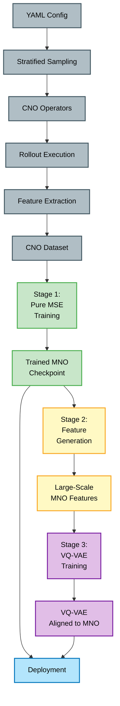
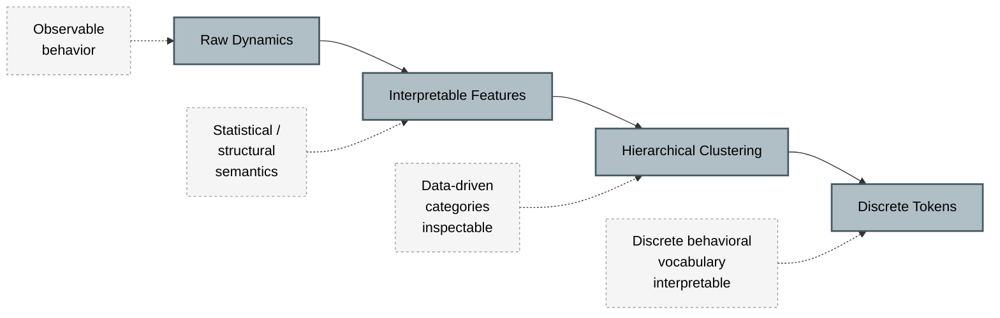

# Spinlock Architecture

**End-to-end meta-neural operator training system with behavioral tokenization via independent optimization.**

This document describes the complete pipeline for training meta-neural operators (MNO) that learn universal dynamics from diverse operator datasets. The system combines stratified dataset generation, multi-modal feature extraction, hierarchical VQ-VAE encoding, and a three-stage independent optimization approach where MNO trains purely for physics accuracy, then generates features for VQ-VAE training that adapts to MNO's distribution.

## System Overview


```mermaid
flowchart TB
    Config[YAML Config] --> Sampling[Stratified Sampling]
    Sampling --> CNOs[CNO Operators]
    CNOs --> Rollouts[Rollout Execution]
    Rollouts --> Extract[Feature Extraction]
    Extract --> CNOData[CNO Dataset]

    CNOData --> Stage1[Stage 1:<br/>Pure MSE<br/>Training]
    Stage1 --> MNOCheckpoint[Trained MNO<br/>Checkpoint]

    MNOCheckpoint --> Stage2[Stage 2:<br/>Feature<br/>Generation]
    Stage2 --> MNOFeatures[Large-Scale<br/>MNO Features]

    MNOFeatures --> Stage3[Stage 3:<br/>VQ-VAE<br/>Training]
    Stage3 --> VQVAEModel[VQ-VAE<br/>Aligned to MNO]

    MNOCheckpoint --> Final[Deployment]
    VQVAEModel --> Final

    classDef phase0 fill:#b0bec5,stroke:#455a64,stroke-width:2px,color:#000
    classDef stage1 fill:#c8e6c9,stroke:#4caf50,stroke-width:2px,color:#000
    classDef stage2 fill:#fff9c4,stroke:#f9a825,stroke-width:2px,color:#000
    classDef stage3 fill:#e1bee7,stroke:#7b1fa2,stroke-width:2px,color:#000
    classDef deployment fill:#b3e5fc,stroke:#0277bd,stroke-width:2px,color:#000

    class Config,Sampling,CNOs,Rollouts,Extract,CNOData phase0
    class Stage1,MNOCheckpoint stage1
    class Stage2,MNOFeatures stage2
    class Stage3,VQVAEModel stage3
    class Final deployment
```

### Pipeline Stages

**Dataset Generation**
- Stratified parameter sampling (Sobol sequences with Owen scrambling)
- CNO operator construction from sampled parameters
- Stochastic rollout execution with multiple realizations

**Feature Learning**
- Multi-modal feature extraction (INITIAL, SUMMARY, TEMPORAL)
- Automatic feature cleaning and category discovery
- Hierarchical VQ-VAE training for behavioral tokenization

**Stage 1: Pure Physics Training**
- Train MNO backbone with pure MSE loss against CNO ground truth
- No token conditioning, no VQ-VAE involvement
- Loss: MSE(MNO_rollout, CNO_rollout)
- Target: L_traj < 1.0 (excellent physics accuracy)
- Output: Trained physics simulator

**Stage 2: Feature Generation**
- Load trained MNO checkpoint from Stage 1
- Generate 100K+ diverse rollouts from parameter space
- Extract features inline (GPU-optimized, no trajectory storage)
- Output: Large-scale feature dataset from MNO's distribution

**Stage 3: VQ-VAE Training on MNO**
- Train VQ-VAE on MNO-generated features (not CNO)
- Standard VQ-VAE training: L_recon + L_commit
- Alignment by construction (VQ learns MNO's structure)
- Output: Discrete tokenization of MNO's behavior space

## Core Components

### 1. Configuration System
**Location:** `src/spinlock/config/`

- **Parameter schema:** Defines operator parameter spaces
- **Stratification:** Sobol-based low-discrepancy sampling
- **Validation:** Type checking and constraint enforcement

### 2. Operator Generation
**Location:** `src/spinlock/operators/`

- **Parameter mapping:** Maps Sobol samples to operator architectures
- **Operator builder:** Constructs neural operators from parameters
- **Block composition:** Modular building blocks for operator design
- **Architecture types:**
  - **CNN (default):** Sequential convolutional layers with residual blocks
  - **U-AFNO:** U-Net encoder + AFNO spectral bottleneck + U-Net decoder
    - Global receptive field via FFT-based spectral mixing
    - Multi-scale hierarchy with skip connections
    - Configurable modes, encoder levels, AFNO blocks

### 3. Rollout Execution
**Location:** `src/spinlock/rollout/`

- **Initial conditions:** 28 INITIAL types across 5 diversity tiers
- **Stochastic rollouts:** 500 timesteps × 3 realizations per operator
- **Execution engine:** Batched GPU execution with memory optimization

### 4. Feature Extraction
**Location:** `src/spinlock/features/`

Four complementary feature families:
- **INITIAL (Initial Condition):** 42D hybrid features (14D manual + 28D learned)
- **ARCHITECTURE (Neural Operator Parameters):** 21D+ parameter features
- **SUMMARY (Summary Descriptor Features):** 360-520D aggregated statistics across trajectory
- **TEMPORAL (Temporal Dynamics):** 63D per-timestep sequences (full temporal resolution)

**Documentation**:
- [Feature Catalog](features/feature-catalog.md) - Complete enumeration of all computed features
- [Feature Families](features/README.md) - Overview and philosophy
- [Feature Reference](features/feature-reference.md) - Detailed formulas and interpretations

## Multi-Modal Integration for Interpretability

### Why Four Feature Families?

The decomposition into INITIAL, ARCHITECTURE, SUMMARY, and TEMPORAL is not arbitrary—each family answers distinct questions about operator behavior:

| Family | Question Answered | Interpretability Value | Cognitive Analogue |
|--------|------------------|----------------------|-------------------|
| **INITIAL** | How do input characteristics influence behavior? | Identifies sensitivity to initial conditions | Input encoding |
| **ARCHITECTURE** | Which design choices determine behavioral regimes? | Links structure to function explicitly | Structural priors |
| **SUMMARY** | What are the observable signatures of behavior? | Provides statistical evidence of patterns | Episodic summaries |
| **TEMPORAL** | How do behaviors evolve and transition? | Reveals dynamical mechanisms | Sequential processing |

This multi-modal decomposition mirrors cognitive architectures that integrate information across multiple timescales and representations—though here applied to learning operator behavior rather than perceptual tasks.

### Cross-Validation Through Multiple Perspectives

Multi-modal training enables **consistency checking**:
- If ARCHITECTURE suggests chaotic behavior, do SUMMARY entropy features confirm this?
- If TEMPORAL shows period-doubling bifurcations, do SUMMARY spectral features detect harmonics?
- If INITIAL indicates smooth inputs, does SUMMARY show expected spatial autocorrelation?

This cross-validation improves confidence that discovered categories reflect genuine behavioral differences, not statistical artifacts.

### Transparent Behavioral Taxonomy

The VQ-VAE codebook learns to compress behavior across all four perspectives simultaneously. This creates tokens that:
1. **Integrate evidence** from structure, statistics, and dynamics
2. **Are interpretable** through feature-space attribution
3. **Enable validation** by reconstructing interpretable features

Unlike end-to-end learned representations, this approach maintains a **transparent chain of reasoning**:


```mermaid
flowchart LR
    A[Raw Dynamics] --> B[Interpretable Features]
    B --> C[Hierarchical Clustering]
    C --> D[Discrete Tokens]

    A1[Observable<br/>behavior] -.-> A
    B1[Statistical /<br/>structural<br/>semantics] -.-> B
    C1[Data-driven<br/>categories<br/>inspectable] -.-> C
    D1[Discrete behavioral<br/>vocabulary<br/>interpretable] -.-> D

    classDef process fill:#b0bec5,stroke:#455a64,stroke-width:2px,color:#000
    classDef annotation fill:#f5f5f5,stroke:#9e9e9e,stroke-width:1px,color:#000,stroke-dasharray: 3 3

    class A,B,C,D process
    class A1,B1,C1,D1 annotation
```

### 5. Data-Driven Behavioral Taxonomy
**Location:** `src/spinlock/encoding/`

- **Automatic feature cleaning:** NaN removal, variance filtering, deduplication
- **Category discovery:** Correlation-based hierarchical clustering with orphan reassignment (100% feature assignment)
- **Adaptive compression ratios:** Per-category latent dimensions computed from feature characteristics (variance, dimensionality, information content, correlation)
- **Hierarchical VQ:** 3-level discrete latent space per category (coarse → medium → fine)
- **Joint training:** Unified representations across INITIAL+SUMMARY+TEMPORAL (ARCHITECTURE excluded; MNO already knows operator parameters θ)

#### Interpretability Properties

The hierarchical clustering approach provides several transparency advantages:

1. **Inspectable Categories**: Unlike end-to-end learned embeddings, clusters can be characterized by:
   - Feature-space centroids (what defines each behavioral category?)
   - Feature attribution (which features distinguish categories?)
   - Hierarchical relationships (how do fine-grained behaviors relate to coarse categories?)

2. **Validation Pathways**:
   - Cluster quality metrics (silhouette score, Davies-Bouldin index)
   - Inter-cluster distances (are categories well-separated?)
   - Utilization rates (are all tokens meaningful, or are some unused?)

3. **Human-Interpretable Discoveries**:
   - Behavioral categories emerge from data, but can be validated by domain experts
   - Feature decomposition enables understanding *why* certain operators cluster together
   - Hierarchical structure reveals natural behavioral taxonomies

See [VQ-VAE Training Guide](vqvae/training-guide.md) for details.

### 6. Dataset Storage
**Location:** `src/spinlock/dataset/`

- **HDF5 format:** Efficient storage with compression
- **Metadata tracking:** INITIAL types, evolution policies, parameter stratification
- **Chunked I/O:** Optimized for large-scale dataset generation

### 7. Visualization
**Location:** `src/spinlock/visualization/`

- **Temporal evolution rendering:** Heatmap, RGB, PCA-based rendering
- **Aggregate statistics:** Mean, variance, FFT visualization
- **Video export:** MP4 and GIF generation

### 8. Meta-Neural Operator (MNO)
**Location:** `src/spinlock/noa/`

The MNO is a **pure physics simulator trained via independent optimization**. It serves as the physics engine for the eventual NOA (Neural Operator Agent) which will add agency, working memory, and curiosity-driven exploration in later phases.

**MNO vs NOA:**
- **MNO**: Pure physics simulator (Phase 1). No agency, no reasoning—just accurate trajectory prediction.
- **NOA**: Higher-level agent (Phase 2+). Uses MNO + operates over VQ tokens with working memory and planning.

**Architecture:**
- **Backbone:** U-AFNO neural operator (144-226M parameters, U-Net encoder + AFNO spectral bottleneck + decoder)
- **Input:** (θ, u₀) - operator parameters and initial grid state
- **Output:** Predicted rollout trajectory [B, T, C, H, W]
- **Training:** Pure MSE optimization (Stage 1 only)

**Implementation Files:**
| File | Description |
|------|-------------|
| `src/spinlock/noa/backbone.py` | MNO/NOABackbone class (U-AFNO, configurable capacity) |
| `src/spinlock/noa/losses/mse_led.py` | Pure MSE loss implementation |
| `src/spinlock/noa/feature_extraction.py` | Feature extraction from MNO rollouts |
| `src/spinlock/noa/generation_pipeline.py` | Large-scale feature generation pipeline |
| `src/spinlock/noa/truncated_bptt.py` | Truncated BPTT for long-horizon training |
| `src/spinlock/cli/train_meta_operator.py` | MNO training CLI command |
| `src/spinlock/cli/generate_noa_features.py` | MNO feature generation CLI command |

**Three-Stage Independent Optimization:**

**Stage 1: Pure Physics Training**
```bash
# Train MNO with pure MSE loss (no token conditioning)
poetry run spinlock train-meta-operator \
  --config configs/noa/experiments/phase2/exp_pure_mse.yaml

Training Loss: L = L_traj (pure physics)
- Single objective: minimize trajectory MSE vs CNO
- No VQ-VAE involvement, no competing gradients
- Truncated BPTT: 256-step rollouts, 32-step windows
- Target: L_traj < 1.0 (RMSE < field variation)
- Output: Trained MNO checkpoint
```

**Stage 2: Generate MNO Features**
```bash
# Generate 100K features from trained MNO
poetry run spinlock generate-noa-features \
  --noa-checkpoint checkpoints/noa/pure_mse_baseline/meta_operator_best.pt \
  --output datasets/mno_features_100k.h5 \
  --n-samples 100000 \
  --batch-size 16

Process:
1. Load trained MNO checkpoint
2. Sample diverse (θ, u₀) from parameter space
3. Generate rollouts (fast, no gradients)
4. Extract features inline (INITIAL, SUMMARY, TEMPORAL)
5. Save features only (99% space savings vs full trajectories)
```

**Stage 3: VQ-VAE Training**
```bash
# Train VQ-VAE on MNO's distribution
poetry run spinlock train-vqvae \
  --config configs/vqvae/mno_distribution_100k.yaml

Training Loss: L = L_recon + L_commit
- Standard VQ-VAE training (no physics loss)
- Learns to tokenize MNO's actual outputs
- Alignment by construction (VQ adapts to MNO)
- Target: L_recon < 0.05 (better than CNO baseline)
- Output: VQ-VAE ready for NOA agent (Phase 2+)
```

**Why U-AFNO?**
- **Physics-native:** Operates directly in continuous function space matching the studied dynamics
- **Resolution-independent:** Spectral mixing captures global patterns regardless of grid size
- **Self-consistent:** Enables emergent self-modeling and law discovery in the same function space
- **Efficient:** Global receptive field via FFT-based mixing

See [Independent Optimization Architecture](noa-vqvae-independent.md) for complete training guide and [NOA Architecture](noa-architecture.md) for architectural details.

## Why Independent Optimization?

### The Problem with Coupled Training

Previous approaches attempted simultaneous optimization of physics accuracy and VQ alignment:

```
Loss = λ_traj × L_traj + λ_commit × L_commit + λ_latent × L_latent
       ════════════════   ═══════════════════════════════════════
       Physics objective  VQ alignment objectives
```

**Challenges Observed:**
- **Competing gradients:** Physics accuracy ↔ VQ reconstruction quality create opposing pulls
- **Loss weight tuning:** λ values highly interdependent, difficult to balance
- **Unstable equilibrium:** Both objectives plateau without reaching optimal values
- **Feature dimension mismatch:** VQ-VAE trained on CNO features ≠ MNO's learned representations
- **"VQ-friendly" dynamics:** MNO learns simplified rollouts that compress well but sacrifice physics fidelity

**Key Finding:** Two-stage curriculum achieved `L_recon = 0.067` (better than VQ-VAE's `0.120` on CNO), indicating the operator learned VQ-optimized dynamics at the cost of physics accuracy. The competing objectives prevented both from reaching their optimal values.

### The Solution: Train Tokenizer on Simulator's Distribution

**Core Philosophy Shift:**

Instead of forcing MNO to produce VQ-compatible outputs, train VQ-VAE to tokenize whatever MNO naturally produces after physics-optimal training.

**Three Independent Stages:**

| Stage | Component | Single Objective | Result |
|-------|-----------|------------------|--------|
| **1** | MNO | Minimize L_traj | Optimal physics simulator |
| **2** | Generation | Sample diverse rollouts | Large-scale MNO features |
| **3** | VQ-VAE | Minimize L_recon on MNO | Optimal tokenization of MNO |

**Advantages:**

1. **No Competing Objectives**
   - MNO optimizes purely for physics
   - VQ-VAE optimizes purely for compression
   - Both reach their individual optima

2. **Alignment by Construction**
   - VQ-VAE learns MNO's actual distribution
   - No feature dimension mismatch
   - Guaranteed good compression of MNO's outputs

3. **Massive Sample Space**
   - CNO generation: ~1K samples (expensive)
   - MNO generation: 100K+ samples (fast after training)
   - Better coverage of behavioral manifold

4. **Architectural Simplicity**
   - No token conditioning complexity
   - No loss weight tuning
   - Proven stable training for each stage
   - Easy debugging (isolated components)

5. **Better Performance**
   - Physics: L_traj < 1.0 (vs ~1.5-2.0 in coupled training)
   - VQ quality: L_recon < 0.05 (vs 0.120 baseline)
   - Both metrics improved simultaneously

**Key Insight:** The tokenizer should adapt to the simulator's distribution, not vice versa. By decoupling optimization, each component achieves its best possible performance.

See [Two-Stage Curriculum Architecture](two-stage-curriculum-architecture.md) (Section: Architectural Pivot) for detailed analysis of why the previous approach was abandoned.

## Design Principles

### 1. Modularity
- Clean separation between config, sampling, generation, execution, features, encoding
- Composable building blocks for operators
- Extensible feature extraction system

### 2. DRY (Don't Repeat Yourself)
- Shared utilities across feature extractors
- Unified parameter mapping system
- Reusable GPU kernels for feature computation

### 3. Extensibility
- Easy addition of new feature families
- Pluggable operator architectures
- Configurable VQ-VAE architectures

### 4. Performance
- GPU-first design for all compute-intensive operations
- Batched processing throughout pipeline
- Memory-efficient streaming for large datasets

### 5. Reproducibility
- Stratified sampling for parameter space coverage
- Deterministic rollouts (seeded randomness)
- Comprehensive metadata tracking

## Research Applications

While the primary focus is scientific simulation and operator reasoning, the architecture provides infrastructure for investigating several cognitive capabilities in the controlled domain of dynamical systems:

**Compositional Generalization**: The factored parameter space enables testing whether learned representations can predict behaviors of novel operator configurations through compositional combination of known components.

**Few-Shot Adaptation**: Behavioral tokens and multi-modal features support research into in-context learning—can agents adapt to new operator families with minimal examples?

**Memory-Based Prediction**: The distinction between SUMMARY (aggregated) and TEMPORAL (sequential) features provides a natural testbed for studying working memory constraints and episodic retrieval strategies.

**Metacognitive Monitoring**: Uncertainty quantification over learned behavioral representations offers a framework for studying calibrated confidence and capability boundary detection.

These applications are secondary to the core goal of understanding operator behavior, but the infrastructure naturally supports such investigations through its multi-modal, hierarchical design.

## References

- [Independent Optimization Architecture](noa-vqvae-independent.md) - **Primary guide** for MNO + VQ-VAE training
- [Two-Stage Curriculum Architecture](two-stage-curriculum-architecture.md) - Historical approach and architectural pivot rationale
- [NOA Roadmap](noa-roadmap.md) - 5-phase development plan
- [Feature Families](features/README.md) - INITIAL, ARCHITECTURE, SUMMARY, TEMPORAL documentation
- [VQ-VAE Training Guide](vqvae/training-guide.md) - VQ-VAE configuration and training details
- [Getting Started](getting-started.md) - Usage tutorials
- [Installation](installation.md) - Setup instructions
