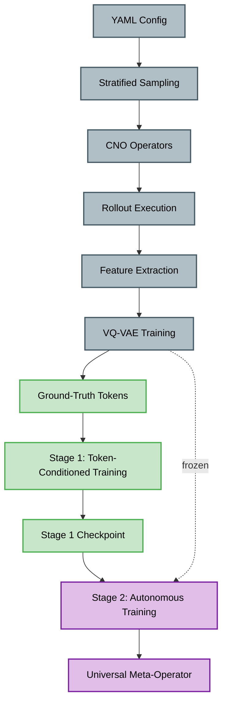
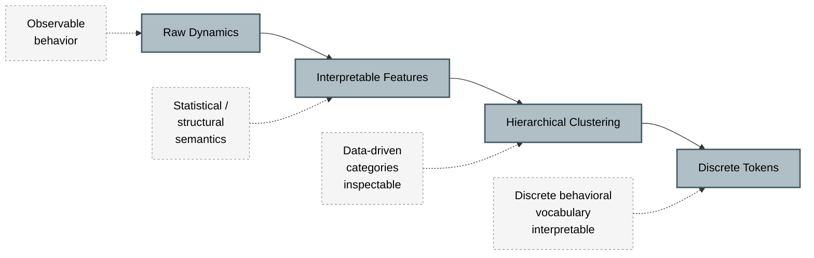

# Spinlock Architecture

**End-to-end meta-neural operator training system with behavioral tokenization and two-stage curriculum learning.**

This document describes the complete pipeline for training meta-neural operators (NOA) that learn universal dynamics from diverse operator datasets. The system combines stratified dataset generation, multi-modal feature extraction, hierarchical VQ-VAE encoding, and a two-stage curriculum that progresses from token-conditioned physics learning to autonomous VQ-compatible rollout generation.

## System Overview


```mermaid
flowchart TB
    Config[YAML Config] --> Sampling[Stratified Sampling]
    Sampling --> CNOs[CNO Operators]
    CNOs --> Rollouts[Rollout Execution]
    Rollouts --> Extract[Feature Extraction]
    Extract --> VQVAE[VQ-VAE Training]

    VQVAE --> GTTokens[Ground-Truth Tokens]
    GTTokens --> Stage1[Stage 1: Token-Conditioned Training]
    Stage1 --> Checkpoint[Stage 1 Checkpoint]

    Checkpoint --> Stage2[Stage 2: Autonomous Training]
    VQVAE -.->|frozen| Stage2
    Stage2 --> Final[Universal Meta-Operator]

    classDef phase1 fill:#b0bec5,stroke:#455a64,stroke-width:2px,color:#000
    classDef phase2stage1 fill:#c8e6c9,stroke:#4caf50,stroke-width:2px,color:#000
    classDef phase2stage2 fill:#e1bee7,stroke:#7b1fa2,stroke-width:2px,color:#000

    class Config,Sampling,CNOs,Rollouts,Extract,VQVAE phase1
    class GTTokens,Stage1,Checkpoint phase2stage1
    class Stage2,Final phase2stage2
```

### Pipeline Stages

**Dataset Generation**
- Stratified parameter sampling (Sobol sequences with Owen scrambling)
- CNO operator construction from sampled parameters
- Stochastic rollout execution with multiple realizations

**Feature Learning**
- Multi-modal feature extraction (INITIAL, SUMMARY, TEMPORAL)
- Automatic feature cleaning and category discovery
- Hierarchical VQ-VAE training for behavioral tokenization

**Stage 1: MSE-Led Training**
- Generate ground-truth VQ tokens from CNO rollouts
- Train NOA with token conditioning
- Loss: Pure MSE against CNO ground truth trajectories
- Output: Token-aware representations

**Stage 2: VQ-Led Training**
- Initialize from Stage 1 checkpoint
- Remove token conditioning (autonomous operation)
- Loss: VQ reconstruction + commitment (primary) + physics regularization
- Output: Universal meta-operator generating VQ-compatible rollouts

## Core Components

### 1. Configuration System
**Location:** `src/spinlock/config/`

- **Parameter schema:** Defines operator parameter spaces
- **Stratification:** Sobol-based low-discrepancy sampling
- **Validation:** Type checking and constraint enforcement

### 2. Operator Generation
**Location:** `src/spinlock/operators/`

- **Parameter mapping:** Maps Sobol samples to operator architectures
- **Operator builder:** Constructs neural operators from parameters
- **Block composition:** Modular building blocks for operator design
- **Architecture types:**
  - **CNN (default):** Sequential convolutional layers with residual blocks
  - **U-AFNO:** U-Net encoder + AFNO spectral bottleneck + U-Net decoder
    - Global receptive field via FFT-based spectral mixing
    - Multi-scale hierarchy with skip connections
    - Configurable modes, encoder levels, AFNO blocks

### 3. Rollout Execution
**Location:** `src/spinlock/rollout/`

- **Initial conditions:** 28 INITIAL types across 5 diversity tiers
- **Stochastic rollouts:** 500 timesteps × 3 realizations per operator
- **Execution engine:** Batched GPU execution with memory optimization

### 4. Feature Extraction
**Location:** `src/spinlock/features/`

Four complementary feature families:
- **INITIAL (Initial Condition):** 42D hybrid features
- **ARCHITECTURE (Neural Operator Parameters):** 21D+ parameter features
- **SUMMARY (Summary Descriptor Features):** 420-520D aggregated statistics
- **TEMPORAL (Temporal Dynamics):** Variable temporal resolution features

See [Feature Families](features/README.md) for details.

## Multi-Modal Integration for Interpretability

### Why Four Feature Families?

The decomposition into INITIAL, ARCHITECTURE, SUMMARY, and TEMPORAL is not arbitrary—each family answers distinct questions about operator behavior:

| Family | Question Answered | Interpretability Value | Cognitive Analogue |
|--------|------------------|----------------------|-------------------|
| **INITIAL** | How do input characteristics influence behavior? | Identifies sensitivity to initial conditions | Input encoding |
| **ARCHITECTURE** | Which design choices determine behavioral regimes? | Links structure to function explicitly | Structural priors |
| **SUMMARY** | What are the observable signatures of behavior? | Provides statistical evidence of patterns | Episodic summaries |
| **TEMPORAL** | How do behaviors evolve and transition? | Reveals dynamical mechanisms | Sequential processing |

This multi-modal decomposition mirrors cognitive architectures that integrate information across multiple timescales and representations—though here applied to learning operator behavior rather than perceptual tasks.

### Cross-Validation Through Multiple Perspectives

Multi-modal training enables **consistency checking**:
- If ARCHITECTURE suggests chaotic behavior, do SUMMARY entropy features confirm this?
- If TEMPORAL shows period-doubling bifurcations, do SUMMARY spectral features detect harmonics?
- If INITIAL indicates smooth inputs, does SUMMARY show expected spatial autocorrelation?

This cross-validation improves confidence that discovered categories reflect genuine behavioral differences, not statistical artifacts.

### Transparent Behavioral Taxonomy

The VQ-VAE codebook learns to compress behavior across all four perspectives simultaneously. This creates tokens that:
1. **Integrate evidence** from structure, statistics, and dynamics
2. **Are interpretable** through feature-space attribution
3. **Enable validation** by reconstructing interpretable features

Unlike end-to-end learned representations, this approach maintains a **transparent chain of reasoning**:


```mermaid
flowchart LR
    A[Raw Dynamics] --> B[Interpretable Features]
    B --> C[Hierarchical Clustering]
    C --> D[Discrete Tokens]

    A1[Observable<br/>behavior] -.-> A
    B1[Statistical /<br/>structural<br/>semantics] -.-> B
    C1[Data-driven<br/>categories<br/>inspectable] -.-> C
    D1[Discrete behavioral<br/>vocabulary<br/>interpretable] -.-> D

    classDef process fill:#b0bec5,stroke:#455a64,stroke-width:2px,color:#000
    classDef annotation fill:#f5f5f5,stroke:#9e9e9e,stroke-width:1px,color:#000,stroke-dasharray: 3 3

    class A,B,C,D process
    class A1,B1,C1,D1 annotation
```

### 5. Data-Driven Behavioral Taxonomy
**Location:** `src/spinlock/encoding/`

- **Automatic feature cleaning:** NaN removal, variance filtering, deduplication
- **Category discovery:** Correlation-based hierarchical clustering with orphan reassignment (100% feature assignment)
- **Adaptive compression ratios:** Per-category latent dimensions computed from feature characteristics (variance, dimensionality, information content, correlation)
- **Hierarchical VQ:** 3-level discrete latent space per category (coarse → medium → fine)
- **Joint training:** Unified representations across INITIAL+SUMMARY+TEMPORAL (ARCHITECTURE excluded; NOA already knows operator parameters θ)

#### Interpretability Properties

The hierarchical clustering approach provides several transparency advantages:

1. **Inspectable Categories**: Unlike end-to-end learned embeddings, clusters can be characterized by:
   - Feature-space centroids (what defines each behavioral category?)
   - Feature attribution (which features distinguish categories?)
   - Hierarchical relationships (how do fine-grained behaviors relate to coarse categories?)

2. **Validation Pathways**:
   - Cluster quality metrics (silhouette score, Davies-Bouldin index)
   - Inter-cluster distances (are categories well-separated?)
   - Utilization rates (are all tokens meaningful, or are some unused?)

3. **Human-Interpretable Discoveries**:
   - Behavioral categories emerge from data, but can be validated by domain experts
   - Feature decomposition enables understanding *why* certain operators cluster together
   - Hierarchical structure reveals natural behavioral taxonomies

See [VQ-VAE Training Guide](vqvae/training-guide.md) for details.

### 6. Dataset Storage
**Location:** `src/spinlock/dataset/`

- **HDF5 format:** Efficient storage with compression
- **Metadata tracking:** INITIAL types, evolution policies, parameter stratification
- **Chunked I/O:** Optimized for large-scale dataset generation

### 7. Visualization
**Location:** `src/spinlock/visualization/`

- **Temporal evolution rendering:** Heatmap, RGB, PCA-based rendering
- **Aggregate statistics:** Mean, variance, FFT visualization
- **Video export:** MP4 and GIF generation

### 8. Neural Operator Agent (NOA)
**Location:** `src/spinlock/noa/`

The NOA is a **meta-neural operator with two-stage curriculum training**:

**Architecture:**
- **Backbone:** U-AFNO neural operator (144-226M parameters, U-Net encoder + AFNO spectral bottleneck + decoder)
- **Input:** u₀ (initial grid) + optional VQ tokens (for token-conditioned training)
- **Output:** Predicted rollout trajectory [B, T, C, H, W]
- **Training:** Two-stage curriculum (MSE-led → VQ-led)

**Implementation Files:**
| File | Description |
|------|-------------|
| `src/spinlock/noa/backbone.py` | NOABackbone class (U-AFNO, configurable capacity) |
| `src/spinlock/noa/token_embedding.py` | Token conditioning for Stage 1 training |
| `src/spinlock/noa/losses/mse_led.py` | Stage 1 (MSE-led) loss implementation |
| `src/spinlock/noa/losses/vq_led.py` | Stage 2 (VQ-led) loss implementation |
| `src/spinlock/noa/feature_extraction.py` | Feature extraction from NOA rollouts |
| `src/spinlock/noa/vqvae_alignment.py` | VQ-VAE integration for Stage 2 |
| `src/spinlock/cli/train_meta_operator.py` | Training CLI command |

**Two-Stage Curriculum Training:**

**Stage 1 (MSE-led with Token Conditioning):**
```
Prerequisites:
1. spinlock train-vqvae          # Train VQ-VAE on trajectories
2. spinlock compute-ground-truth-tokens  # Generate tokens for dataset
3. spinlock train-meta-operator  # Train NOA with token scaffolding

Training Loss: L = L_traj (pure physics, token-guided)
- Tokens provide behavioral scaffolding
- Model learns physics with discrete behavioral hints
- Creates token-aware internal representations
```

**Stage 2 (VQ-led Self-Regulation):**
```
Training Loss: L = L_recon + L_commit + λ * L_traj
- L_recon, L_commit: VQ losses (primary)
- L_traj: Physics regularizer (auxiliary, λ=0.3)
- No tokens provided - model must self-regulate
- Fine-tunes to internalize VQ structure autonomously
```

**Training Flow:**
```
Stage 1: (u₀, VQ_tokens) → NOA → trajectory → MSE vs CNO
Stage 2: u₀ → NOA → trajectory → VQ losses + physics reg
```

**Why U-AFNO?**
- **Physics-native:** Operates directly in continuous function space matching the studied dynamics
- **Resolution-independent:** Spectral mixing captures global patterns regardless of grid size
- **Self-consistent:** Enables emergent self-modeling and law discovery in the same function space
- **Efficient:** Global receptive field via FFT-based mixing

See [Two-Stage Curriculum Architecture](two-stage-curriculum-architecture.md) for training details and [NOA Architecture](noa-architecture.md) for implementation specifics.

## Design Principles

### 1. Modularity
- Clean separation between config, sampling, generation, execution, features, encoding
- Composable building blocks for operators
- Extensible feature extraction system

### 2. DRY (Don't Repeat Yourself)
- Shared utilities across feature extractors
- Unified parameter mapping system
- Reusable GPU kernels for feature computation

### 3. Extensibility
- Easy addition of new feature families
- Pluggable operator architectures
- Configurable VQ-VAE architectures

### 4. Performance
- GPU-first design for all compute-intensive operations
- Batched processing throughout pipeline
- Memory-efficient streaming for large datasets

### 5. Reproducibility
- Stratified sampling for parameter space coverage
- Deterministic rollouts (seeded randomness)
- Comprehensive metadata tracking

## Research Applications

While the primary focus is scientific simulation and operator reasoning, the architecture provides infrastructure for investigating several cognitive capabilities in the controlled domain of dynamical systems:

**Compositional Generalization**: The factored parameter space enables testing whether learned representations can predict behaviors of novel operator configurations through compositional combination of known components.

**Few-Shot Adaptation**: Behavioral tokens and multi-modal features support research into in-context learning—can agents adapt to new operator families with minimal examples?

**Memory-Based Prediction**: The distinction between SUMMARY (aggregated) and TEMPORAL (sequential) features provides a natural testbed for studying working memory constraints and episodic retrieval strategies.

**Metacognitive Monitoring**: Uncertainty quantification over learned behavioral representations offers a framework for studying calibrated confidence and capability boundary detection.

These applications are secondary to the core goal of understanding operator behavior, but the infrastructure naturally supports such investigations through its multi-modal, hierarchical design.

## References

- [NOA Roadmap](noa-roadmap.md) - 5-phase development plan
- [Feature Families](features/README.md) - INITIAL, ARCHITECTURE, SUMMARY, TEMPORAL documentation
- [Getting Started](getting-started.md) - Usage tutorials
- [Installation](installation.md) - Setup instructions
