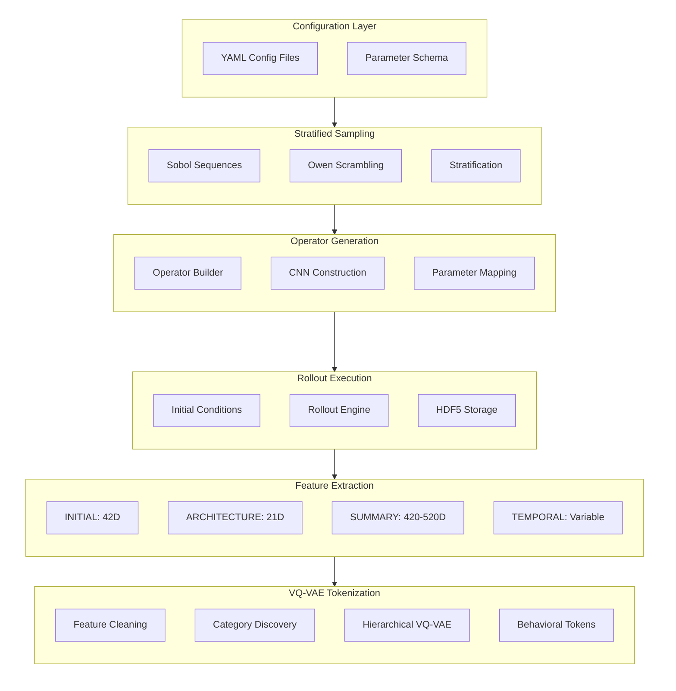
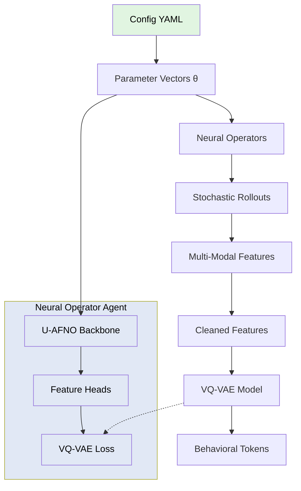

# Spinlock Architecture

**Stratified neural operator dataset generation and hierarchical VQ-VAE tokenization system for behavioral representation learning.**

This document describes the core infrastructure for generating diverse operator datasets and extracting multi-modal behavioral representations. The resulting tokenized representations serve as the foundation for Neural Operator Agent (NOA) research, including potential applications to meta-learning, compositional reasoning, and memory-based prediction.

## System Overview



## Core Components

### 1. Configuration System
**Location:** `src/spinlock/config/`

- **Parameter schema:** Defines operator parameter spaces
- **Stratification:** Sobol-based low-discrepancy sampling
- **Validation:** Type checking and constraint enforcement

### 2. Operator Generation
**Location:** `src/spinlock/operators/`

- **Parameter mapping:** Maps Sobol samples to operator architectures
- **Operator builder:** Constructs neural operators from parameters
- **Block composition:** Modular building blocks for operator design
- **Architecture types:**
  - **CNN (default):** Sequential convolutional layers with residual blocks
  - **U-AFNO:** U-Net encoder + AFNO spectral bottleneck + U-Net decoder
    - Global receptive field via FFT-based spectral mixing
    - Multi-scale hierarchy with skip connections
    - Configurable modes, encoder levels, AFNO blocks

### 3. Rollout Execution
**Location:** `src/spinlock/rollout/`

- **Initial conditions:** 28 INITIAL types across 5 diversity tiers
- **Stochastic rollouts:** 500 timesteps × 3 realizations per operator
- **Execution engine:** Batched GPU execution with memory optimization

### 4. Feature Extraction
**Location:** `src/spinlock/features/`

Four complementary feature families:
- **INITIAL (Initial Condition):** 42D hybrid features
- **ARCHITECTURE (Neural Operator Parameters):** 21D+ parameter features
- **SUMMARY (Summary Descriptor Features):** 420-520D aggregated statistics
- **TEMPORAL (Temporal Dynamics):** Variable temporal resolution features

See [Feature Families](features/README.md) for details.

## Multi-Modal Integration for Interpretability

### Why Four Feature Families?

The decomposition into INITIAL, ARCHITECTURE, SUMMARY, and TEMPORAL is not arbitrary—each family answers distinct questions about operator behavior:

| Family | Question Answered | Interpretability Value | Cognitive Analogue |
|--------|------------------|----------------------|-------------------|
| **INITIAL** | How do input characteristics influence behavior? | Identifies sensitivity to initial conditions | Input encoding |
| **ARCHITECTURE** | Which design choices determine behavioral regimes? | Links structure to function explicitly | Structural priors |
| **SUMMARY** | What are the observable signatures of behavior? | Provides statistical evidence of patterns | Episodic summaries |
| **TEMPORAL** | How do behaviors evolve and transition? | Reveals dynamical mechanisms | Sequential processing |

This multi-modal decomposition mirrors cognitive architectures that integrate information across multiple timescales and representations—though here applied to learning operator behavior rather than perceptual tasks.

### Cross-Validation Through Multiple Perspectives

Multi-modal training enables **consistency checking**:
- If ARCHITECTURE suggests chaotic behavior, do SUMMARY entropy features confirm this?
- If TEMPORAL shows period-doubling bifurcations, do SUMMARY spectral features detect harmonics?
- If INITIAL indicates smooth inputs, does SUMMARY show expected spatial autocorrelation?

This cross-validation improves confidence that discovered categories reflect genuine behavioral differences, not statistical artifacts.

### Transparent Behavioral Taxonomy

The VQ-VAE codebook learns to compress behavior across all four perspectives simultaneously. This creates tokens that:
1. **Integrate evidence** from structure, statistics, and dynamics
2. **Are interpretable** through feature-space attribution
3. **Enable validation** by reconstructing interpretable features

Unlike end-to-end learned representations, this approach maintains a **transparent chain of reasoning**:
```
Raw dynamics → Interpretable features → Hierarchical clustering → Discrete tokens
     ↓              ↓                         ↓                        ↓
Observable    Statistical/    Data-driven      Discrete behavioral
behavior      structural      categories       vocabulary
              semantics       (inspectable)    (interpretable)
```

### 5. Data-Driven Behavioral Taxonomy
**Location:** `src/spinlock/encoding/`

- **Automatic feature cleaning:** NaN removal, variance filtering, deduplication
- **Category discovery:** Hierarchical clustering across all feature families
- **Hierarchical VQ:** 3-level discrete latent space (coarse → medium → fine)
- **Joint training:** Unified representations across INITIAL+ARCHITECTURE+SUMMARY+TEMPORAL

#### Interpretability Properties

The hierarchical clustering approach provides several transparency advantages:

1. **Inspectable Categories**: Unlike end-to-end learned embeddings, clusters can be characterized by:
   - Feature-space centroids (what defines each behavioral category?)
   - Feature attribution (which features distinguish categories?)
   - Hierarchical relationships (how do fine-grained behaviors relate to coarse categories?)

2. **Validation Pathways**:
   - Cluster quality metrics (silhouette score, Davies-Bouldin index)
   - Inter-cluster distances (are categories well-separated?)
   - Utilization rates (are all tokens meaningful, or are some unused?)

3. **Human-Interpretable Discoveries**:
   - Behavioral categories emerge from data, but can be validated by domain experts
   - Feature decomposition enables understanding *why* certain operators cluster together
   - Hierarchical structure reveals natural behavioral taxonomies

See [VQ-VAE Training Guide](vqvae/training-guide.md) for details.

### 6. Dataset Storage
**Location:** `src/spinlock/dataset/`

- **HDF5 format:** Efficient storage with compression
- **Metadata tracking:** INITIAL types, evolution policies, parameter stratification
- **Chunked I/O:** Optimized for large-scale dataset generation

### 7. Visualization
**Location:** `src/spinlock/visualization/`

- **Temporal evolution rendering:** Heatmap, RGB, PCA-based rendering
- **Aggregate statistics:** Mean, variance, FFT visualization
- **Video export:** MP4 and GIF generation

### 8. Neural Operator Agent (NOA)
**Location:** `src/spinlock/noa/`

The NOA is a **hybrid neural operator (U-AFNO backbone) with discrete VQ-VAE perceptual loss**:

**Architecture:**
- **Backbone:** U-AFNO neural operator (144M parameters, U-Net encoder + AFNO spectral bottleneck + decoder)
- **Input:** θ (operator parameters) + u₀ (initial grid)
- **Output:** Predicted rollout trajectory [B, T, C, H, W]
- **Training Loss:** Three-loss structure with CNO replay supervision

**Implementation Files:**
| File | Description |
|------|-------------|
| `src/spinlock/noa/backbone.py` | NOABackbone class (U-AFNO, 144M params) |
| `src/spinlock/noa/vqvae_alignment.py` | VQVAEAlignmentLoss, TrajectoryFeatureExtractor |
| `src/spinlock/noa/cno_replay.py` | CNOReplayer for state-level supervision |
| `scripts/dev/train_noa_state_supervised.py` | Training script with VQ-VAE alignment |

**Three-Loss Training Structure:**
```
L = L_traj + λ₁ * L_latent + λ₂ * L_commit

L_traj:   MSE on trajectories (physics fidelity)           weight: 1.0
L_latent: Pre-quantized latent alignment (smooth gradients) weight: λ₁ = 0.1
L_commit: VQ commitment loss (manifold adherence)           weight: λ₂ = 0.5
```

**Training Flow:**
```
IC (u₀) → NOA Backbone → Predicted Trajectory
                              ↓
                   TrajectoryFeatureExtractor
                              ↓
                   standard_normalize() + nan_to_num()
                              ↓
                   VQ-VAE Encoder (frozen) → z_pre
                              ↓
            L_latent = MSE(z_pred_norm, z_target_norm)
            L_commit = MSE(z_pre, sg(z_quantized))
```

**Why U-AFNO?**
- **Physics-native:** Operates directly in continuous function space matching the studied dynamics
- **Resolution-independent:** Spectral mixing captures global patterns regardless of grid size
- **Self-consistent:** Enables emergent self-modeling and law discovery in the same function space
- **Efficient:** Global receptive field via FFT-based mixing

See [NOA Roadmap](noa-roadmap.md) for development phases and [Phase 1 Baseline](baselines/phase1-uafno-vqvae.md) for architecture details.

## Performance Characteristics

### Dataset Generation (Baseline 10K)
- **Operator count:** 10,000 neural operators
- **Rollout size:** 500 timesteps × 3 realizations
- **Grid resolution:** 128×128 (fixed for VQ-VAE compatibility)
- **Generation time:** ~12 hours (GPU-accelerated)
- **Dataset size:** ~50-100 GB (HDF5 compressed)

### Feature Extraction
- **Inline extraction:** Features computed during rollout generation
- **GPU acceleration:** Batch processing for INITIAL, SUMMARY, TEMPORAL features
- **Memory optimization:** Streaming computation for large datasets

### VQ-VAE Training
- **Input features:** ~300D after cleaning (INITIAL+SUMMARY+TEMPORAL; ARCHITECTURE excluded since NOA already knows θ)
- **Categories:** ~8-15 automatically discovered via clustering
- **Codebook sizes:** Configurable (typically 24 codes per level with uniform initialization)
- **Training time:** ~30-60 minutes for 100K dataset (GPU with torch.compile)

## Design Principles

### 1. Modularity
- Clean separation between config, sampling, generation, execution, features, encoding
- Composable building blocks for operators
- Extensible feature extraction system

### 2. DRY (Don't Repeat Yourself)
- Shared utilities across feature extractors
- Unified parameter mapping system
- Reusable GPU kernels for feature computation

### 3. Extensibility
- Easy addition of new feature families
- Pluggable operator architectures
- Configurable VQ-VAE architectures

### 4. Performance
- GPU-first design for all compute-intensive operations
- Batched processing throughout pipeline
- Memory-efficient streaming for large datasets

### 5. Reproducibility
- Stratified sampling for parameter space coverage
- Deterministic rollouts (seeded randomness)
- Comprehensive metadata tracking

## Research Applications

While the primary focus is scientific simulation and operator reasoning, the architecture provides infrastructure for investigating several cognitive capabilities in the controlled domain of dynamical systems:

**Compositional Generalization**: The factored parameter space enables testing whether learned representations can predict behaviors of novel operator configurations through compositional combination of known components.

**Few-Shot Adaptation**: Behavioral tokens and multi-modal features support research into in-context learning—can agents adapt to new operator families with minimal examples?

**Memory-Based Prediction**: The distinction between SUMMARY (aggregated) and TEMPORAL (sequential) features provides a natural testbed for studying working memory constraints and episodic retrieval strategies.

**Metacognitive Monitoring**: Uncertainty quantification over learned behavioral representations offers a framework for studying calibrated confidence and capability boundary detection.

These applications are secondary to the core goal of understanding operator behavior, but the infrastructure naturally supports such investigations through its multi-modal, hierarchical design.

## Data Flow



**NOA Architecture:** The Neural Operator Agent uses a U-AFNO backbone that takes operator parameters (θ) + initial conditions (u₀) as input. The U-AFNO generates rollouts whose features are encoded by a frozen VQ-VAE, producing discrete behavioral tokens used for loss computation.

## References

- [NOA Roadmap](noa-roadmap.md) - 5-phase development plan
- [Feature Families](features/README.md) - INITIAL, ARCHITECTURE, SUMMARY, TEMPORAL documentation
- [Getting Started](getting-started.md) - Usage tutorials
- [Installation](installation.md) - Setup instructions
