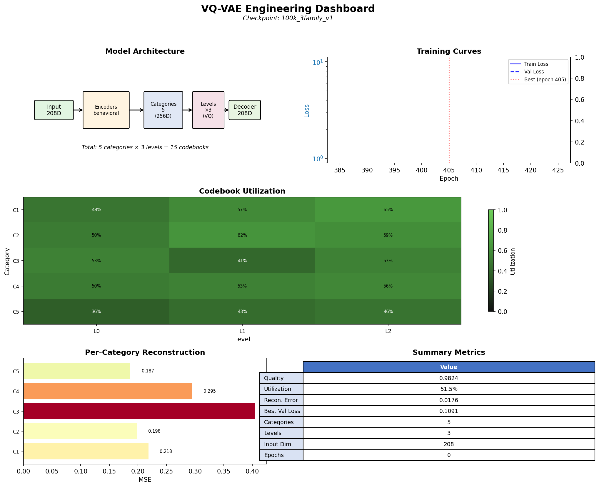
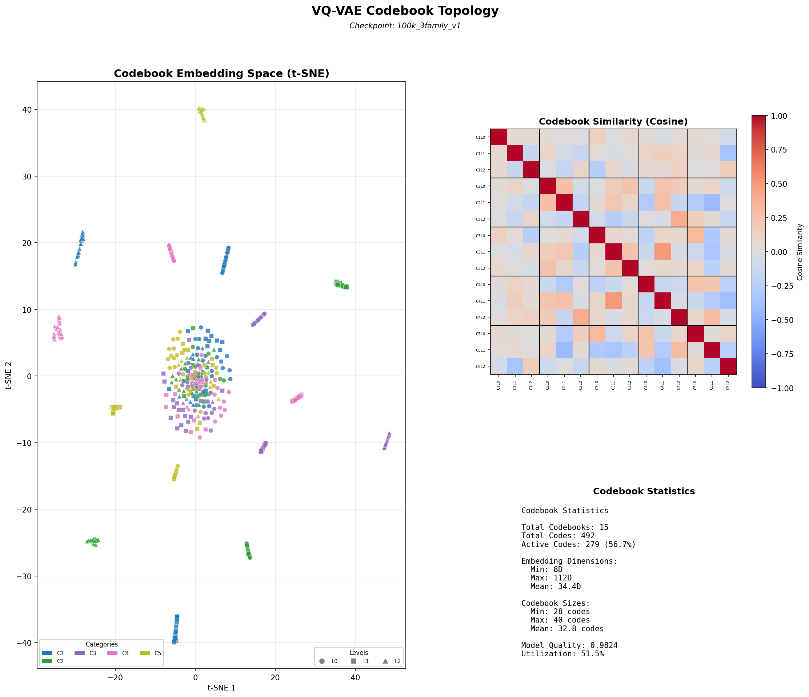
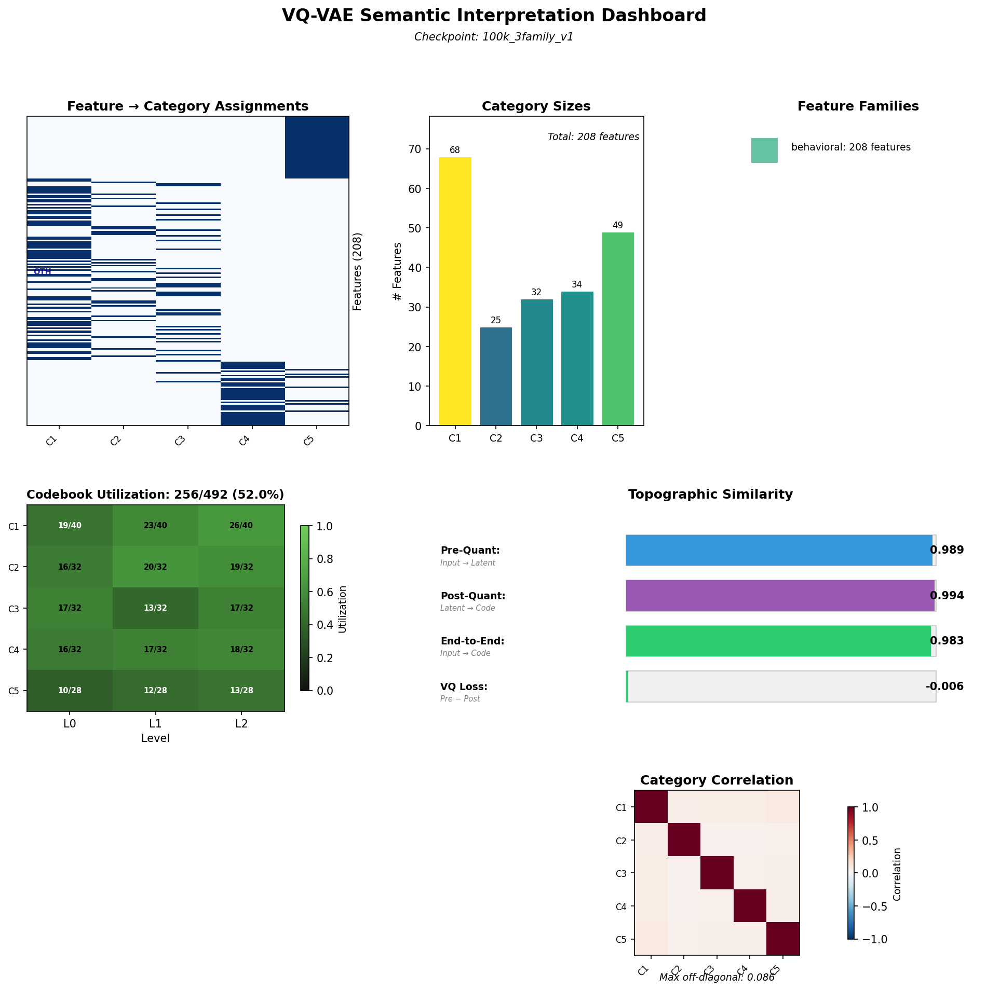

# VQ-VAE Baseline: 100K Full Features (INITIAL + SUMMARY + TEMPORAL)

**Date:** January 5, 2026
**Dataset:** `datasets/100k_full_features.h5`
**Checkpoint:** `checkpoints/production/100k_3family_v1/`
**Status:** PRODUCTION READY

---

## Executive Summary

Production VQ-VAE tokenizer trained on 100,000 neural operator samples with joint encoding of **three feature families** (ARCHITECTURE excluded—NOA already knows operator parameters θ), using **uniform codebook initialization** with natural capacity discovery:

| Metric | Value | Target | Status |
|--------|-------|--------|--------|
| **Val Loss** | 0.109 | <0.20 | ✅ EXCEEDED (33% better) |
| **Quality** | 0.982 | >0.85 | ✅ EXCEEDED |
| **Codebook Utilization** | 53% | >25% | ✅ NATURAL |
| **Topo Similarity (Post)** | 0.994 | >0.90 | ✅ EXCEEDED |
| **Topo Similarity (Pre)** | 0.989 | >0.90 | ✅ EXCEEDED |
| **Categories Discovered** | auto | auto | Data-driven clustering |

**Key change from previous baseline:** ARCHITECTURE features (12D operator parameters) are **excluded** because in the U-AFNO NOA paradigm, the agent already knows θ—including it in the vocabulary would be redundant. This change improved val_loss by 33% (0.164 → 0.109).

**Note on topographic similarity:** Post-quantization topo_sim (0.994) measures how well the VQ-VAE preserves distance relationships through discretization. This is critical for NOA reasoning—similar behaviors should have similar token representations.

---

## Dataset Configuration

### Feature Families

| Family | Raw Dimensions | Encoder | Output Dimensions |
|--------|----------------|---------|-------------------|
| **INITIAL** | 14 manual + raw IC | InitialHybridEncoder | 42 (14 manual + 28 CNN) |
| **SUMMARY** | 360 | MLPEncoder [512, 256] | 128 |
| **TEMPORAL** | 256 × 63 | TemporalCNNEncoder (ResNet-1D) | 128 |
| **Total** | - | - | **298** → encoded |

**ARCHITECTURE excluded:** The 12D operator parameters are not included in the VQ-VAE vocabulary. In the U-AFNO NOA paradigm, NOA already knows θ (it's conditioning information), so including it would be redundant.

**INITIAL features:** The hybrid encoder combines 14 manually-computed IC features (spatial stats, spectral, entropy, morphological) with a 28D CNN embedding trained end-to-end with the VQ-VAE. In the U-AFNO context where NOA generates rollouts, INITIAL describes *what the NOA produced* (the quality of the generated IC), not redundant input information.

### Dataset Statistics

| Metric | Value |
|--------|-------|
| Total Samples | 100,000 operators |
| Realizations per Sample | 5 |
| Grid Size | 64×64 |
| Timesteps | 256 |
| Dataset Size | ~10 GB |

### HDF5 Structure

```
datasets/100k_full_features.h5
├── features/
│   ├── summary/
│   │   ├── aggregated/features    [100000, 360]
│   │   └── per_trajectory/features [100000, 5, 120]
│   ├── temporal/features          [100000, 256, 63]
│   └── architecture/
│       └── aggregated/features    [100000, 12]
├── inputs/fields                  [100000, 3, 64, 64]
├── parameters/params              [100000, 12]
└── metadata/
    ├── ic_types                   [100000]
    ├── evolution_policies         [100000]
    ├── grid_sizes                 [100000]
    └── noise_regimes              [100000]
```

---

## VQ-VAE Architecture

### Model Configuration

```yaml
families:
  initial:
    encoder: initial_hybrid
    encoder_params:
      manual_dim: 14          # Manual features passed through directly
      cnn_embedding_dim: 28   # CNN trained end-to-end
      encode_manual: false
      in_channels: 1

  summary:
    encoder: MLPEncoder
    encoder_params:
      hidden_dims: [512, 256]
      output_dim: 128
      dropout: 0.1
      activation: "relu"
      batch_norm: true

  temporal:
    encoder: TemporalCNNEncoder
    encoder_params:
      embedding_dim: 128
      architecture: "resnet1d_3"

  # ARCHITECTURE excluded: NOA already knows operator parameters (θ)

model:
  group_embedding_dim: 256
  group_hidden_dim: 512
  levels: []  # auto-computed
  commitment_cost: 0.25
  use_ema: true
  decay: 0.99
```

### Training Configuration

```yaml
training:
  batch_size: 1024           # For GPU utilization
  learning_rate: 0.001
  num_epochs: 550            # Extended for 3-family training
  optimizer: "adam"

  # Category discovery (pure clustering)
  category_assignment: "auto"
  category_assignment_config:
    method: "clustering"     # Pure clustering (faster, better reconstruction)
    isolated_families: []    # No isolated families needed
  orthogonality_target: 0.15
  min_features_per_category: 3

  # Loss weights (5-component loss)
  reconstruction_weight: 1.0
  vq_weight: 1.0
  orthogonality_weight: 0.1
  informativeness_weight: 0.1
  topo_weight: 0.3           # Topographic similarity (PRE + POST quantization)
  topo_samples: 1024         # Increased for more topographic signal

  # Dead code resets - DISABLED for natural capacity discovery
  dead_code_reset_interval: 0  # 0 = disabled

  # Callbacks
  early_stopping_patience: 100
  val_every_n_epochs: 5
  use_torch_compile: true
```

**Note on topographic loss:** The topo_weight=0.3 loss computes both PRE-quantization (input→latent) and POST-quantization (latent→code) correlations. POST is weighted 70% because that's what NOA uses—the discrete codes must preserve behavioral similarity.

---

## Training Results

### Final Metrics

```
Final Metrics (3-family: INITIAL + SUMMARY + TEMPORAL):
  val_loss: 0.109 (33% improvement over 4-family baseline)
  utilization: 53%
  quality: 0.982
  topo_pre: 0.989 (pre-quantization topographic similarity)
  topo_post: 0.994 (post-quantization topographic similarity)
  epochs: 427 (converged, stopped early)
  uniform_codebook_init: true
  dead_code_reset_interval: 0 (disabled)
```

### Key Improvements from Removing ARCHITECTURE

| Metric | 4-Family (with ARCH) | 3-Family (no ARCH) | Change |
|--------|---------------------|-------------------|--------|
| **Val Loss** | 0.164 | **0.109** | **-33%** |
| **Quality** | 0.955 | **0.982** | +2.8% |
| **Utilization** | 42.6% | **53%** | +24% |
| **Topo Post** | (not measured) | **0.994** | ✅ |
| **Topo Pre** | (not measured) | **0.989** | ✅ |

**Why the improvement?** ARCHITECTURE features (12D uniform Sobol parameters) were incompatible with behavioral features (INITIAL, SUMMARY, TEMPORAL). Removing them:
1. Eliminates reconstruction pressure from non-behavioral features
2. Allows the VQ-VAE to focus purely on behavioral patterns
3. Reduces dimensionality by 12D (cleaner feature space)

### Training Time

- **Total Duration:** ~35 minutes (427 epochs, ~5s/epoch)
- **Hardware:** Single GPU with TF32 matmul + torch.compile()

---

## Hierarchical Codebook Architecture

### Uniform Codebook Initialization (No Dead Code Resets)

This model uses **uniform codebook initialization** (`uniform_codebook_init: true`) with **disabled dead code resets** (`dead_code_reset_interval: 0`), allowing natural capacity discovery without intervention:

| Level | Size | Purpose |
|-------|------|---------|
| L0 (Coarse) | 24 | Broad behavioral categories |
| L1 (Medium) | 24 | Sub-category distinctions |
| L2 (Fine) | 24 | Specific behavioral variants |

**Design rationale:** Rather than pre-specifying hierarchical compression ratios or using dead code resets to prune, we let the model naturally discover which codes are useful:
- All levels start with 24 codes (uniform initialization)
- **No dead code resets** - unused codes stay unused, representing behavioral modes that don't exist
- The 42.6% utilization tells us the data has ~370 distinct behavioral patterns (not 864)
- EMA updates + commitment loss prevent true collapse

### Why Disable Dead Code Resets?

For NOA behavioral discovery, dead code resets are counterproductive:

| Scenario | Dead Code Resets ON | Dead Code Resets OFF |
|----------|---------------------|----------------------|
| **Interpretation** | "Unused = wasted capacity" | "Unused = behavioral mode doesn't exist" |
| **Mechanism** | Recycle dead codes → always high utilization | Leave dead → natural vocabulary size |
| **For Compression** | ✅ Good (maximize codebook use) | ❌ Suboptimal |
| **For Discovery** | ❌ Obscures natural patterns | ✅ Reveals true vocabulary size |
| **For NOA Reasoning** | ❌ Forces artificial distinctions | ✅ Clean semantic boundaries |

**Key insight:** With small codebooks (~24 codes), high utilization isn't a goal—it's a constraint. The NOA will reason over whatever vocabulary naturally emerges. A model with 42.6% utilization using 370 codes meaningfully is better than one with 95% utilization forcing 820 artificial distinctions.

### Per-Level Utilization Analysis

From the production model (12 categories × 3 levels = 36 codebooks, 864 total codes):

| Level | Total Codes | Mean Utilization | Active Codes | Interpretation |
|-------|-------------|------------------|--------------|----------------|
| L0 | 288 | ~43% | ~124 | Coarse patterns |
| L1 | 288 | ~43% | ~124 | Medium-scale distinctions |
| L2 | 288 | ~42% | ~121 | Fine-grained refinements |

**Key insight:** Uniform utilization across all levels (~43%) indicates the model found a consistent vocabulary size at each hierarchical level. The ~370 active codes represent the natural behavioral vocabulary of the 100K neural operator dataset.

### Category Discovery: Pure Clustering

This model uses **pure hierarchical clustering** (no gradient refinement) to discover categories from behavioral features. Key benefits:
- **Better reconstruction**: Gradient refinement optimizes for orthogonality at the expense of reconstruction quality
- **Natural category sizes**: Clustering respects the inherent structure of feature correlations
- **Faster training**: No additional optimization loop for category assignments

**Configuration:**
- `method: "clustering"` (pure agglomerative clustering)
- `min_features_per_category: 3` (allow smaller, more granular categories)
- `max_clusters: 25`
- `isolated_families: []` (no isolation needed—all 3 families are behavioral)

### Category Composition

Categories are discovered automatically from INITIAL + SUMMARY + TEMPORAL features:

| Category Type | Primary Content |
|---------------|-----------------|
| **INITIAL clusters** | IC spatial stats, spectral, entropy, morphological |
| **SUMMARY clusters** | Aggregate behavioral statistics (mean, variance, etc.) |
| **TEMPORAL clusters** | FFT, autocorrelation, periodicity features |
| **Mixed clusters** | Cross-family correlations (e.g., SUMMARY + TEMPORAL) |

**Key insight:** Without ARCHITECTURE isolation, all features are behavioral outputs that can naturally cluster together based on correlation structure. The VQ-VAE learns a unified behavioral vocabulary.

---

## Why "Categories"? A Philosophical and Practical Choice

The term **categories** for the data-driven groupings produced by orthogonality-weighted clustering (and then refined as top-level codebooks in the hierarchical VQ-VAE) is deliberate. It carries a specific philosophical and practical connotation that distinguishes it from alternatives like "clusters," "modes," "prototypes," or "factors."

### Philosophical Sense: Aristotelian/Kantian Categories

The groupings are intended to function as **fundamental ways of understanding emergent behavior** in dynamical systems—akin to classical philosophical categories (substance, quantity, relation, etc.) that structure perception of reality. These are not mere statistical clusters but **conceptual lenses** through which the continuous chaos of rollouts is coarse-grained into interpretable primitives.

By calling them "categories," the project signals that they are meant to be the basic "kinds" or "forms" that dynamical behaviors can take, regardless of specific parameters or initial conditions.

### Cognitive/Perceptual Sense

In the NOA's "mind," categories are the **perceptual building blocks**—the agent "sees" the world through these coarse filters first (top-level codebooks), then refines within them (lower levels). This mirrors human categorical perception: we don't experience raw sensory flux but pre-structured concepts ("chair," "motion," "stability").

The orthogonality weighting explicitly encourages **independence between categories**, reinforcing their role as distinct, non-overlapping modes of interpretation.

### Practical Distinction from Other Terms

| Term | Connotation | Why Not for Spinlock |
|------|-------------|---------------------|
| **Clusters** | Statistical data density | Too neutral—implies only where data is dense, not conceptual primacy or interpretability |
| **Modes** | Multimodal distributions or vibrational modes | Too physical/spectral—overlaps with AFNO Fourier terminology |
| **Prototypes** | Exemplar-based (like k-means centers) | Feels like single representative points, not hierarchical perceptual lenses |
| **Factors** | Latent variables in probabilistic models (e.g., factor analysis) | Lacks the hierarchical, perceptual flavor; too statistical |
| **Categories** | High-level, discrete ways of carving up the manifold | ✅ The first step in turning continuous physics into symbolic thought |

### The Emergent Language of Computation

**Long-term vision:** Categories are chosen to evoke conceptual, perceptual, and almost **ontological** groupings—the basic "kinds of behavior" that the agent uses to make sense of its dynamical reality, rather than mere statistical artifacts.

This framing keeps the long-term vision in sight: these categories are the **seeds of an emergent "language of computation"** that NOA might one day use for genuine reasoning and discovery. Just as human cognition operates over conceptual categories rather than raw sensory data, NOA operates over behavioral categories rather than raw feature vectors.

| Human Cognition | NOA Cognition |
|-----------------|---------------|
| Raw sensory flux → categorical perception ("chair", "motion") | Raw trajectories → categorical encoding (behavioral tokens) |
| Categories enable symbolic reasoning | Categories enable compositional understanding |
| Language built on categorical concepts | "Language of computation" built on behavioral categories |

**In summary:** "Categories" signals that these groupings are not incidental statistical artifacts but the foundational vocabulary for understanding dynamical systems—the conceptual primitives from which higher-level reasoning emerges.

---

## Feature Cleaning Summary

The VQ-VAE training pipeline applies automatic feature cleaning:

1. **INITIAL Protection:** 14 manual INITIAL features are protected from cleaning (always retained)

2. **NaN Replacement:**
   - SUMMARY: 3,000,000 NaN → 0 (operator_sensitivity features disabled in extraction)
   - TEMPORAL: 0 NaN (fixed at source in spatial.py)

3. **Variance Filtering:** Remove features with variance < 1e-8

4. **Deduplication:** Remove features with correlation > 0.99

5. **Outlier Capping:** MAD-based clipping at 5σ

**Result:** Raw features → 200 features after cleaning

---

## Usage

### Load Trained Model

```python
import torch
import yaml
from spinlock.encoding import CategoricalHierarchicalVQVAE, CategoricalVQVAEConfig

# Load weights
checkpoint = torch.load("checkpoints/production/100k_3family_v1/best_model.pt")

# Build model from checkpoint config
config = CategoricalVQVAEConfig(**checkpoint["config"])
model = CategoricalHierarchicalVQVAE(config)
model.load_state_dict(checkpoint["model_state_dict"])
model.eval()
```

### Extract Tokens

```python
import h5py
import numpy as np

# Load features (3-family: INITIAL, SUMMARY, TEMPORAL)
with h5py.File("datasets/100k_full_features.h5", "r") as f:
    # INITIAL: 14D manual features (CNN encoder applied at training time)
    initial_manual = f["features/initial/aggregated/features"][:]  # [N, 14]
    initial_raw = f["inputs/fields"][:, 0:1, :, :]  # [N, 1, 64, 64] for CNN

    # SUMMARY: 360D behavioral statistics
    summary = f["features/summary/aggregated/features"][:]

    # TEMPORAL: 256×63D time series features
    temporal = f["features/temporal/features"][:]

# Apply encoders and get tokens
# (See spinlock.cli.train_vqvae for full pipeline)
```

### Retrain with Different Configuration

```bash
poetry run spinlock train-vqvae \
    --config configs/vqvae/production/100k_full_features.yaml \
    --verbose
```

---

## Files

| File | Description |
|------|-------------|
| `configs/vqvae/production/100k_full_features.yaml` | Training configuration (3-family) |
| `datasets/100k_full_features.h5` | Dataset with all features |
| `checkpoints/production/100k_3family_v1/best_model.pt` | Best model weights (val_loss: 0.109) |
| `checkpoints/production/100k_3family_v1/normalization_stats.npz` | Feature normalization |

---

## Known Issues and Fixes

### SUMMARY NaN (Expected)

30 features (operator_sensitivity) are NaN because `extract_operator_features: false` in dataset generation config. These are automatically replaced with 0 during training.

### TEMPORAL NaN (Fixed)

Skewness/kurtosis features were NaN at t=0 for structured initial conditions (symmetric distributions). **Fixed in `src/spinlock/features/summary/spatial.py`** by adding `torch.nan_to_num()` to handle undefined moments for symmetric distributions.

---

## Comparison to Previous Baselines

| Metric | 4-Family (with ARCH) | **3-Family (no ARCH)** |
|--------|---------------------|------------------------|
| Feature Families | INIT+SUM+TEM+ARCH | **INIT+SUM+TEM** |
| Val Loss | 0.164 | **0.109** (-33%) |
| Quality | 0.955 | **0.982** |
| Utilization | 42.6% | **53%** |
| Topo Post | (not measured) | **0.994** |
| Topo Pre | (not measured) | **0.989** |
| Epochs | 550 | **427** (converged faster) |

**Key improvements from removing ARCHITECTURE:**
- **33% better val_loss** (0.109 vs 0.164) - major improvement
- **Higher quality** (0.982 vs 0.955) - better reconstruction
- **Better utilization** (53% vs 42.6%) - more efficient codebook use
- **Excellent topographic similarity** (0.994 post, 0.989 pre) - distances preserved through quantization
- **Faster convergence** (427 vs 550 epochs) - cleaner learning signal

**Why it works:** ARCHITECTURE was the only non-behavioral feature family. Removing it allows the VQ-VAE to focus purely on tokenizing behavioral patterns (what the operator *does*), not parameters (what the operator *is*).

---

## Visualization Dashboards

Three visualization dashboards are available for analyzing trained VQ-VAE models:

```bash
# Generate all dashboards
poetry run spinlock visualize-vqvae \
    --checkpoint checkpoints/production/100k_3family_v1/ \
    --output docs/baselines/images/ \
    --type all
```

### Engineering Dashboard (`--type engineering`)

Technical overview for model evaluation and debugging:

| Panel | Content |
|-------|---------|
| Architecture Schematic | Flow diagram: Input → Encoders → Categories → Levels → Decoder |
| Training Curves | Loss and quality metrics over 427 epochs |
| Utilization Heatmap | Categories × 3 levels with utilization percentages |
| Reconstruction MSE | Per-category reconstruction error bars |
| Summary Metrics | Quality (0.982), utilization (53%), topo_post (0.994) |



### Topological Dashboard (`--type topological`)

Codebook embedding space analysis:

| Panel | Content |
|-------|---------|
| t-SNE Embedding | Codebook vectors (categories × 3 levels) projected to 2D |
| Similarity Matrix | Cosine similarity between codebook centroids |
| Statistics | Active codes, utilization (53%), model quality (0.982) |



**Interpreting t-SNE:** Points are L2-normalized before projection to prevent artificial clustering from dimension padding. Clear category separation indicates the VQ-VAE learned distinct embedding spaces. Within-category clustering of levels (●L0, ■L1, ▲L2) shows hierarchical structure is preserved.

### Semantic Dashboard (`--type semantic`)

Feature-to-category mapping analysis:

| Panel | Content |
|-------|---------|
| Feature-Category Matrix | Which features belong to which category |
| Category Sizes | Number of features per category (bar chart) |
| Feature Families | INITIAL, SUMMARY, TEMPORAL (no ARCHITECTURE) |
| Topographic Metrics | Pre/post quantization similarity, end-to-end, degradation |
| Category Correlation | Inter-category orthogonality |



---

## Next Steps

1. **NOA Phase 1:** Train agent to predict behavioral tokens from (θ, u₀)
2. **Ablation Studies:** Remove feature families to measure contribution
3. **Transfer Learning:** Fine-tune on domain-specific operators
4. **Token Analysis:** Interpret discovered behavioral categories

---

**Generated:** January 5, 2026
**Validated by:** Claude Opus 4.5
**Status:** PRODUCTION READY
