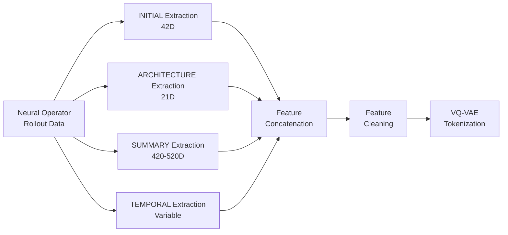

# Feature Families

Spinlock extracts **4 complementary feature families** that jointly capture neural operator behavior from different perspectives.

## Overview

| Family | Dimensions | Captures | Granularity |
|--------|-----------|----------|-------------|
| **INITIAL** | 42D | Initial condition characteristics (spatial, spectral, information, morphology) | Per-realization |
| **ARCHITECTURE** | 21D+ | Operator parameters (architecture, stochastic, evolution) | Per-operator |
| **SUMMARY** | 420-520D | Aggregated behavioral statistics (spatial, spectral, temporal, causality) | Scalar summaries |
| **TEMPORAL** | Variable | Full temporal trajectories preserving time-series structure | Per-timestep |

## Feature Family Details

### Initial Condition (INITIAL) Features

**Location:** `src/spinlock/features/ic/`

42-dimensional hybrid features combining:
- **14 manual features:** Spatial, spectral, information-theoretic, and morphological characteristics
- **28 CNN embeddings:** ResNet-3 encoder extracting learned spatial patterns

For detailed documentation, see [ic.md](ic.md).

### Neural Operator Parameter (ARCHITECTURE) Features

**Location:** `src/spinlock/features/nop/`

21+ dimensional features directly from the parameter space:
- Architecture features (6D): Layer counts, kernel sizes, channels
- Stochastic features (5D): Noise parameters, schedules
- Operator features (3D): Operator type identifiers
- Evolution features (3D): Update policies, integration parameters
- Stratification features (4D): Parameter space location

For detailed documentation, see [nop.md](nop.md).

### Summary Descriptor Features (SUMMARY)

**Location:** `src/spinlock/features/sdf/`

420-520 dimensional aggregated behavioral statistics:

**v1.0 Features:**
- Spatial features (34D): Gradients, anisotropy, multiscale statistics
- Spectral features (31D): FFT power, dominant frequencies, spectral entropy
- Temporal features (44D): Autocorrelation, stationarity, regime transitions

**v2.0 Features:**
- Operator sensitivity (12D): Response to parameter perturbations
- Cross-channel correlations (12D): Multi-channel interactions
- Causality metrics (15D): Temporal information flow
- Invariant drift (64D): Long-term behavioral evolution

For detailed documentation, see [sdf.md](sdf.md).

### Temporal Dynamics (TEMPORAL) Features

**Location:** `src/spinlock/features/td/`

Variable-dimensional temporal features preserving time-series structure:
- Per-timestep feature vectors [N, M, T, D]
- Derived temporal curves (growth rates, curvature, oscillation)
- 1D CNN encoder for temporal pattern extraction

For detailed documentation, see [td.md](td.md).

## Joint Training

The VQ-VAE jointly trains on all 4 feature families simultaneously. Rather than treating each family independently, hierarchical clustering discovers natural groupings that span multiple feature types, enabling holistic operator behavioral patterns.

This multi-modal approach allows the model to learn representations that integrate:
- How initial conditions influence operator dynamics (INITIAL)
- How architectural choices determine behavioral regimes (ARCHITECTURE)
- Statistical signatures of emergent patterns (SUMMARY)
- Temporal evolution and regime transitions (TEMPORAL)

## Feature Extraction Pipeline

## Feature Cleaning

Before VQ-VAE training, all features undergo automatic cleaning:
1. **NaN removal:** Drop features with any NaN values
2. **Variance filtering:** Remove zero-variance features (threshold: 1e-8)
3. **Deduplication:** Remove highly correlated features (threshold: 0.99)
4. **Outlier capping:** Clip extreme values using MAD-based outliers (threshold: 5.0 MAD)

See [VQ-VAE Training Guide](../vqvae/training-guide.md) for details on the tokenization pipeline.

## Implementation

All feature extractors are GPU-accelerated and optimized for batch processing:
- Parallel extraction across multiple operators
- Efficient memory management for large datasets
- Inline feature computation during dataset generation

For usage examples, see [Getting Started](../getting-started.md).
