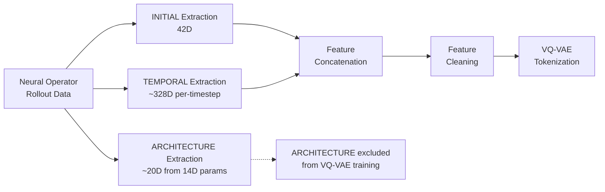

# Feature Families

Spinlock extracts **3 complementary feature families** that jointly capture neural operator behavior from different perspectives. This multi-modal representation provides a foundation for studying compositional reasoning, working memory dynamics, and online behavioral prediction in the controlled domain of dynamical systems.

**Last Updated:** 2026-01-18 (v3.0 - SUMMARY features removed, TEMPORAL features enhanced)

## Overview

| Family | Dimensions | Captures | Granularity | Cognitive Role |
|--------|-----------|----------|-------------|----------------|
| **INITIAL** | 42D | Initial condition characteristics (spatial, spectral, information, morphology) | Per-realization | Input encoding |
| **ARCHITECTURE** | ~20D | Operator parameters from 14D parameter space (architecture, stochastic, evolution) | Per-operator | Structural priors |
| **TEMPORAL** | ~328D | Per-timestep behavioral features (spatial, spectral, cross-channel, temporal dynamics) | Per-timestep | Working memory |

## Feature Family Details

### Initial Condition (INITIAL) Features

**Location:** `src/spinlock/features/initial/`

42-dimensional hybrid features combining:
- **14 manual features:** Spatial, spectral, information-theoretic, and morphological characteristics
- **28 CNN embeddings:** ResNet-3 encoder extracting learned spatial patterns

See [Feature Reference](feature-reference.md) for complete feature specifications.

### Neural Operator Parameter (ARCHITECTURE) Features

**Location:** `src/spinlock/features/architecture/`

~20 dimensional features derived from the **14D parameter space**:
- Architecture features (5D): num_layers, base_channels, kernel_size, activation, dropout_rate
- Stochastic features (4D): noise_type, noise_scale, noise_schedule, spatial_correlation
- Operator features (2D): normalization, grid_size
- Evolution features (3D): update_policy, dt (timestep size), alpha (convex weight)
- Stratification features (variable): Parameter space location indicators

**Parameter Space Details (14D):**
- `dt`: 10 discrete choices [0.005, 0.01, 0.015, ..., 0.05] for residual policy
- `alpha`: 9 discrete choices [0.1, 0.2, 0.3, ..., 0.9] for convex policy
- Results in ~19 unique evolution dynamics (10 dt values + 9 alpha values)

**Note:** ARCHITECTURE features are stored in `/parameters/params [N, 14]` as Sobol unit cube values in HDF5 files, not in `/features/architecture/`.

See [Feature Reference](feature-reference.md) for complete feature specifications.

### ~~Summary Descriptor Features (SUMMARY)~~ [REMOVED in v3.0]

**SUMMARY features were removed in v3.0.0** to support online Neural Operator Apprentice (NOA) predictions. Aggregated trajectory-level features (causality, invariant drift, operator sensitivity, nonlinear dynamics) are incompatible with per-timestep online computation.

Archived code available in `src/spinlock/features/temporal_old_v2/summary/` for reference.

**Rationale:** NOA must make predictions at each timestep without seeing the full trajectory, requiring features to be computable online. SUMMARY features required complete trajectories and were thus incompatible with this architecture.

### Temporal Dynamics (TEMPORAL) Features

**Location:** `src/spinlock/features/temporal/`

**~328D per-timestep behavioral features** (enhanced from 63D in v2.x):

**Spatial Features (~105D):**
- Per-channel statistics (mean, std, min, max, percentiles)
- Spatial gradients and Laplacian features
- Histogram-based distribution features

**Spectral Features (~93D):**
- Multi-scale FFT features (power spectrum, dominant frequencies)
- Frequency band energy distributions
- Spectral entropy and complexity metrics

**Cross-Channel Features (~10D):**
- Pairwise channel correlations
- Eigenvalue statistics of covariance matrix

**Enhanced Temporal Dynamics (~120D):**
- Windowed temporal statistics (velocity, acceleration)
- Stability metrics (Lyapunov-inspired features)
- Phase space reconstruction features
- Temporal autocorrelation and memory depth

**Storage Format:** `[N, T, D_temporal]` where T is the number of timesteps and D_temporal ≈ 328.

All features are **per-timestep computable**, making them suitable for online prediction in NOA.

See [Feature Reference](feature-reference.md) for complete feature specifications.

## Joint Training

The VQ-VAE jointly trains on **2 behavioral feature families (INITIAL, TEMPORAL)**. ARCHITECTURE is excluded because the NOA already knows operator parameters θ—including it would be redundant.

This multi-modal approach allows the model to learn representations that integrate:
- How initial conditions influence operator dynamics (INITIAL → input encoding)
- Per-timestep behavioral evolution and regime transitions (TEMPORAL → working memory sequences)

**v3.0 Change:** SUMMARY features were removed, simplifying the architecture to focus on per-timestep online-computable features that support real-time NOA predictions.

## NOA Feature Heads

In the Phase 1 NOA architecture, the U-AFNO backbone produces **auxiliary feature heads** aligned with these families:

| Head | Source | Output | Purpose |
|------|--------|--------|---------|
| **INITIAL-like** | U-AFNO bottleneck at t=0 | 42D | Quality of generated initial conditions |
| **TEMPORAL-like** | Skip connections at each timestep | ~328D | Per-timestep behavioral features |

This means features are **both extracted from datasets** (Phase 0) and **predicted by the NOA** (Phase 1+). The frozen VQ-VAE encodes both → discrete tokens, enabling loss computation via token reconstruction.

**v3.0 Change:** Removed SUMMARY-like head (aggregated features incompatible with online prediction). TEMPORAL features are now predicted per-timestep, enabling online NOA operation.

### Cognitive Architecture Analogues

The three-family decomposition provides measurable analogues to cognitive processing:

**Input Encoding (INITIAL)**: Like sensory encoding in biological systems, INITIAL features characterize the "perceptual" properties of inputs that the operator will process. This enables studying how different input statistics influence downstream behavioral trajectories.

**Structural Priors (ARCHITECTURE)**: Analogous to innate biases or learned schemas, ARCHITECTURE features encode the operator's intrinsic computational structure—independent of specific inputs. This supports research into how architectural inductive biases shape behavioral regimes.

**Working Memory (TEMPORAL)**: Per-timestep TEMPORAL features mirror working memory dynamics in biological systems—maintaining rich, structured representations of ongoing processes without compression. The ~328D feature space at each timestep captures multi-modal behavioral signatures (spatial, spectral, cross-channel, temporal dynamics) that evolve online.

These analogues are not metaphorical—they provide concrete, measurable frameworks for studying memory, online prediction, and representation in a domain without the confounds of natural perception.

**v3.0 Change:** Removed the episodic compression analogy (SUMMARY features). The current architecture focuses on online working memory (TEMPORAL) rather than offline trajectory compression, better aligning with real-time cognitive processing.

## Feature Extraction Pipeline

```mermaid
flowchart LR
    Rollout[Neural Operator<br/>Rollout Data]
    INITIAL[INITIAL Extraction<br/>42D]
    ARCHITECTURE[ARCHITECTURE Extraction<br/>~20D from 14D params]
    TEMPORAL[TEMPORAL Extraction<br/>~328D per-timestep]
    Concat[Feature<br/>Concatenation]
    Clean[Feature<br/>Cleaning]
    VQVAE[VQ-VAE<br/>Tokenization]

    Rollout --> INITIAL
    Rollout --> ARCHITECTURE
    Rollout --> TEMPORAL
    INITIAL --> Concat
    TEMPORAL --> Concat
    Concat --> Clean
    Clean --> VQVAE

    Note[ARCHITECTURE excluded<br/>from VQ-VAE training]
    ARCHITECTURE -.-> Note
```

## Feature Cleaning

Before VQ-VAE training, all features undergo automatic cleaning:
1. **NaN removal:** Drop features with any NaN values
2. **Variance filtering:** Remove zero-variance features (threshold: 1e-8)
3. **Deduplication:** Remove highly correlated features (threshold: 0.99)
4. **Outlier capping:** Clip extreme values using MAD-based outliers (threshold: 5.0 MAD)

See [VQ-VAE Training Guide](../vqvae/training-guide.md) for details on the tokenization pipeline.

## Implementation

All feature extractors are GPU-accelerated and optimized for batch processing:
- Parallel extraction across multiple operators
- Efficient memory management for large datasets
- Inline feature computation during dataset generation

### Operator Compatibility

Feature extraction works identically with all supported operator architectures:

| Operator Type | Description | Feature Compatibility |
|---------------|-------------|----------------------|
| **CNN** | Sequential convolutional layers with residual blocks | ✅ Full support |
| **U-AFNO** | U-Net encoder + AFNO spectral bottleneck + decoder | ✅ Full support |

The feature extraction pipeline is architecture-agnostic—it processes rollout trajectories regardless of how they were generated. This enables direct comparison of behavioral features across different operator architectures within the same dataset or across datasets.

**Note:** ARCHITECTURE features automatically capture operator-type-specific parameters (e.g., U-AFNO's `modes`, `encoder_levels`, `afno_blocks` are included when using U-AFNO operators).

For usage examples, see [Getting Started](../getting-started.md).
