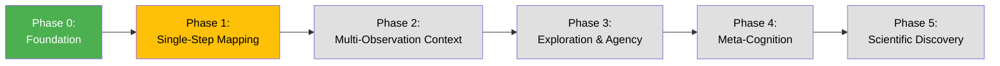

# Neural Operator Agent (NOA) Roadmap

**A hierarchical, meta-cognitive neural operator system for learning, generating, and reflecting on complex dynamical behaviors.**

This roadmap provides a practical blueprint for building an Agent Neural Operator (ANO) capable of mapping VQ-VAE token sequences to operators and initial conditions, producing rollouts consistent with observed dynamics, and developing self-referential understanding of its own generative behavior.

## Overview

**Legend:**
- 🟢 **Green**: Complete
- 🟡 **Yellow**: In Development
- ⚪ **Gray**: Planned

---

## Phase 0: Foundation – Data and Tokens

**Status:** ✅ **COMPLETE**

### Objective
Establish the data infrastructure and tokenization system that enables behavioral representation learning.

### Components

**Inputs:**
- Hierarchical VQ-VAE tokens representing neural operator rollouts
- Stratified parameter sampling (Sobol + Owen scrambling)
- Stochastic rollout generation (500 timesteps × 3 realizations)

**Initial Conditions:**
- Small, generic basis: Gaussian noise, band-limited noise, simple sinusoids/blobs
- Regime-separated variance/frequency levels
- Balanced diversity to avoid codebook allocation bias

**Features:**
- **IC** (Initial Condition): 42D hybrid features (14 manual + 28 CNN)
- **NOP** (Neural Operator Parameters): 21D architectural/stochastic/evolution features
- **SDF** (Summary Descriptor Features): 420-520D aggregated behavioral statistics
  - Spatial, temporal, spectral, cross-channel, and invariant drift axes
- **TD** (Temporal Dynamics): Full temporal resolution features

**Key Emphasis:**
- IC diversity balanced to avoid biasing codebook allocation
- Neutral priors ensuring tokenization reflects operator semantics, not IC frequency
- Joint training across all 4 feature families (IC+NOP+SDF+TD)

### Deliverables
- ✅ Stratified neural operator dataset generator
- ✅ Multi-modal feature extraction pipeline
- ✅ Hierarchical VQ-VAE tokenizer with automatic category discovery
- ✅ Behavioral token vocabulary (discrete latent space)

---

## Phase 1: Single-Step ANO Mapping

**Status:** 🔄 **IN DEVELOPMENT**

### Objective
Establish baseline meta-operator mapping from tokens to operators and initial conditions.

### Architecture
- MLP or lightweight feedforward network
- **Input:** Token sequence for a single rollout
- **Output:** Parameters of a neural operator + IC to reconstruct that rollout

### Training

**Loss Function (Hybrid):**
1. **Token sequence reconstruction** - Discrete VQ-VAE alignment
2. **Feature-space reconstruction** - Continuous SDF matching

**Training Objective:**
Minimize divergence between generated and target rollouts while preserving codebook semantics.

**Evaluation Metrics:**
- Token reconstruction accuracy
- Feature-space error (MSE on SDFs)
- Stability of operator assignments across IC regimes
- Codebook utilization and coverage

### Key Emphasis
This phase establishes the **baseline meta-operator mapping** essential before multi-step or self-referential capabilities.

### Deliverables
- [ ] ANO architecture implementation
- [ ] Hybrid loss function
- [ ] Training pipeline
- [ ] Evaluation metrics and benchmarks

---

## Phase 2: Multi-Observation Context

**Status:** 📋 **PLANNED**

### Objective
Capture temporal correlations and higher-order operator dependencies across multiple observations.

### Architecture Upgrade
- **Transformer or attention-based temporal encoder**
- **Input:** Sequence of tokenized rollouts across multiple observations or timesteps
- **Output:** Contextualized operator parameters conditioned on multi-step patterns

### Advantages
- Enables ANO to synthesize operators conditioned on multi-step patterns
- Forms **contextualized latent representations** supporting emergent reasoning
- Attention across sequences enables identification of invariant operator traits over time

### Key Emphasis
Attention across sequences is critical for eventual **self-modeling**—the agent must identify invariant traits in its own operator generation over time.

### Deliverables
- [ ] Transformer-based temporal encoder
- [ ] Multi-observation training protocol
- [ ] Contextualized representation analysis
- [ ] Temporal dependency metrics

---

## Phase 3: Exploration and Agency

**Status:** 📋 **PLANNED**

### Objective
Develop meta-dynamical cognitive memory with self-directed exploration capabilities.

### Directive Framework
- **Task:** Explore novel ICs or operators probing underrepresented/uncertain dynamics
- **Feedback loop:** Compare generated rollouts against predicted tokens or SDFs
- **Optimization:** Novelty, diversity, or reduction of internal uncertainty
- **Optional:** Curriculum learning for gradual complexity increase

### Outcomes
ANO develops **meta-dynamical cognitive memory**, capable of:
- Synthesizing operators expressing inferred latent structures
- Exploring unknown dynamics with self-directed "curiosity"
- Generating rollouts reflecting internal understanding of patterns

### Key Emphasis
This phase is the **first step toward emergent self-referential modeling**—the agent begins to treat its own operator generation as part of the environment it can learn about.

### Deliverables
- [ ] Exploration policy implementation
- [ ] Novelty/diversity metrics
- [ ] Uncertainty quantification
- [ ] Curriculum learning framework

---

## Phase 4: Self-Referential Meta-Cognition

**Status:** 📋 **PLANNED**

### Objective
Enable the ANO to model its own generative behavior, forming functional introspection.

### Mechanism
- Feed ANO-generated rollouts back through the VQ-VAE
- Summarize internal errors or surprises
- Encourage ANO to **model its own generative behavior**

### Internal Model
Form latent encoding "how I, the ANO, typically behave":
- Predictive consistency of self-generated outputs
- Error distributions relative to expected behavior
- Deviations from expected SDFs/tokens

### Key Emphasis
This is where **self-perspective emerges**—not through symbolic identity but as a **learned internal model of its own dynamics**, the functional equivalent of introspection.

### Deliverables
- [ ] Self-observation loop implementation
- [ ] Internal consistency metrics
- [ ] Self-model evaluation framework
- [ ] Introspection analysis tools

---

## Phase 5: Scientific Discovery and Evaluation

**Status:** 📋 **PLANNED**

### Objective
Enable autonomous scientific exploration and hypothesis generation.

### Evaluation Metrics
- Token reproducibility and codebook coverage
- Feature-space error stability across IC types
- Mutual information between generated operator behavior and input tokens
- Emergent compositionality and abstraction in generated operators

### Applications
- **Meta-learning of operators:** Learn families of operators with shared structure
- **Interpretable dynamics generation:** Generate reusable, understandable dynamics
- **Autonomous scientific exploration:** Self-directed hypothesis generation and testing
- **Emergent understanding:** Discover operator families and dynamical regimes

### Key Capabilities
- Formulate hypotheses about operator behavior
- Design experiments to test hypotheses
- Analyze results and refine understanding
- Generate new operators targeting specific behaviors

### Deliverables
- [ ] Hypothesis generation framework
- [ ] Experimental design system
- [ ] Automated analysis pipeline
- [ ] Discovery metrics and evaluation

---

## Design Philosophy

This roadmap systematically integrates multiple advanced components:
- **Tokenized latent representations** (Phase 0)
- **Feature-based reconstruction** (Phase 1)
- **Multi-step attention** (Phase 2)
- **Exploratory agency** (Phase 3)
- **Self-referential modeling** (Phase 4)
- **Scientific discovery** (Phase 5)

The resulting architecture serves dual purposes:
1. **Research platform** for studying emergent cognitive-like behavior in dynamical systems
2. **Foundation for autonomous scientific exploration**, enabling the system to abstract, reason about, and experiment with its own operator space

This approach could lead to novel insights and discoveries by allowing the system to develop its own understanding of dynamical behavior.

---

## References

- Spinlock codebase: `/home/daniel/projects/spinlock/`
- Feature extraction: `src/spinlock/features/`
- VQ-VAE tokenization: `src/spinlock/encoding/`
- Dataset generation: `src/spinlock/dataset/`

For detailed architecture and implementation, see [architecture.md](architecture.md).
