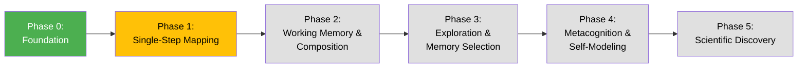

# Neural Operator Agent (NOA) Roadmap

**A hierarchical, meta-cognitive neural operator system for learning, generating, and reflecting on complex dynamical behaviors with general intelligence capabilities.**

This roadmap provides a practical blueprint for building a Neural Operator Agent (NOA) capable of mapping VQ-VAE token sequences to operators and initial conditions, producing rollouts consistent with observed dynamics, and developing self-referential understanding of its own generative behavior. The architecture provides a testbed for cognitive capabilities including working memory, compositional reasoning, episodic memory formation, meta-learning, and metacognitive monitoring—all grounded in measurable, empirically testable mechanisms.

## Overview

**Legend:**
- 🟢 **Green**: Complete
- 🟡 **Yellow**: In Development
- ⚪ **Gray**: Planned

---

## Design Principles: Bias-Minimizing Discovery Architecture

The NOA is designed around a radical premise: **we don't know what we're looking for**. The architecture prioritizes discovering truly novel structure over optimizing predetermined objectives.

### 1. Mathematical Guarantees Against Sampling Bias

**Problem**: Random sampling creates "blind spots" where lucky draws dominate, and unlucky regions remain unexplored.

**Solution**: Stratified Sobol sequences with Owen scrambling
- **Discrepancy <0.01**: Mathematical guarantee of fair exploration across the entire parameter hypercube
- **High-dimensional coverage** (d>100): No region left unsampled, no artifacts mistaken for structure
- **Independent contribution**: Custom-engineered sampler achieving provably optimal space-filling properties

**Why it matters**: Prevents "discovering" patterns that are actually sampling artifacts. Every region explored equitably.

### 2. Bias-Free Feature Extraction: Learning Without Prejudice

Rather than choosing "interesting" features based on human intuition, extract **comprehensive statistical signatures**:

- **INITIAL**: All spatial/spectral/information characteristics, not cherry-picked
- **ARCHITECTURE**: Complete parameter space mapping, not designer-selected hyperparameters
- **SUMMARY**: Full statistical profile (spatial, spectral, temporal, causal, topological) without filtering
- **TEMPORAL**: Entire time series preserved, no predetermined "important" timesteps

**Principle**: If we don't extract it, we can't discover it. Cast the widest possible net.

### 3. Data-Driven Taxonomy: Categories Emerge, Not Imposed

Behavioral categories discovered through **unsupervised hierarchical clustering**:
- No labeled data (labels impose human bias)
- No task-specific objectives (tasks constrain discovery space)
- Categories reflect the natural geometry of operator behavior, potentially revealing alien semantics

**Validation**: Cluster quality metrics (silhouette, Davies-Bouldin) ensure structure is genuine, not forced

### 4. Topological Positional Encoding: Reasoning About Functional Similarity

**Innovation**: Positional encoding based on **parameter-space distance**, not chronological time

**Standard Transformer**: Position = sequence order (temporal)
**NOA Transformer**: Position = behavioral similarity (topological)

Enables the agent to reason: "This operator I've never seen is similar to these three I have seen, based on parameter proximity."

**Why it matters**: In-context learning of operator physics—the attention mechanism performs implicit regression over parameter-behavior relationships.

### 5. Curiosity-Driven Adaptive Refinement: Closing the Loop

**Phase 3 Innovation**: Agent actively directs its own exploration

- **Prediction error** as curiosity signal: High-variance regions = poor understanding
- **Autonomous re-parameterization**: Agent refines sampling to explore behavioral frontiers
- **Self-directed discovery**: System identifies gaps in its world model and fills them

**This is the "meta" in meta-cognitive**: Not just learning from data, but learning *what to learn about*.

### 6. Transparent Mechanisms at Every Level

Even advanced phases maintain interpretability:
- **Feature → Token mapping**: Inspectable through attribution analysis
- **Self-models**: Must be analyzable—track what the system "believes" about itself
- **Discovered laws**: Expressed as testable, falsifiable mathematical relationships

**Goal**: Discovery of alien semantics, but through transparent, validatable mechanisms

---

## Phase 0: Foundation – Data and Tokens

**Status:** ✅ **COMPLETE**

### Objective
Establish the data infrastructure and tokenization system that enables behavioral representation learning.

### Components

**Inputs:**
- Hierarchical VQ-VAE tokens representing neural operator rollouts
- Stratified parameter sampling (Sobol + Owen scrambling)
- Stochastic rollout generation (500 timesteps × 3 realizations)
- Multiple operator architectures:
  - **CNN**: Sequential convolutional layers for local feature extraction
  - **U-AFNO**: U-Net encoder + AFNO spectral bottleneck + decoder for global receptive field via FFT-based mixing

**Initial Conditions:**
- Small, generic basis: Gaussian noise, band-limited noise, simple sinusoids/blobs
- Regime-separated variance/frequency levels
- Balanced diversity to avoid codebook allocation bias

**Features:**
- **INITIAL** (Initial Condition): 42D hybrid features (14 manual + 28 CNN)
- **ARCHITECTURE** (Neural Operator Parameters): 21D architectural/stochastic/evolution features
- **SUMMARY** (Summary Descriptor Features): 420-520D aggregated behavioral statistics
  - Spatial, temporal, spectral, cross-channel, and invariant drift axes
- **TEMPORAL** (Temporal Dynamics): Full temporal resolution features

**Key Emphasis:**
- INITIAL diversity balanced to avoid biasing codebook allocation
- Neutral priors ensuring tokenization reflects operator semantics, not INITIAL frequency
- Joint training across all 4 feature families (INITIAL+ARCHITECTURE+SUMMARY+TEMPORAL)

### Deliverables
- ✅ Stratified neural operator dataset generator
- ✅ Multi-modal feature extraction pipeline
- ✅ Hierarchical VQ-VAE tokenizer with automatic category discovery
- ✅ Behavioral token vocabulary (discrete latent space)

---

## Phase 1: Single-Step NOA Mapping

**Status:** 🔄 **IN DEVELOPMENT**

### Objective
Establish baseline meta-operator mapping from tokens to operators and initial conditions.

### Architecture
- MLP or lightweight feedforward network
- **Input:** Token sequence for a single rollout
- **Output:** Parameters of a neural operator + INITIAL to reconstruct that rollout

### Training

**Loss Function (Hybrid):**
1. **Token sequence reconstruction** - Discrete VQ-VAE alignment
2. **Feature-space reconstruction** - Continuous SUMMARY matching

**Training Objective:**
Minimize divergence between generated and target rollouts while preserving codebook semantics.

**Evaluation Metrics:**
- Token reconstruction accuracy
- Feature-space error (MSE on SDFs)
- Stability of operator assignments across INITIAL regimes
- Codebook utilization and coverage

### Key Emphasis
This phase establishes the **baseline meta-operator mapping** essential before multi-step or self-referential capabilities.

### Validation Methodology

**Interpretability Metrics**:
- **Feature-token alignment**: Do tokens capture feature-space structure?
- **Reconstruction fidelity**: Can we recover interpretable features from tokens?
- **Category coherence**: Are discovered clusters semantically meaningful?

**Transparency Mechanisms**:
- **Codebook inspection**: Visualize what each token represents in feature space
- **Attribution analysis**: Which features contribute most to each token assignment?
- **Failure case analysis**: When does the mapping break down and why?

**Success Criteria** (Phase 1 → Phase 2):
- Token reconstruction achieves <10% feature-space error
- Manual inspection confirms behavioral categories are interpretable
- Stability analysis shows consistent token assignments across runs

### Deliverables
- [ ] NOA architecture implementation
- [ ] Hybrid loss function
- [ ] Training pipeline
- [ ] Evaluation metrics and benchmarks

---

## Phase 2: Multi-Observation Context & Working Memory

**Status:** 📋 **PLANNED**

### Objective
Capture temporal correlations and higher-order operator dependencies across multiple observations, enabling compositional reasoning and working memory dynamics.

### Architecture Upgrade
- **Transformer or attention-based temporal encoder**
- **Input:** Sequence of tokenized rollouts across multiple observations or timesteps
- **Output:** Contextualized operator parameters conditioned on multi-step patterns

### Cognitive Capabilities (Grounded in Mechanisms)

**Working Memory Dynamics:**
- Transformer attention mechanism maintains limited-capacity state over operator sequences
- Empirically measurable: track which prior observations influence current predictions (attention weights)
- Testable hypothesis: Does performance degrade with sequence length in a capacity-limited manner?

**Compositional Reasoning:**
- Learn how operator components combine to produce emergent behaviors
- Mechanism: Attention over operator parameter subspaces reveals compositional structure
- Validation: Zero-shot generalization to novel parameter combinations not seen during training
- Quantifiable metric: Prediction accuracy on held-out compositional configurations

**Meta-Learning from Dynamics:**
- Few-shot adaptation to novel operator families through in-context learning
- No gradient updates required—adaptation via attention over similar past experiences
- Testable: Measure generalization error after N shots vs. baselines (k-NN, direct transfer)

### Key Emphasis
Attention across sequences is critical for eventual **self-modeling**—the agent must identify invariant traits in its own operator generation over time. This phase establishes measurable analogues to cognitive working memory through attention mechanisms.

### Deliverables
- [ ] Transformer-based temporal encoder
- [ ] Multi-observation training protocol
- [ ] Contextualized representation analysis
- [ ] Temporal dependency metrics
- [ ] Working memory capacity analysis
- [ ] Compositional generalization benchmarks
- [ ] Few-shot adaptation evaluation

---

## Phase 3: Curiosity-Driven Exploration & Attention-Based Memory Selection

**Status:** 📋 **PLANNED**

### Objective
Close the loop: agent actively directs its own exploration by identifying knowledge gaps and adaptively refining sampling. Develop attention-based mechanisms for determining which experiences are worth encoding vs. discarding.

### Core Mechanism: Adaptive Refinement
- **Prediction error as curiosity signal**: High-variance regions indicate poor understanding
- **World model uncertainty**: Track which regions of operator space are poorly understood
- **Autonomous re-parameterization**: Agent refines sampling to explore behavioral frontiers
- **Directed discovery**: Use prediction error to guide exploration toward novel regimes

### Cognitive Capabilities (Grounded in Mechanisms)

**Attention-Based Memory Selection:**
- Mechanism: Use prediction error gradient to determine which operator experiences merit long-term encoding
- High-surprise operators → higher retention probability (analogous to biological memory consolidation)
- Quantifiable: Compare replay buffer composition under error-weighted vs. uniform sampling
- Testable: Does selective memory improve sample efficiency vs. random replay?

**Episodic-Like Memory Indexing:**
- Organize operator "experiences" by behavioral similarity (not chronological order)
- Retrieval mechanism: Query by feature-space proximity, not recency
- Validation: Measure retrieval precision/recall on held-out operator queries
- Metric: Does similarity-based indexing outperform temporal or random retrieval?

**Cross-Domain Abstraction (Empirical):**
- Identify parameter-invariant behavioral patterns across different operator families
- Mechanism: Hierarchical clustering in learned representation space
- Test: Train on operator family A, evaluate abstraction transfer to family B
- Quantify: Measure zero-shot transfer accuracy as proxy for domain-invariant learning

### Why This Matters
This is the **"meta" in meta-cognitive**: Not just learning from data, but learning *what to learn about*.

The NOA doesn't just model existing data—it actively identifies gaps in its world model and fills them through targeted exploration. This transforms the system from passive learner to active discoverer.

### Validation Questions
- Does curiosity-driven sampling discover fundamentally new behavioral categories?
- Are identified "knowledge gaps" semantically meaningful?
- Does adaptive refinement improve coverage of operator space more efficiently than uniform sampling?
- Does attention-weighted memory selection improve sample efficiency vs. uniform replay?
- Can the system identify and retrieve behaviorally similar operators across different parameter regimes?

### Key Emphasis
This phase closes the discovery loop: the NOA becomes self-directed, autonomously identifying behavioral frontiers and adapting its exploration strategy. It develops mechanisms for selective memory encoding and cross-domain pattern recognition.

### Deliverables
- [ ] Prediction error-based curiosity metric
- [ ] World model uncertainty quantification
- [ ] Adaptive sampling re-parameterization
- [ ] Discovery validation framework
- [ ] Attention-weighted memory consolidation
- [ ] Similarity-based retrieval system
- [ ] Cross-domain transfer benchmarks

---

## Phase 4: Transparent Self-Modeling & Metacognitive Monitoring

**Status:** 📋 **PLANNED**

### Research Question
Can an agent develop interpretable internal models of its own generative processes, enabling metacognitive monitoring of prediction confidence and capability boundaries?

### Core Mechanism
The NOA learns a **self-model**: a function mapping from internal state → predicted behavioral outcomes. This is not "self-awareness" in an anthropomorphic sense, but rather:
- A learned approximation of the agent's own input-output mapping
- An inspectable representation of what the system "expects" itself to do
- A tool for detecting distributional shift in the agent's own behavior

### Cognitive Capabilities (Grounded in Mechanisms)

**Metacognitive Confidence Estimation:**
- Mechanism: Learn mapping from internal activation patterns → prediction error
- Output: Calibrated uncertainty estimates for each operator prediction
- Validation: Measure calibration curve (predicted confidence vs. actual accuracy)
- Testable: Does the agent "know when it doesn't know"? (High uncertainty → high error correlation)

**Capability Boundary Detection:**
- Identify parameter regions where self-model uncertainty is high (knowledge gaps)
- Mechanism: Track prediction variance across ensemble or dropout samples
- Quantifiable: Compare identified "uncertain" regions to actual generalization error
- Use case: Explicit refusal on out-of-distribution operators vs. silent failure

**Episodic Memory Consolidation:**
- Selective encoding of high-information operator sequences into long-term memory
- Mechanism: Prioritize replay of experiences where self-model was most surprised
- Metric: Does surprise-weighted replay improve sample efficiency vs. uniform?
- Biological analogue: Replay of hippocampal sequences during consolidation (empirically testable)

**Forward Modeling of Own Behavior:**
- Predict how NOA's own predictions will change with additional observations
- Mechanism: Second-order model (model of the model) for meta-level prediction
- Test: Can agent predict its own learning trajectory on held-out tasks?
- Application: Active learning—query examples that maximally reduce self-model uncertainty

### Transparency Requirements

1. **Inspectable self-models**: The learned self-representation should be analyzable
   - Can we visualize what the agent "believes" about its own behavior?
   - Are self-model predictions calibrated with actual outcomes?

2. **Validation against ground truth**: Compare self-model predictions to actual behavior
   - Measure alignment: does the agent accurately predict its own outputs?
   - Identify blind spots: where does the self-model fail?

3. **Interpretable discrepancies**: When self-model diverges from reality, understand why
   - Distribution shift detection
   - Novel scenario identification
   - Failure mode analysis

### Scientific Validation
- **Hypothesis**: Self-modeling improves exploration efficiency by identifying knowledge gaps
- **Test**: Compare exploration in agents with/without self-models
- **Interpretability check**: Are identified "knowledge gaps" semantically meaningful?
- **Calibration test**: Plot predicted uncertainty vs. actual error (should be monotonic)
- **Active learning test**: Does self-model-guided querying outperform random or uncertainty sampling?

### Key Emphasis
This approach treats self-modeling as a **mechanistic tool** for understanding and improving agent behavior, not as a mystical property. The self-model must be transparent and inspectable. Metacognitive capabilities are operationalized as uncertainty quantification and capability boundary detection—measurable, testable phenomena.

### Deliverables
- [ ] Self-model learning architecture
- [ ] Calibration validation metrics
- [ ] Distributional shift detection
- [ ] Interpretability analysis tools
- [ ] Metacognitive confidence estimation
- [ ] Capability boundary detection system
- [ ] Surprise-weighted episodic replay
- [ ] Forward model of learning dynamics

---

## Phase 5: Systematic Discovery of Computational Laws

**Status:** 📋 **PLANNED**

### Objective
Move from behavioral categorization to discovering fundamental principles governing the "physics of change" in computational systems.

### Core Research Goal
Identify universal patterns and relationships in operator behavior that can be expressed as testable, falsifiable mathematical statements.

### Hypothesis Generation
- Identify potential universal patterns in operator behavior
- Example: "Operators with high spatial gradients exhibit turbulent temporal dynamics"
- Example: "Parameter regions near bifurcation points show high sensitivity to initial conditions"
- Generate candidate relationships between ARCHITECTURE parameters and SUMMARY behavioral signatures

### Rigorous Testing
- **Directed sampling**: Generate operators specifically designed to test hypotheses
- **Statistical validation**: Use rigorous hypothesis testing (not just correlation)
- **Falsification**: Actively search for counter-examples
- **Replication**: Verify discoveries hold across independent datasets

### Symbolic Regression
- Distill discovered patterns into interpretable mathematical relationships
- Express laws as symbolic equations, not black-box models
- Enable human understanding and verification of discoveries

### Falsifiability Requirement
Every discovered "law" must be:
- Expressed precisely enough to be testable
- Potentially refutable through counter-examples
- Validated through independent experiments

### Key Capabilities
- **Autonomous hypothesis generation**: Formulate testable conjectures about operator families
- **Experimental design**: Create targeted operator configurations to test specific hypotheses
- **Statistical rigor**: Apply proper hypothesis testing methodology
- **Interpretable discoveries**: Express findings as human-understandable mathematical relationships

### Deliverables
- [ ] Hypothesis generation framework
- [ ] Directed experimental design system
- [ ] Statistical validation pipeline
- [ ] Symbolic regression tools
- [ ] Falsifiability verification framework

---

## Design Philosophy

This roadmap systematically integrates multiple advanced components:
- **Tokenized latent representations** (Phase 0)
- **Feature-based reconstruction** (Phase 1)
- **Multi-step attention & working memory** (Phase 2)
- **Exploratory agency & memory selection** (Phase 3)
- **Self-referential modeling & metacognition** (Phase 4)
- **Scientific discovery** (Phase 5)

### Dual Purpose Architecture

The resulting architecture serves dual purposes:

1. **Research platform** for studying emergent cognitive-like behavior in dynamical systems
   - Working memory dynamics through attention mechanisms
   - Compositional reasoning via parameter-space decomposition
   - Meta-learning through in-context adaptation
   - Episodic memory formation via selective consolidation
   - Cross-domain abstraction through representation learning
   - Metacognitive monitoring via uncertainty quantification

2. **Foundation for autonomous scientific exploration**, enabling the system to abstract, reason about, and experiment with its own operator space

### From Dynamical Systems to General Intelligence

The NOA architecture provides a testbed for general intelligence capabilities grounded in dynamical system reasoning:

**Meta-Learning:** Few-shot adaptation to novel operator families tests whether the system learns abstract behavioral principles rather than memorizing specific instances. This is empirically measurable through generalization error after N<10 shots.

**Compositional Reasoning:** Predicting emergent behaviors from operator component combinations tests systematic generalization—a core challenge in general intelligence. Zero-shot accuracy on held-out configurations provides quantifiable metrics.

**Working Memory:** Attention-based maintenance of limited operator sequences mirrors cognitive working memory constraints. Capacity limits and performance degradation with sequence length are directly measurable.

**Episodic Memory:** Selective encoding and retrieval of high-information operator experiences tests whether the system develops efficient memory indexing strategies. Retrieval precision/recall on similarity queries provides ground truth.

**Cross-Domain Abstraction:** Identifying domain-invariant patterns across different operator families tests transfer learning capabilities. Zero-shot transfer accuracy from domain A→B quantifies abstraction quality.

**Metacognitive Monitoring:** Uncertainty-aware prediction and capability boundary detection test whether the system develops accurate self-models. Calibration curves (predicted vs. actual error) provide rigorous validation.

These capabilities are not anthropomorphic analogies—they are operationalized as measurable, testable phenomena grounded in concrete mechanisms. The dynamical systems domain provides clean experimental conditions for studying these phenomena without the confounds of natural language or vision tasks.

This approach could lead to novel insights and discoveries by allowing the system to develop its own understanding of dynamical behavior while simultaneously advancing our understanding of general intelligence architectures.

---

## References

- Spinlock codebase: `/home/daniel/projects/spinlock/`
- Feature extraction: `src/spinlock/features/`
- VQ-VAE tokenization: `src/spinlock/encoding/`
- Dataset generation: `src/spinlock/dataset/`
- Operator architectures: `src/spinlock/operators/` (CNN, U-AFNO)

For detailed architecture and implementation, see [architecture.md](architecture.md).
