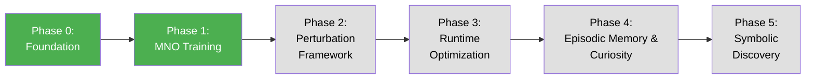

# Neural Operator Agent (NOA) Roadmap

**Autonomous perturbation-driven system for discovering computational structure through episodic memory and curiosity-driven exploration.**

This roadmap provides a practical blueprint for building a Neural Operator Agent (NOA)—an **online perturbation-response system** that operates autonomously without parameter conditioning. The NOA combines a trained Meta-Neural Operator (MNO) as a learned physics engine with VQ-VAE behavioral tokenization, episodic memory, and curiosity signals to enable self-directed exploration and symbolic discovery of dynamical patterns.

## Overview


```mermaid
flowchart LR
    Phase0[Phase 0:<br/>Foundation]
    Phase1[Phase 1:<br/>MNO Training]
    Phase2[Phase 2:<br/>Perturbation<br/>Framework]
    Phase3[Phase 3:<br/>Runtime<br/>Optimization]
    Phase4[Phase 4:<br/>Episodic Memory &<br/>Curiosity]
    Phase5[Phase 5:<br/>Symbolic<br/>Discovery]

    Phase0 --> Phase1
    Phase1 --> Phase2
    Phase2 --> Phase3
    Phase3 --> Phase4
    Phase4 --> Phase5

    style Phase0 fill:#4CAF50,color:#fff
    style Phase1 fill:#4CAF50,color:#fff
    style Phase2 fill:#e0e0e0,color:#000
    style Phase3 fill:#e0e0e0,color:#000
    style Phase4 fill:#e0e0e0,color:#000
    style Phase5 fill:#e0e0e0,color:#000
```

**Legend:**
- 🟢 **Green**: Complete
- ⚪ **Gray**: Planned

---

## Design Principles: Bias-Minimizing Discovery Architecture

The NOA is designed around a radical premise: **we don't know what we're looking for**. The architecture prioritizes discovering truly novel structure over optimizing predetermined objectives.

### 1. Mathematical Guarantees Against Sampling Bias

**Problem**: Random sampling creates "blind spots" where lucky draws dominate, and unlucky regions remain unexplored.

**Solution**: Stratified Sobol sequences with Owen scrambling
- **Discrepancy <0.01**: Mathematical guarantee of fair exploration across the entire parameter hypercube
- **High-dimensional coverage** (d>100): No region left unsampled, no artifacts mistaken for structure
- **Independent contribution**: Custom-engineered sampler achieving provably optimal space-filling properties

**Why it matters**: Prevents "discovering" patterns that are actually sampling artifacts. Every region explored equitably.

### 2. Bias-Free Feature Extraction: Learning Without Prejudice

Rather than choosing "interesting" features based on human intuition, extract **comprehensive statistical signatures**:

- **INITIAL**: All spatial/spectral/information characteristics, not cherry-picked
- **ARCHITECTURE**: Complete parameter space mapping, not designer-selected hyperparameters
- **SUMMARY**: Full statistical profile (spatial, spectral, temporal, causal, topological) without filtering
- **TEMPORAL**: Entire time series preserved, no predetermined "important" timesteps

**Principle**: If we don't extract it, we can't discover it. Cast the widest possible net.

### 3. Data-Driven Taxonomy: Categories Emerge, Not Imposed

Behavioral categories discovered through **unsupervised hierarchical clustering**:
- No labeled data (labels impose human bias)
- No task-specific objectives (tasks constrain discovery space)
- Categories reflect the natural geometry of operator behavior, potentially revealing alien semantics

**Validation**: Cluster quality metrics (silhouette, Davies-Bouldin) ensure structure is genuine, not forced

### 4. Perturbation-Driven Exploration: Autonomous Discovery

**Phase 2+ Innovation**: Agent explores through perturbation-response loops, not parameter conditioning

- **Perturbations excite learned dynamics**: Impulse perturbations → eigenmodes, continuous forcing → driven dynamics
- **Token-based behavioral signatures**: VQ-VAE encodes episodes into discrete symbols
- **Curiosity from prediction error**: High-variance responses indicate knowledge gaps
- **Self-directed experimentation**: Agent generates perturbations targeting unexplored regimes

**This is discovery without predetermined structure**: The system identifies patterns through autonomous exploration of its own behavioral manifold.

### 5. Transparent Mechanisms at Every Level

Even advanced phases maintain interpretability:
- **Feature → Token mapping**: Inspectable through attribution analysis
- **Self-models**: Must be analyzable—track what the system "believes" about itself
- **Discovered laws**: Expressed as testable, falsifiable mathematical relationships

**Goal**: Discovery of alien semantics, but through transparent, validatable mechanisms

---

## Phase 0: Foundation – Data and Tokens

**Status:** ✅ **COMPLETE**

### Objective
Establish the data infrastructure and tokenization system that enables behavioral representation learning.

### Components

**Inputs:**
- Hierarchical VQ-VAE tokens representing neural operator rollouts
- Stratified parameter sampling (Sobol + Owen scrambling)
- Stochastic rollout generation (500 timesteps × 3 realizations)
- Multiple operator architectures:
  - **CNN**: Sequential convolutional layers for local feature extraction
  - **U-AFNO**: U-Net encoder + AFNO spectral bottleneck + decoder for global receptive field via FFT-based mixing

**Initial Conditions:**
- Small, generic basis: Gaussian noise, band-limited noise, simple sinusoids/blobs
- Regime-separated variance/frequency levels
- Balanced diversity to avoid codebook allocation bias

**Features:**
- **INITIAL** (Initial Condition): 42D hybrid features (14 manual + 28 CNN)
- **ARCHITECTURE** (Neural Operator Parameters): 21D architectural/stochastic/evolution features
- **SUMMARY** (Summary Descriptor Features): 420-520D aggregated behavioral statistics
  - Spatial, temporal, spectral, cross-channel, and invariant drift axes
- **TEMPORAL** (Temporal Dynamics): Full temporal resolution features

**Key Emphasis:**
- INITIAL diversity balanced to avoid biasing codebook allocation
- Neutral priors ensuring tokenization reflects operator semantics, not INITIAL frequency
- Joint training across all 4 feature families (INITIAL+ARCHITECTURE+SUMMARY+TEMPORAL)

### Deliverables
- ✅ Stratified neural operator dataset generator
- ✅ Multi-modal feature extraction pipeline
- ✅ Hierarchical VQ-VAE tokenizer with automatic category discovery
- ✅ Behavioral token vocabulary (discrete latent space)

---

## Phase 1: Foundation - CNO-Trained Components

**Status:** ✅ **VQ-VAE COMPLETE** | 🔄 **MNO IN PROGRESS**

### Objective
Train two independent components on CNO ground truth data: a **VQ-VAE tokenizer** for discrete symbolic representation and a **MNO world model** for high-fidelity physics simulation. These components compose to form the foundation for the **NOA** (Neural Operator Agent) which will add autonomous perturbation-driven operation, episodic memory, and curiosity-driven exploration in later phases.

**Component Architecture:**
- **VQ-VAE**: Discrete behavioral vocabulary (trained on CNO features). Provides symbolic representation for reasoning.
- **MNO**: High-fidelity physics simulator (trained on CNO trajectories). Serves as world model for exploration.
- **NOA**: Autonomous agent architecture (Phase 2+). Uses MNO for exploration + VQ-VAE for symbolic reasoning.

### Why U-AFNO as MNO Backbone?

- **Physics-native**: Operates directly in continuous function space matching the studied dynamics
- **Resolution-independent**: Spectral mixing captures global patterns regardless of grid size
- **Proven infrastructure**: Leverages existing dataset-generation U-AFNO architecture
- **Self-consistent**: Enables emergent self-modeling and law discovery in the same function space
- **Efficient**: 4–9× inference speedup vs pure CNN, with global receptive field via FFT

### Architecture

**MNO Backbone: U-AFNO Neural Operator**
- **Training input**: θ (operator parameters) + u₀ (initial grid) - parameter-conditioned supervised learning
- **Autonomous operation**: Perturbations drive dynamics (Phase 2+), no explicit θ conditioning
- **Output**: Predicted rollout trajectory [B, T, C, H, W]
- **Latent extraction**: Bottleneck spectral modes + multi-scale encoder skips via `get_intermediate_features()`
- **Implementation**: `src/spinlock/noa/backbone.py` (NOABackbone class used for MNO, 226M parameters)

### CNO-Trained Components

**Primary Guide:** See [CNO-Trained Architecture](noa-architecture.md) for complete implementation details.

**Component 1: VQ-VAE Tokenizer** ✅ COMPLETE
- **Implementation:** `src/spinlock/cli/train_vqvae.py`
- **Input:** CNO ground truth features (50K samples from `cno_50k_v3_1.h5`)
- **Loss:** `L = L_recon + L_commit + auxiliary_losses` (orthogonality, topographic, entropy)
- **Training:** 50K CNO samples with v3.1 enhanced features
- **Target:** L_recon < 0.05 (achieved 0.006 in 50K baseline)
- **Result:** Frozen discrete tokenizer (8 categories, 22 tokens/sample)

**Component 2: MNO World Model** 🔄 IN PROGRESS
- **Implementation:** `src/spinlock/cli/train_meta_operator.py`
- **Input:** CNO ground truth trajectories (10K samples from `cno_50k_v3_1.h5`)
- **Loss:** `L = L_traj + L_ic` (pure MSE against CNO ground truth)
- **Training:** 10K CNO samples (stratified subset)
- **Target:** L_traj < 1.0 (RMSE < field variation)
- **Result:** High-fidelity physics simulator for NOA exploration

**Post-Training Validation:**
- Verify VQ reconstruction quality on MNO outputs (~0.006 L_recon)
- Compare MNO vs CNO feature distributions (KL divergence < 0.1)
- Analyze token usage similarity between CNO and MNO outputs

### Production Baseline Results ✅

**VQ-VAE Tokenizer (50K CNO Baseline):**
- **Dataset:** 50K samples from `cno_50k_v3_1.h5` (v3.1 enhanced features)
- **Architecture:** 3-level hierarchical VQ-VAE (INITIAL, SUMMARY, TEMPORAL)
- **Reconstruction error:** 0.006 (quality=99.4%)
- **Categories discovered:** 8 behavioral categories (automatic clustering)
- **Tokens per sample:** ~22 (adaptive per family)
- **Codebook utilization:** High (entropy-regularized)
- **Config:** `configs/vqvae/50k_baseline.yaml`
- **Checkpoint:** `checkpoints/vqvae/50k_baseline/vqvae_best.pt`

**MNO World Model (10K CNO Baseline):**
- **Dataset:** 10K samples from `cno_50k_v3_1.h5` (stratified subset)
- **Architecture:** U-AFNO, 227M parameters
- **Training:** Pure MSE loss (L_traj + L_ic)
- **Target:** L_traj < 1.0 (RMSE < field variation)
- **Status:** 🔄 In progress
- **Config:** `configs/noa/10k_baseline.yaml`

**Why These Results Are Excellent:**
1. **VQ-VAE: 99.4% reconstruction quality** on CNO ground truth (L_recon=0.006)
2. **Modular validation:** Each component tested independently on CNO
3. **Parallel training:** VQ-VAE and MNO trained simultaneously (faster iteration)
4. **Simpler pipeline:** No intermediate MNO feature generation step
5. **Ready for composition:** Both components validated on same ground truth dataset

### Transition to Autonomous Operation (Phase 2)

**Key Insight:** During training, MNO learns P(u_t+1 | u_t) across the training ensemble. This implicit generative model captures characteristic timescales, relaxation dynamics, and behavioral patterns that recur across parameter space.

**Autonomous deployment:** When operated without explicit θ conditioning, the MNO transitions from simulator to learned dynamical system:
- **Perturbations excite eigenmodes**: Impulse perturbations probe the learned attractor landscape
- **Continuous forcing creates driven dynamics**: Sustained perturbations balance internal relaxation
- **Observable trajectories**: System projects inputs onto learned manifold of "dynamics-like" behavior

Phase 2 builds the perturbation framework and validates that MNO responds meaningfully to autonomous operation.

### Deliverables
- ✅ U-AFNO MNO architecture implementation (`src/spinlock/noa/backbone.py`)
- ✅ Pure MSE loss implementation (`src/spinlock/noa/losses/mse_led.py`)
- ✅ CNO dataset with v3.1 enhanced features (`cno_50k_v3_1.h5`)
- ✅ VQ-VAE training script (`src/spinlock/cli/train_vqvae.py`)
- ✅ MNO training script (`src/spinlock/cli/train_meta_operator.py`)
- ✅ VQ-VAE tokenizer: 50K baseline complete (L_recon=0.006, 8 categories)
- 🔄 MNO world model: 10K baseline in progress (target: L_traj < 1.0)
- 🔄 Post-training validation: Verify VQ reconstruction on MNO outputs
- ✅ Production baseline validates foundation for Phase 2

---

## Phase 2: Perturbation Framework & MNO Behavioral Validation

**Status:** 📋 **PLANNED**

### Objective
Build minimal perturbation interface and validate that the trained MNO responds meaningfully to impulse perturbations when operated autonomously (without θ conditioning). Establish token-based behavioral signatures and early stopping criteria for episodes.

**Strategy:** Parallel approach - develop minimal perturbation interface while running validation experiments to empirically test autonomous operation.

### Key Infrastructure

#### 1. Perturbation Module (`src/spinlock/perturbations/`)

**Abstract Base Interface:**
```python
class BasePerturbation(ABC):
    @abstractmethod
    def apply(self, state: Tensor, t: int) -> Tensor:
        """Apply perturbation to state at timestep t"""

    @abstractmethod
    def is_active(self, t: int) -> bool:
        """Check if perturbation active at timestep t"""

    def get_metadata(self) -> Dict[str, Any]:
        """Return parameters for logging/memory"""
```

**Impulse Perturbations (Phase 2):**
- `ImpulsePerturbation` - Single-timestep perturbations
  - Gaussian blobs: amplitude, spatial_scale, center_location
  - Spatial patterns: sinusoidal, blob, edge injection
  - Frequency modes: specific Fourier mode excitation

**Future Extensibility (designed now, implemented later):**
- `SustainedPerturbation` - Multi-timestep forcing (Phase 3+)
- `StructuredPerturbation` - Pattern-based, learned perturbations (Phase 4+)

**Design Principles:**
- **Modular OOP**: Single responsibility per class
- **Extensible**: Add new perturbation types without changing existing code
- **Metadata logging**: All perturbations track parameters for episodic memory
- **Domain-agnostic**: Architecture supports multi-domain (implement single-domain first)

#### 2. Episode Runner (`src/spinlock/noa/episode.py`)

```python
@dataclass
class Episode:
    """Single perturbation-response episode"""
    perturbation: BasePerturbation
    initial_state: Tensor
    trajectory: Tensor  # [T, C, H, W]
    token_sequence: Tensor  # [T, num_categories * num_levels]
    metadata: Dict[str, Any]

class EpisodeRunner:
    """Execute MNO rollouts with perturbations and early stopping"""
    def __init__(self, mno: NOABackbone, vqvae: VQVAEModel,
                 early_stop_criterion: EarlyStopCriterion):
        ...

    def run_episode(self, u0: Tensor, perturbation: BasePerturbation,
                    max_steps: int = 256) -> Episode:
        """Run MNO until early stopping triggers"""
```

#### 3. Early Stopping (`src/spinlock/noa/early_stopping.py`)

```python
class EarlyStopCriterion(ABC):
    @abstractmethod
    def should_stop(self, trajectory: Tensor, tokens: Tensor, t: int) -> bool:
        """Determine if episode should terminate"""

class ConvergenceStop(EarlyStopCriterion):
    """Stop when ||u_t - u_{t-1}|| < threshold (equilibrium)"""

class TokenStabilityStop(EarlyStopCriterion):
    """Stop when token sequence repeats (limit cycle detected)"""

class MaxStepsStop(EarlyStopCriterion):
    """Stop after fixed timesteps (safety fallback)"""

class CompositeStop(EarlyStopCriterion):
    """Combine criteria with OR/AND logic"""
```

#### 4. Behavioral Encoding (`src/spinlock/noa/behavioral_encoding.py`)

```python
class BehavioralEncoder:
    """Extract behavioral signatures from token sequences"""

    def encode_episode(self, episode: Episode) -> BehavioralSignature:
        """Convert token sequence → behavioral fingerprint"""
        # - Token entropy over time
        # - L0→L1→L2 transition patterns
        # - Regime identification (stable/oscillatory/chaotic)

    def compute_similarity(self, sig1: BehavioralSignature,
                          sig2: BehavioralSignature) -> float:
        """Token sequence similarity for memory retrieval"""
```

### Validation Experiments

**Research Questions:**

1. **Does MNO respond meaningfully to impulse perturbations?**
   - Experiment: Gaussian blob at t=0, observe relaxation dynamics
   - Metric: Token sequence divergence from unperturbed baseline
   - Success: Different perturbation locations → different token sequences

2. **Do token sequences capture behavioral regimes?**
   - Experiment: Same perturbation, different ICs → cluster by tokens
   - Metric: Silhouette score (token-based vs spatial-based clustering)
   - Success: Token clustering ≥ spatial clustering (compression without information loss)

3. **When should episodes terminate?**
   - Experiment: Run 256 steps, analyze convergence distribution across 1000 episodes
   - Metric: Convergence timestep distribution
   - Success: Early stopping saves 30-50% computation vs fixed max_steps

4. **Are perturbation-response patterns reproducible?**
   - Experiment: Same (u₀, perturbation) repeated 5 times
   - Metric: Token sequence cosine similarity
   - Success: >0.95 similarity (MNO deterministic → exact match)

**Validation Dataset:** 1000 episodes = 10 ICs × 100 impulse perturbations (varied location/amplitude)

### Success Criteria (Phase 2 → 3)

**Metrics:**
- 90% episodes show token divergence from baseline (not just noise)
- 40%+ episodes terminate early with valid stopping criteria
- Behavioral signature extraction <10ms per episode
- >0.95 token similarity for identical (u₀, perturbation) pairs
- 3+ interpretable behavioral regimes identified (manual inspection)

### Deliverables
- [ ] Perturbation module (`perturbations/`: base, impulse, factory)
- [ ] Episode infrastructure (`noa/`: episode, early_stopping, behavioral_encoding)
- [ ] Validation scripts (4 experiments)
- [ ] Documentation (architecture guide, validation results)
- [ ] Unit tests (perturbations, episode runner, early stopping)

---

## Phase 3: Dynamic Sampling & Runtime Optimization

**Status:** 📋 **PLANNED**

### Objective
Implement intelligent MNO rollout sampling (skip predictable timesteps) and token-based screening (skip expensive MNO calls when token prediction is sufficient). Optimize quality vs runtime trade-offs through senior-level ML strategies.

### Key Infrastructure

#### 1. Adaptive Sampler (`src/spinlock/noa/adaptive_sampler.py`)

**Concept:** Dense sampling during transients (high dynamics), sparse sampling during equilibrium (low dynamics).

```python
class AdaptiveSampler:
    """Dynamically adjust MNO sampling rate based on dynamics"""

    def __init__(self, base_rate: int = 1, max_skip: int = 8):
        # base_rate=1: every timestep
        # max_skip=8: skip up to 8 steps during equilibrium

    def get_sampling_schedule(self, episode: Episode) -> List[int]:
        """Determine which timesteps to compute MNO forward pass"""
        # High dynamics (transient) → dense sampling
        # Low dynamics (equilibrium) → sparse sampling
        # Interpolate skipped timesteps linearly
```

**Strategies:**
- **Gradient-based:** Skip when ||u_t - u_{t-1}|| < threshold
- **Token-based:** Dense when tokens change, sparse when stable
- **Hybrid:** Start dense, gradually sparse as convergence detected

**Validation:**
- Metric: Speedup (30-50% fewer MNO calls)
- Metric: Fidelity (final tokens 90%+ match vs dense sampling)
- Metric: Error (interpolated states <5% RMSE vs true MNO)

#### 2. Token Predictor (`src/spinlock/noa/token_predictor.py`)

**Fast Path: Predict next tokens without full MNO rollout**

```python
class TokenPredictor(nn.Module):
    """Predict next tokens without full MNO rollout"""
    # Small transformer: token_sequence[-K:] → next_token
    # K=5-10 context window
    # 100K-1M params (vs 226M MNO)
    # Train on Phase 2 episodes

class ScreeningPipeline:
    """Two-stage: fast token screening + precise MNO verification"""

    def screen(self, perturbation: BasePerturbation, u0: Tensor) -> bool:
        """Fast: Does this → interesting token sequence?"""

    def verify(self, perturbation: BasePerturbation, u0: Tensor) -> Episode:
        """Precise: Run full MNO for selected candidates"""
```

**Use Case:**
- Explore 10K perturbations
- Screen 10K with TokenPredictor (<1 min)
- Filter to 1K novel/uncertain
- Verify 1K with MNO → **10× speedup**

#### 3. Execution Policies (`src/spinlock/noa/execution_policy.py`)

**Strategy pattern for quality/runtime trade-offs:**

```python
class ExecutionPolicy(ABC):
    @abstractmethod
    def execute(self, perturbation, u0) -> Episode:
        """Execute with specific quality/runtime trade-off"""

class HighFidelityPolicy(ExecutionPolicy):
    """Dense MNO sampling, all timesteps (100% fidelity)"""

class BalancedPolicy(ExecutionPolicy):
    """Adaptive sampling + early stopping (90-95% fidelity, 30-50% speedup)"""

class ExploratoryPolicy(ExecutionPolicy):
    """Token screening + selective verification (80-90% fidelity, 10× speedup)"""
```

**Quality vs Runtime Trade-offs:**

| Strategy | MNO Calls | Token Fidelity | Use Case |
|----------|-----------|----------------|----------|
| Dense | 256 | 100% | High-value validation |
| Adaptive | 120-180 | 90-95% | Standard exploration |
| Screening | 10-50 | 80-90% | Large-scale search |
| Pure prediction | 0 | 60-70% | Initial filtering only |

### Success Criteria (Phase 3 → 4)

**Metrics:**
- 30-50% speedup with <10% token fidelity loss (adaptive sampling)
- 70%+ top-1 token prediction accuracy (TokenPredictor)
- 10× throughput increase for large-scale exploration (screening pipeline)
- <100ms end-to-end episode generation (balanced policy)
- GPU utilization >70% (profiling and optimization)

### Deliverables
- [ ] Adaptive sampling (`adaptive_sampler.py`, `execution_policy.py`)
- [ ] Token screening (`token_predictor.py`, `screening_pipeline.py`)
- [ ] Training scripts (train TokenPredictor on Phase 2 episodes)
- [ ] Validation scripts (benchmark sampling strategies, profiling)
- [ ] Documentation (adaptive sampling guide, token screening guide)

---

## Phase 4: Episodic Memory & Curiosity-Driven Exploration

**Status:** 📋 **PLANNED**

### Objective
Build episodic memory indexed by token sequence similarity. Develop prediction-error curiosity signals. Enable self-directed perturbation generation targeting knowledge gaps. Create autonomous exploration loop.

### Key Infrastructure

#### 1. Episode Store (`src/spinlock/noa/memory/episode_store.py`)

**Persistent HDF5 storage for episodes:**

```python
class EpisodeStore:
    """Persistent HDF5 storage for episodes"""
    # Schema: /category_id/episode_id/{perturbation, tokens, trajectory}

    def store(self, episode: Episode) -> int:
        """Store episode, return unique ID"""

    def retrieve(self, episode_id: int) -> Episode:
        """Load episode by ID"""

    def query_by_tokens(self, token_seq: Tensor, k: int) -> List[Episode]:
        """K most similar episodes by token sequence"""
```

**Memory Organization:**
- **Primary index:** Token sequence similarity (behavioral)
- **Secondary:** Perturbation type, outcome regime, timestamp
- **Metadata:** Perturbation params, IC fingerprint, convergence time
- **Compression:** Store tokens + metadata, reconstruct trajectories on-demand

#### 2. Token Index (`src/spinlock/noa/memory/token_index.py`)

**Fast ANN search over token sequences:**

```python
class TokenSequenceIndex:
    """Fast ANN search over token sequences (FAISS/Annoy)"""

    def build(self, episodes: List[Episode]):
        """Build index from episode token sequences"""

    def search(self, query_tokens: Tensor, k: int) -> List[int]:
        """Find K nearest episodes (approximate nearest neighbors)"""
```

#### 3. Memory-Based Predictor (`src/spinlock/noa/curiosity/predictor.py`)

**Predict token sequences from perturbations using memory:**

```python
class MemoryBasedPredictor:
    """Predict token sequence from perturbation using memory"""

    def predict(self, perturbation: BasePerturbation, u0: Tensor) ->
        Tuple[Tensor, float]:
        """Predict tokens + confidence from similar past episodes"""
        # 1. Embed perturbation parameters
        # 2. K-NN retrieval from memory (similar perturbations)
        # 3. Weighted average of neighbor tokens
        # 4. Confidence = agreement across neighbors
```

#### 4. Curiosity Signal (`src/spinlock/noa/curiosity/signal.py`)

**Measure prediction error as curiosity/novelty:**

```python
class CuriositySignal:
    """Measure prediction error as curiosity/novelty"""

    def compute(self, predicted_tokens: Tensor, actual_tokens: Tensor,
                confidence: float) -> float:
        """Curiosity = prediction_error × (1 - confidence)"""
        # High curiosity: Wrong prediction AND low confidence (knowledge gap)
        # Low curiosity: Correct prediction OR high confidence (known territory)
```

#### 5. Perturbation Generator (`src/spinlock/noa/curiosity/perturbation_generator.py`)

**Generate perturbations targeting knowledge gaps:**

```python
class CuriosityDrivenGenerator:
    """Generate perturbations targeting knowledge gaps"""

    def generate_batch(self, n: int, strategy: str) -> List[BasePerturbation]:
        """N perturbations using exploration strategy"""
        # - "exploit": Near high-reward past (refine understanding)
        # - "explore": Far from all past (coverage)
        # - "curious": High prediction error regions (knowledge gaps)
        # - "balanced": Epsilon-greedy mix
```

#### 6. Exploration Loop (`src/spinlock/noa/curiosity/exploration_loop.py`)

**Autonomous self-directed exploration:**

```python
class ExplorationLoop:
    """Autonomous exploration with curiosity-driven sampling"""

    def run(self, n_iterations: int, batch_size: int):
        """Self-directed exploration loop"""
        for i in range(n_iterations):
            # 1. Generate curious perturbations (target knowledge gaps)
            # 2. Execute episodes (with Phase 3 screening)
            # 3. Compute curiosity signals (prediction error)
            # 4. Store high-curiosity episodes in memory
            # 5. Update perturbation generator
```

### Validation Experiments

1. **Memory retrieval accuracy:** 80%+ precision@10 for behavioral similarity
2. **Curiosity signal validity:** Novel perturbations have 2× median curiosity vs familiar
3. **Exploration coverage:** Curiosity-driven explores 50%+ more token states than random
4. **Novel regime discovery:** 70%+ high-curiosity episodes show interpretable novel behaviors

### Success Criteria (Phase 4 → 5)

**Metrics:**
- 100K episodes stored, <100ms retrieval latency
- 80%+ precision@10 for token similarity retrieval
- 2× median curiosity for novel vs familiar perturbations
- 50%+ more token coverage vs random exploration
- 10+ interpretable behavioral patterns discovered (manual inspection)

### Deliverables
- [ ] Memory system (`memory/`: episode_store, token_index, retrieval_strategies)
- [ ] Curiosity framework (`curiosity/`: predictor, signal, perturbation_generator, exploration_loop)
- [ ] Analysis tools (memory coverage visualization, curiosity landscape)
- [ ] Validation scripts (4 experiments)
- [ ] Documentation (episodic memory guide, curiosity framework guide, validation results)

---

## Phase 5: Symbolic Discovery & Self-Modeling

**Status:** 📋 **PLANNED**

### Objective
Formalize perturbation-response relationships as testable symbolic rules. Develop self-models predicting MNO's own behavioral responses to perturbations (not operator predictions). Enable hypothesis generation, testing, and falsification.

### Key Infrastructure

#### 1. Pattern Extractor (`src/spinlock/noa/symbolic/pattern_extractor.py`)

**Association rule mining from episodic memory:**

```python
class PatternExtractor:
    """Extract symbolic rules from episodic memory"""

    def mine_rules(self, memory: EpisodeStore, min_support: int) -> List[Rule]:
        """Find frequent perturbation → token sequence patterns"""
        # Association rule mining
        # E.g., "High amplitude center → [Category 3, L1=5]"

@dataclass
class SymbolicRule:
    antecedent: PerturbationProfile  # Perturbation characteristics
    consequent: TokenPattern  # Expected token sequence
    support: int  # Episodes supporting rule
    confidence: float  # P(consequent | antecedent)
    exceptions: List[int]  # Violating episodes
```

**Pattern Types:**
- **Regime transitions:** "Amplitude > 0.5 → Category 7 (chaotic)"
- **Spatial patterns:** "Central perturbation → symmetric tokens"
- **Temporal patterns:** "Fast convergence (t<50) ↔ Category 2"
- **Compositional:** "Perturbation A + location B → tokens C"

#### 2. Self-Model (`src/spinlock/noa/self_model/predictor.py`)

**Predict MNO's own behavioral responses:**

```python
class SelfModel(nn.Module):
    """Predict MNO's behavioral response to perturbations"""
    # Input: Perturbation embedding + state embedding
    # Output: Predicted token sequence (NOT full trajectory)
    # Architecture: Lightweight transformer (10M vs 226M MNO)

    def predict_response(self, perturbation: BasePerturbation,
                        u0: Tensor) -> Tensor:
        """Predict token sequence without running MNO"""
```

**Metacognitive Capabilities:**
- **Uncertainty estimation:** Predict when self-model will be wrong
- **Capability boundaries:** Identify perturbations outside training distribution
- **Confidence calibration:** P(correct | confidence) monotonic (ECE < 0.1)

#### 3. Hypothesis Generator (`src/spinlock/noa/symbolic/hypothesis.py`)

**Generate testable hypotheses from discovered rules:**

```python
@dataclass
class Hypothesis:
    statement: str  # Natural language
    formal_rule: SymbolicRule  # Machine-readable
    predicted_outcomes: Dict[str, Any]  # Testable predictions

class HypothesisGenerator:
    """Generate testable hypotheses from discovered rules"""

    def generate(self, rules: List[SymbolicRule]) -> List[Hypothesis]:
        """Create hypotheses from frequent patterns"""
```

#### 4. Hypothesis Tester (`src/spinlock/noa/symbolic/falsification.py`)

**Design experiments to test/falsify hypotheses:**

```python
class HypothesisTester:
    """Design experiments to test/falsify hypotheses"""

    def design_experiment(self, hypothesis: Hypothesis) -> List[BasePerturbation]:
        """Generate perturbations to test hypothesis"""

    def evaluate(self, hypothesis: Hypothesis,
                 results: List[Episode]) -> TestResult:
        """Statistical validation (p-values, confidence intervals)"""
```

#### 5. Symbolic Regressor (`src/spinlock/noa/symbolic/regression.py`)

**Fit symbolic equations to perturbation-response data:**

```python
class SymbolicRegressor:
    """Fit symbolic equations to perturbation-response data (PySR)"""

    def fit(self, episodes: List[Episode]) -> SymbolicEquation:
        """Discover f: perturbation_params → behavioral_features"""
```

**Example Discovered Laws:**
- `token_entropy = 2.3 * log(amplitude) + 0.5 * spatial_scale - 1.1`
- `convergence_time = 45 / amplitude^0.8`
- `category = floor(amplitude / 0.3) % 10`

### Validation Experiments

1. **Rule discovery:** 50+ interpretable rules (support >100, confidence >0.8)
2. **Self-model accuracy:** 75%+ token prediction on held-out perturbations
3. **Hypothesis testing:** 70%+ hypotheses validated, 30% rejected (filters noise)
4. **Symbolic regression:** 5+ laws with R² > 0.8
5. **Metacognitive calibration:** ECE < 0.1 (agent knows when uncertain)

### Success Criteria (Phase 5 Complete)

**Metrics:**
- 50+ high-confidence symbolic rules discovered
- 75%+ self-model token prediction accuracy (held-out test set)
- 70%+ hypotheses validated through empirical testing
- 5+ symbolic equations with R² > 0.8
- ECE < 0.1 for uncertainty calibration (Expected Calibration Error)

### Deliverables
- [ ] Symbolic discovery (`symbolic/`: pattern_extractor, hypothesis, falsification, regression)
- [ ] Self-modeling (`self_model/`: predictor, calibration, capability_boundaries)
- [ ] Analysis tools (rule mining, hypothesis testing, law fitting)
- [ ] Validation scripts (5 experiments)
- [ ] Documentation (symbolic discovery guide, self-modeling guide, discovered laws catalog)
- [ ] Publication materials (research paper draft, visualizations)

---

## Architecture Design: Extensibility for Future Expansion

### Multi-Domain Support (Future)

**Design enabling multi-domain without current implementation:**

1. **Domain-agnostic perturbation interface:**
   ```python
   # Works for any state representation
   BasePerturbation.apply(state, t)

   # Physics-specific subclasses (future)
   ImpulsePerturbationRD vs ImpulsePerturbationFluid
   ```

2. **Modular episode storage:**
   ```python
   # HDF5: /domain/{domain_name}/episodes/...
   class MultiDomainMemory:
       vqvaes: Dict[str, VQVAEModel]  # domain → tokenizer
       stores: Dict[str, EpisodeStore]  # domain → storage
   ```

3. **Cross-domain analysis (future Phase 6):**
   - Compare token vocabularies for computational universals
   - Test if RD perturbation patterns generalize to fluids
   - Vocabulary alignment as key experiment

**Implementation strategy:**
- Single-domain (reaction-diffusion) in Phases 2-5
- Architecture supports multi-domain extension
- No multi-domain code until Phase 5 complete

### Adding New Perturbation Types

**3-step process:**

1. **Implement `BasePerturbation` subclass:**
   ```python
   class VideoFramePerturbation(BasePerturbation):
       def apply(self, state, t): ...
       def is_active(self, t): ...
       def get_metadata(self): ...
   ```

2. **Register in factory:**
   ```python
   PerturbationFactory.register("video_frame", VideoFramePerturbation)
   ```

3. **Update metadata schema:**
   - Add `video_frame_id` to HDF5 episode storage
   - Update retrieval indices

**No changes needed:** Episode runner, memory system, token encoding (all generic)

### Progressive Complexity

```
Phase 0-1: Foundation (complete)
    ↓ Stratified data, MNO training, VQ-VAE tokenization

Phase 2: Minimal perturbation framework (impulse only, basic validation)
    ↓ Validate autonomous operation, token-based encoding

Phase 3: Efficient runtime (adaptive sampling, token screening)
    ↓ Quality/runtime trade-offs, 10× speedup for exploration

Phase 4: Memory + curiosity (autonomous exploration)
    ↓ Episodic storage, prediction-error curiosity, self-directed generation

Phase 5: Symbolic discovery (interpretable laws)
    ↓ Rule mining, self-modeling, hypothesis testing

Future: Multi-domain, video perturbations, learned patterns, cross-domain universals
```

---

## Critical Files by Phase

### Phase 2: Perturbation Framework & Validation
- `src/spinlock/perturbations/base.py` - Abstract perturbation interface (NEW, foundation)
- `src/spinlock/perturbations/impulse.py` - Impulse perturbations (NEW)
- `src/spinlock/noa/episode.py` - Episode management (NEW, core execution)
- `src/spinlock/noa/early_stopping.py` - Termination criteria (NEW)
- `src/spinlock/noa/behavioral_encoding.py` - Token signatures (NEW)
- `src/spinlock/noa/backbone.py` - MNO interface (MODIFY, add perturbation hooks)
- `src/spinlock/encoding/categorical_vqvae.py` - Token encoding (EXISTING, use as-is)

### Phase 3: Runtime Optimization
- `src/spinlock/noa/adaptive_sampler.py` - Intelligent timestep selection (NEW)
- `src/spinlock/noa/token_predictor.py` - Next-token forecasting (NEW)
- `src/spinlock/noa/execution_policy.py` - Strategy pattern for trade-offs (NEW)
- `src/spinlock/noa/screening_pipeline.py` - Fast path screening (NEW)

### Phase 4: Memory & Curiosity
- `src/spinlock/noa/memory/episode_store.py` - HDF5 storage (NEW)
- `src/spinlock/noa/memory/token_index.py` - Similarity retrieval (NEW)
- `src/spinlock/noa/curiosity/predictor.py` - Memory-based prediction (NEW)
- `src/spinlock/noa/curiosity/signal.py` - Prediction error curiosity (NEW)
- `src/spinlock/noa/curiosity/perturbation_generator.py` - Self-directed generation (NEW)
- `src/spinlock/noa/curiosity/exploration_loop.py` - Autonomous loop (NEW)

### Phase 5: Symbolic Discovery
- `src/spinlock/noa/symbolic/pattern_extractor.py` - Rule mining (NEW)
- `src/spinlock/noa/symbolic/hypothesis.py` - Hypothesis generation (NEW)
- `src/spinlock/noa/symbolic/falsification.py` - Hypothesis testing (NEW)
- `src/spinlock/noa/self_model/predictor.py` - Self-modeling (NEW)
- `src/spinlock/noa/symbolic/regression.py` - Symbolic equations (NEW)

### Documentation
- `docs/noa-roadmap.md` - This document
- `docs/architecture.md` - Update Phase 2-5 sections (AFTER roadmap complete)
- `docs/noa-training-guide.md` - Add perturbation framework guide (Phase 2)
- `README.md` - Update progress status as phases complete

---

## Summary

This roadmap transitions the NOA from **parameter-conditioned batch training** (outdated) to **autonomous perturbation-driven online operation** (README vision). Each phase builds progressively:

**Phase 0-1 (Complete):** Foundation established with excellent PoC metrics (0.018 recon error, 70.7% utilization, 10 behavioral categories)

**Phase 2:** Validate autonomous operation - Does MNO respond meaningfully to perturbations? Build minimal framework.

**Phase 3:** Optimize runtime - Intelligent sampling, token screening, 10× speedup for large-scale exploration.

**Phase 4:** Enable curiosity - Episodic memory, prediction-error signals, self-directed perturbation generation.

**Phase 5:** Discover laws - Symbolic rules, self-modeling, hypothesis testing, interpretable equations.

**Future:** Multi-domain extension tests computational universals via vocabulary alignment.

The architecture maintains DRY principles, modular OOP design, and extensibility for multi-domain while implementing single-domain (reaction-diffusion) first. Each phase has concrete deliverables (specific OOP classes, validation scripts, documentation), measurable success criteria, and empirical validation experiments.
