# Spinlock Pipeline Architecture

A framework for learning **discrete token representations** of dynamical systems,
enabling generative modelling and physics-guided exploration via discrete diffusion.

---

## End-to-End Pipeline

```mermaid
%%{init: {"flowchart": {"subGraphTitleMargin": {"top": 8, "bottom": 4}}}}%%
flowchart TD
    %% ── STAGE 1: DATA GENERATION ─────────────────────────────────────────
    subgraph S1["① Dataset Generation"]
        direction LR
        PARAMS["Physics parameters θ<br/>γ · T · ω · mass · …"]
        QBM["QBM Simulator<br/>Caldeira–Leggett model<br/>GPU split-operator FFT"]
        RAW["Raw dataset · HDF5<br/>fields: N × M × T × 2 × 64×64<br/>params: N × 9<br/>N=50k · M=3 realizations · T=256"]
        PARAMS --> QBM --> RAW
    end

    %% ── STAGE 2: FEATURE EXTRACTION ──────────────────────────────────────
    subgraph S2["② Feature Extraction & Cleaning"]
        direction LR
        ORCH["TemporalFeatureOrchestrator<br/>Spatial · Spectral · Cross-channel<br/>Aggregated across M realizations"]
        CLEAN["Variance filter<br/>247 raw → 152 kept"]
        FEATS["Feature families<br/>Temporal  N × T × 152<br/>Initial   N × D_i<br/>Theta     N × 9"]
        ORCH --> CLEAN --> FEATS
    end

    %% ── STAGE 3: FEATURE GROUPING ────────────────────────────────────────
    subgraph S3["③ Data-Driven Feature Grouping"]
        direction LR
        INTR["DatasetIntrospector<br/>all dims auto-detected<br/>at runtime"]
        GRPMETHOD["Grouping oracle<br/>PCA"]
        GROUPS["30 temporal groups<br/>G_k raw feature indices"]
        INTR --> GRPMETHOD --> GROUPS
    end

    %% ── STAGE 4: ENCODERS ────────────────────────────────────────────────
    subgraph S4["④ VQTokenizer Encoders"]
        direction LR
        PYRTMP["PyramidTemporalEncoder<br/>One per group · ResNet-1D<br/>4-level pyramid<br/>input  [B, T, G_k]<br/>output [B, 64]"]
        INITCNN["InitialEncoder<br/>CNN  [B, C, 64, 64]<br/>+ MLP  [B, D_i]<br/>output [B, emb_dim]"]
        THETAMLP["ThetaEncoder<br/>MLP  [B, 9]<br/>output [B, 32]"]
    end

    %% ── STAGE 5: VQ ──────────────────────────────────────────────────────
    subgraph S5["⑤ VQTokenizer Quantization & Reconstruction"]
        direction LR
        PROJ["Per-category projectors<br/>Linear → hierarchical latent<br/>ratios  0.5 · 1.0 · 1.5"]
        VQL0["Level 0  coarse<br/>30 groups<br/>~28 codes × ~60-dim"]
        VQL1["Level 1  medium<br/>30 groups<br/>~12 codes × ~22-dim"]
        VQL2["Level 2  fine<br/>30 groups<br/>~6 codes × ~12-dim"]
        DEC["Decoder<br/>concat all quantised<br/>→ reconstructed features"]
        PROJ --> VQL0 & VQL1 & VQL2 --> DEC
    end

    %% ── STAGE 5b: LOSSES ─────────────────────────────────────────────────
    subgraph S5b["⑤ VQTokenizer Losses"]
        direction LR
        L1["Reconstruction<br/>MSE on features"]
        L2["VQ commitment<br/>codebook alignment"]
        L3["Topographic<br/>pre/post-VQ distance<br/>preservation"]
        L4["Roundtrip<br/>re-encode decoded<br/>output"]
    end

    TOKENS["Token dictionary · 183 integers per rollout<br/>temporal_group_k_L0,L1,L2   k = 1…30<br/>initial_group_j_L0,L1,L2   ·   theta_group_i_L0,L1,L2"]

    PRETOK["Offline tokenisation of dataset<br/>100x faster diffusion training"]

    %% ── STAGE 6: FORWARD PROCESS ─────────────────────────────────────────
    subgraph S6["⑥ Discrete Diffusion · Forward Process"]
        direction LR
        FWDU["Uniform noise<br/>Q_t = (1−β)I + β·U"]
        FWDA["Absorbing noise<br/>Q_t = (1−β)I + β·e_mask"]
    end

    %% ── STAGE 7: DENOISER ────────────────────────────────────────────────
    subgraph S7["⑦ Discrete Diffusion · Denoising Transformer"]
        direction LR
        DEMB["Token embeddings<br/>per-category-level<br/>variable vocab sizes"]
        DPOS["Positional encoding<br/>+ time embedding t"]
        DATTN["Multi-head attention<br/>6 layers · 8 heads · 256-dim<br/>L0 hierarchical guidance"]
        DOUT["Output heads<br/>Linear → vocab logits"]
        DEMB --> DPOS --> DATTN --> DOUT
    end

    DLOSS["D3PM Loss<br/>cross-entropy per category<br/>+ SNR weighting  1/β_t<br/>+ vocab-size normalisation  log V / log V_max"]

    %% ── STAGE 8: INFERENCE ───────────────────────────────────────────────
    subgraph S8["⑧ Inference · Dreamer & Inpainter"]
        direction LR
        COND["Observed context<br/>theta + initial tokens"]
        MASK["Mask unobserved<br/>temporal tokens"]
        REPAINT["RePaint loop<br/>T reverse-diffusion steps<br/>observed tokens fixed"]
        GEN["Predicted trajectory<br/>tokens → VQTokenizer decoder<br/>→ feature trajectory"]
        COND --> MASK --> REPAINT --> GEN
    end

    %% ── CONNECTIONS ──────────────────────────────────────────────────────
    S1 --> S2
    S2 --> S3
    S3 --> S4
    S4 --> S5
    S5 --> S5b
    S5 --> TOKENS
    TOKENS --> PRETOK
    PRETOK --> S6
    S6 --> S7
    S7 --> DLOSS
    DLOSS --> S8

    %% ── SUBGRAPH PADDING (prevents title occlusion) ──────────────────────
    style S1 padding-top:20px
    style S2 padding-top:20px
    style S3 padding-top:20px
    style S4 padding-top:20px
    style S5 padding-top:20px
    style S5b padding-top:20px
    style S6 padding-top:20px
    style S7 padding-top:20px
    style S8 padding-top:20px
```

---

## PoC Design Principles

All dataset-dependent dimensions (channels, feature count, timesteps, codebook sizes) are
**auto-detected at runtime** via `DatasetIntrospector`. Config files specify only algorithmic
choices — no hardcoded values.

### Multi-Codebook Token Sets
Each rollout is represented as a **set of 183 discrete tokens** (30 groups × 3 levels for
temporal, plus initial and theta families). Diversity is measured over unique token-set
combinations across the dataset — not per-codebook utilisation in isolation.

### Hierarchical Quantisation
Three levels of resolution (coarse → medium → fine) per feature group enable the diffusion
model to condition on coarse structure when denoising fine-grained tokens, analogous to
classifier-free hierarchical guidance.

### Temporally-Progressive Encoding (v5)
Per-group **PyramidTemporalEncoders** operate directly on raw temporal slices `[B, T, G_k]`
using a 4-level ResNet-1D pyramid, preserving trajectory dynamics that mean/std aggregation
discards. Group assignments come from PCA loading votes — no rotation matrix stored at
inference.

### Experimental Discrete Dreamer
The D3PM model acts as a **physics-space dreamer**: given observed initial conditions and
parameters, it inpaints the unobserved temporal token trajectory via reverse diffusion,
enabling counterfactual exploration without re-running the simulator.
